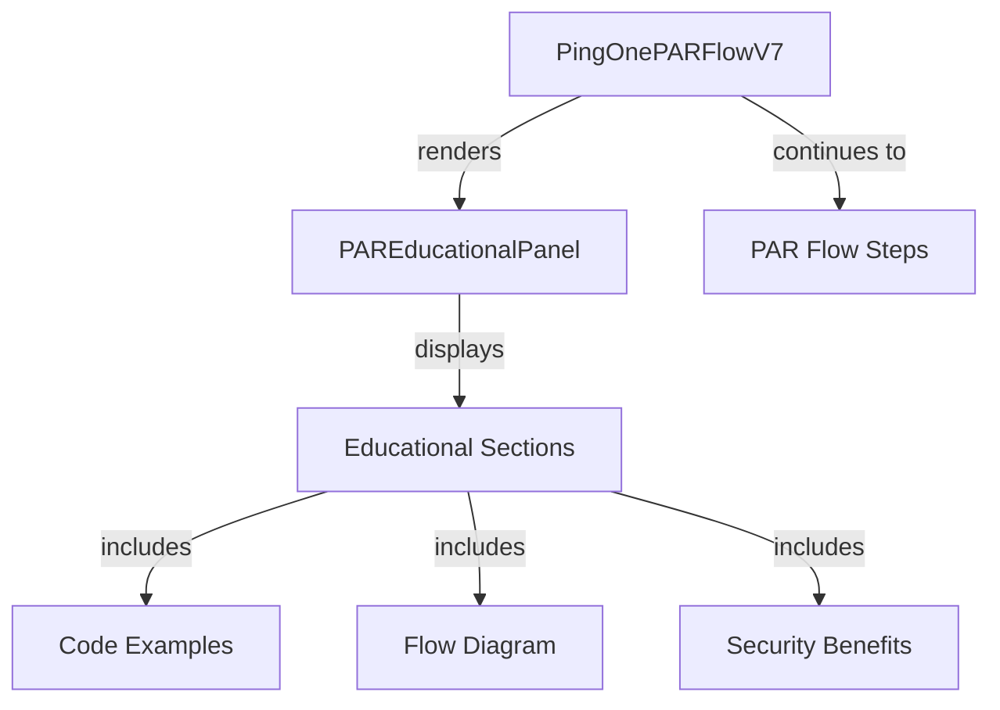

# PAR Flow Educational Enhancement - Design Document

## Overview

This design document outlines the technical approach for adding comprehensive educational content to the PingOne PAR (Pushed Authorization Request) Flow V7. The solution creates a reusable educational panel component that explains what PAR is, how it relates to the Authorization Code flow, PKCE requirements, and provides detailed examples with explanations.

The design follows the same pattern established in the Worker Token V7 educational enhancement, ensuring consistency across the application.

## Architecture

### Component Hierarchy

```
PingOnePARFlowV7
├── FlowHeader (existing)
├── PAREducationalPanel (new)
│   ├── OverviewSection
│   ├── FlowRelationshipSection
│   ├── PKCERequirementSection
│   ├── RequestExampleSection
│   ├── ResponseExampleSection
│   ├── SecurityBenefitsSection
│   ├── WhenToUseSection
│   └── FlowSequenceDiagram
├── VariantSelector (existing)
├── StepContent (existing)
└── StepNavigationButtons (existing)
```

### Data Flow



## Components and Interfaces

### 1. PAREducationalPanel (New Component)

**Purpose**: Display comprehensive educational content about PAR, including what it is, how it works, PKCE requirements, and examples.

**Location**: `src/components/PAREducationalPanel.tsx`

**Props Interface**:
```typescript
interface PAREducationalPanelProps {
  variant?: 'full' | 'compact';
  showFlowRelationship?: boolean;
  showPKCERequirement?: boolean;
  showRequestExample?: boolean;
  showResponseExample?: boolean;
  showSecurityBenefits?: boolean;
  showWhenToUse?: boolean;
  showFlowSequence?: boolean;
  environmentId?: string; // For dynamic examples
  className?: string;
}
```

**Sections**:

#### 1. Overview Section
```typescript
<OverviewSection>
  <Title>🔐 What is PAR (Pushed Authorization Request)?</Title>
  <Content>
    - RFC 9126 specification
    - Sends authorization parameters to secure backend endpoint
    - Returns a request_uri reference
    - Enhances Authorization Code flow security
  </Content>
</OverviewSection>
```

#### 2. Flow Relationship Section
```typescript
<FlowRelationshipSection>
  <Title>📊 PAR + Authorization Code Flow</Title>
  <Content>
    - PAR is NOT a standalone flow
    - Enhances the Authorization Code flow
    - Two-step process: PAR Request → Authorization
    - Token exchange remains unchanged
  </Content>
  <FlowDiagram>
    1. PAR Request (POST to /as/par)
    2. Authorization (GET to /as/authorize with request_uri)
    3. Token Exchange (POST to /as/token)
  </FlowDiagram>
</FlowRelationshipSection>
```

#### 3. PKCE Requirement Section
```typescript
<PKCERequirementSection>
  <Title>🔑 PKCE is Required</Title>
  <Content>
    - PKCE (RFC 7636) prevents code interception
    - code_challenge sent in PAR request
    - code_verifier sent in token exchange
    - Uses S256 method (SHA-256 hash)
  </Content>
  <CodeExample>
    code_verifier: random 43-128 character string
    code_challenge: BASE64URL(SHA256(code_verifier))
    code_challenge_method: S256
  </CodeExample>
</PKCERequirementSection>
```

#### 4. Request Example Section
```typescript
<RequestExampleSection>
  <Title>📤 PAR Request Example</Title>
  <HTTPRequest>
    POST /as/par HTTP/1.1
    Host: auth.pingone.com
    Content-Type: application/x-www-form-urlencoded
    
    client_id=YOUR_CLIENT_ID
    &redirect_uri=https://your-app.com/callback
    &response_type=code
    &scope=openid profile email
    &code_challenge=E9Melhoa2OwvFrEMTJguCHaoeK1t8URWbuGJSstw-cM
    &code_challenge_method=S256
    &state=abc123
  </HTTPRequest>
  <ParameterExplanations>
    - client_id: Your application identifier
    - redirect_uri: Where to send the user after authorization
    - response_type: Always "code" for Authorization Code flow
    - scope: Permissions requested
    - code_challenge: PKCE challenge (SHA-256 hash of verifier)
    - code_challenge_method: Always "S256"
    - state: CSRF protection token
  </ParameterExplanations>
</RequestExampleSection>
```

#### 5. Response Example Section
```typescript
<ResponseExampleSection>
  <Title>📥 PAR Response Example</Title>
  <JSONResponse>
    {
      "request_uri": "urn:ietf:params:oauth:request_uri:6esc_11ACC5bwc014ltc14eY22c",
      "expires_in": 90
    }
  </JSONResponse>
  <ResponseExplanation>
    - request_uri: Reference to your pushed parameters
    - expires_in: Validity period in seconds (typically 90)
    - Use request_uri in authorization URL
  </ResponseExplanation>
  <UsageExample>
    Authorization URL:
    https://auth.pingone.com/{environmentId}/as/authorize
      ?client_id=YOUR_CLIENT_ID
      &request_uri=urn:ietf:params:oauth:request_uri:6esc_11ACC5bwc014ltc14eY22c
  </UsageExample>
</ResponseExampleSection>
```

#### 6. Security Benefits Section
```typescript
<SecurityBenefitsSection>
  <Title>🛡️ Security Benefits</Title>
  <BenefitsList>
    - ✅ Prevents parameter tampering (params not in URL)
    - ✅ Protects sensitive data (not visible in browser)
    - ✅ Reduces URL length (no query string bloat)
    - ✅ Server-side validation (before authorization)
    - ✅ Supports complex parameters (RAR, etc.)
  </BenefitsList>
</SecurityBenefitsSection>
```

#### 7. When to Use Section
```typescript
<WhenToUseSection>
  <Title>🎯 When to Use PAR</Title>
  <RecommendedFor>
    ✅ High-security applications
    ✅ Complex authorization parameters
    ✅ Rich Authorization Requests (RAR)
    ✅ Applications requiring parameter confidentiality
  </RecommendedFor>
  <Considerations>
    ⚠️ Requires additional round-trip to server
    ⚠️ Adds complexity to implementation
    ⚠️ Not needed for simple use cases
  </Considerations>
</WhenToUseSection>
```

#### 8. Flow Sequence Diagram
```typescript
<FlowSequenceDiagram>
  <SequenceSteps>
    [Client] --1. PAR Request--> [Authorization Server]
    [Authorization Server] --2. request_uri--> [Client]
    [Client] --3. Authorization Request (with request_uri)--> [Authorization Server]
    [Authorization Server] --4. User Login/Consent--> [User]
    [User] --5. Approval--> [Authorization Server]
    [Authorization Server] --6. Authorization Code--> [Client]
    [Client] --7. Token Request (with code_verifier)--> [Authorization Server]
    [Authorization Server] --8. Access Token + ID Token--> [Client]
  </SequenceSteps>
</FlowSequenceDiagram>
```

**Styling**:
```typescript
const PanelContainer = styled.div`
  background: linear-gradient(135deg, #3b82f6 0%, #1e40af 100%);
  color: white;
  padding: 32px;
  border-radius: 16px;
  margin: 24px 0;
  box-shadow: 0 8px 32px rgba(59, 130, 246, 0.3);
`;

const SectionTitle = styled.h3`
  font-size: 1.25rem;
  font-weight: 600;
  margin: 0 0 16px 0;
  display: flex;
  align-items: center;
  gap: 8px;
`;

const CodeBlock = styled.pre`
  background: rgba(0, 0, 0, 0.2);
  padding: 16px;
  border-radius: 8px;
  overflow-x: auto;
  font-family: 'Monaco', 'Menlo', 'Courier New', monospace;
  font-size: 0.875rem;
  line-height: 1.6;
  border: 1px solid rgba(255, 255, 255, 0.1);
`;

const ParameterList = styled.dl`
  margin: 16px 0;
  
  dt {
    font-weight: 600;
    color: #fbbf24;
    margin-top: 8px;
  }
  
  dd {
    margin: 4px 0 0 16px;
    color: rgba(255, 255, 255, 0.9);
  }
`;
```

### 2. PingOnePARFlowV7 Component (Modified)

**Changes Required**:

1. **Import PAREducationalPanel**:
```typescript
import PAREducationalPanel from '../../components/PAREducationalPanel';
```

2. **Add Educational Panel to Step 0 or Before Steps**:
```typescript
const renderEducationalContent = () => (
  <PAREducationalPanel
    variant="full"
    showFlowRelationship={true}
    showPKCERequirement={true}
    showRequestExample={true}
    showResponseExample={true}
    showSecurityBenefits={true}
    showWhenToUse={true}
    showFlowSequence={true}
    environmentId={controller.credentials.environmentId}
  />
);

// Add before step content or in Step 0
return (
  <Container>
    <ContentWrapper>
      <FlowHeader flowId="pingone-par-v7" />
      
      {/* Educational Panel */}
      {currentStep === 0 && renderEducationalContent()}
      
      <MainCard>
        {/* Existing step content */}
      </MainCard>
    </ContentWrapper>
  </Container>
);
```

## Data Models

### PAREducationalContent

```typescript
interface PAREducationalContent {
  overview: {
    title: string;
    description: string;
    rfcReference: string;
    keyPoints: string[];
  };
  flowRelationship: {
    title: string;
    description: string;
    steps: FlowStep[];
    clarifications: string[];
  };
  pkceRequirement: {
    title: string;
    description: string;
    parameters: PKCEParameter[];
    example: PKCEExample;
  };
  requestExample: {
    title: string;
    httpRequest: string;
    parameters: ParameterExplanation[];
  };
  responseExample: {
    title: string;
    jsonResponse: string;
    fields: ResponseFieldExplanation[];
    usageExample: string;
  };
  securityBenefits: {
    title: string;
    benefits: SecurityBenefit[];
  };
  whenToUse: {
    title: string;
    recommendedFor: string[];
    considerations: string[];
  };
  flowSequence: {
    title: string;
    steps: SequenceStep[];
  };
}

interface FlowStep {
  number: number;
  name: string;
  description: string;
}

interface PKCEParameter {
  name: string;
  description: string;
  example: string;
}

interface PKCEExample {
  codeVerifier: string;
  codeChallenge: string;
  method: string;
}

interface ParameterExplanation {
  name: string;
  description: string;
  required: boolean;
  example: string;
}

interface ResponseFieldExplanation {
  name: string;
  description: string;
  type: string;
}

interface SecurityBenefit {
  icon: string;
  title: string;
  description: string;
}

interface SequenceStep {
  number: number;
  from: string;
  to: string;
  action: string;
  description: string;
}
```

## Error Handling

### Component Rendering Errors

```typescript
const PAREducationalPanel: React.FC<PAREducationalPanelProps> = (props) => {
  try {
    return (
      <PanelContainer>
        {/* Content */}
      </PanelContainer>
    );
  } catch (error) {
    console.error('[PAREducationalPanel] Rendering error:', error);
    return null; // Fail gracefully
  }
};
```

### Dynamic Content Errors

```typescript
const renderRequestExample = () => {
  try {
    const exampleRequest = generateExampleRequest(environmentId);
    return <CodeBlock>{exampleRequest}</CodeBlock>;
  } catch (error) {
    console.error('[PAREducationalPanel] Error generating example:', error);
    return <ErrorMessage>Unable to generate example</ErrorMessage>;
  }
};
```

## Testing Strategy

### Unit Tests

1. **PAREducationalPanel.test.tsx**
   - Renders all sections correctly
   - Respects variant prop (full vs compact)
   - Conditional section rendering based on props
   - Dynamic environmentId in examples
   - Code block formatting
   - Copy button functionality

2. **PingOnePARFlowV7.test.tsx**
   - Educational panel renders in Step 0
   - Panel hidden in other steps
   - No errors in console
   - Existing functionality unaffected

### Integration Tests

1. **PAR Flow End-to-End**
   - User navigates to PAR Flow
   - Educational content displays
   - User can read and understand content
   - User proceeds through flow successfully

2. **Content Accuracy**
   - RFC 9126 reference correct
   - Code examples valid
   - Parameter explanations accurate
   - Flow sequence matches actual implementation

### Visual Regression Tests

1. Educational panel styling
2. Code block formatting
3. Responsive design on mobile/tablet
4. Dark mode compatibility (if applicable)

## Implementation Phases

### Phase 1: Component Creation (Requirements 1-10)
- Create PAREducationalPanel component
- Implement all content sections
- Add styling and responsive design
- Write unit tests

### Phase 2: Integration (All Requirements)
- Import panel into PingOnePARFlowV7
- Add to Step 0 or before steps
- Test integration
- Verify no regressions

### Phase 3: Content Refinement
- Review technical accuracy
- Get feedback from users
- Refine explanations
- Add more examples if needed

### Phase 4: Documentation
- Update user guides
- Update developer docs
- Create video tutorial
- Announce changes

## Security Considerations

### Code Examples

**Risk**: Example code might be copied without understanding
**Mitigation**: Include warnings and best practices in examples

```typescript
<WarningBox>
  ⚠️ Never hardcode client secrets in production code.
  Always use environment variables or secure configuration.
</WarningBox>
```

### Parameter Exposure

**Risk**: Showing real parameter values in examples
**Mitigation**: Use placeholder values and clearly mark them

```typescript
const exampleRequest = `
client_id=YOUR_CLIENT_ID  // Replace with your actual client ID
&redirect_uri=https://your-app.com/callback  // Your registered redirect URI
`;
```

## Performance Considerations

### Component Rendering

- **Educational Panel**: Memoize with `React.memo`
- **Code Examples**: Pre-generate static examples
- **Dynamic Content**: Use `useMemo` for expensive computations

```typescript
const PAREducationalPanel = React.memo<PAREducationalPanelProps>(
  ({ variant, environmentId, ...props }) => {
    const exampleRequest = useMemo(
      () => generateExampleRequest(environmentId),
      [environmentId]
    );
    
    return (
      <PanelContainer>
        {/* Content */}
      </PanelContainer>
    );
  }
);
```

### Bundle Size

- Educational content: ~8KB (text + JSX)
- No additional dependencies required
- Reuse existing styled-components
- Total impact: <15KB gzipped

## Accessibility

### WCAG 2.1 AA Compliance

1. **Color Contrast**
   - Educational panel text: 4.5:1 minimum
   - Blue gradient background with white text: 7:1 ratio
   - Code blocks: High contrast

2. **Keyboard Navigation**
   - All interactive elements focusable
   - Logical tab order
   - Focus indicators visible

3. **Screen Reader Support**
   - Semantic HTML (section, article, code)
   - ARIA labels for icons
   - Descriptive headings

```typescript
<section aria-labelledby="par-overview">
  <h3 id="par-overview">What is PAR?</h3>
  <p>PAR (Pushed Authorization Request) is...</p>
</section>
```

4. **Content Structure**
   - Proper heading hierarchy (h2 → h3 → h4)
   - Lists for scannable content
   - Code blocks with language labels

## Browser Compatibility

- Chrome 90+ ✅
- Firefox 88+ ✅
- Safari 14+ ✅
- Edge 90+ ✅

No browser-specific features required. Uses standard React, styled-components, and ES6+ features.

## Backward Compatibility

### Existing PAR Flow

- No changes to existing flow logic
- Educational panel is additive only
- Can be hidden with prop if needed
- No breaking changes to APIs

### Other Flows

- PAREducationalPanel is PAR-specific
- No impact on other flows
- Pattern can be reused for other flows

## Migration Path

### For Users

1. Navigate to PAR Flow
2. See educational content (new)
3. Read and understand PAR concepts
4. Proceed through flow as before (unchanged)

### For Developers

1. No code changes required in consuming components
2. Educational panel available for reuse
3. Pattern established for other flow enhancements

## Future Enhancements

### Potential Improvements

1. **Interactive Examples**
   - Live PAR request tester
   - Parameter builder
   - Response validator

2. **Video Tutorials**
   - Embedded video explaining PAR
   - Step-by-step walkthrough
   - Common pitfalls

3. **Comparison Tool**
   - PAR vs Standard Authorization Code
   - Side-by-side comparison
   - Performance metrics

4. **Advanced Topics**
   - JWT-secured authorization requests
   - Request object encryption
   - RAR integration examples

5. **Troubleshooting Guide**
   - Common errors
   - Debugging tips
   - FAQ section

## Documentation Updates

### User Documentation

- Add PAR educational guide
- Update flow comparison chart
- Add troubleshooting section
- Include code examples

### Developer Documentation

- Document PAREducationalPanel component API
- Add integration examples
- Document styling customization
- Add testing guidelines

## Rollout Plan

### Phase 1: Development (Week 1)
- Implement PAREducationalPanel
- Write unit tests
- Code review

### Phase 2: Integration (Week 1)
- Integrate into PingOnePARFlowV7
- Integration testing
- Visual regression testing

### Phase 3: QA (Week 2)
- Manual testing
- Content accuracy review
- Accessibility audit
- Cross-browser testing

### Phase 4: Deployment (Week 2)
- Deploy to staging
- User acceptance testing
- Deploy to production
- Monitor for issues

### Phase 5: Documentation (Week 2)
- Update user guides
- Update developer docs
- Create video tutorial
- Announce changes

## Success Metrics

### User Experience

- Reduced confusion about PAR (survey)
- Decreased support tickets about PAR
- Increased successful PAR flow completion rate
- Positive user feedback on educational content

### Technical

- Zero regression bugs
- <100ms performance impact
- 100% test coverage for new code
- Zero accessibility violations

### Adoption

- 90%+ of PAR flow users see educational content
- Increased understanding of PKCE requirement
- Reduced implementation errors
- Faster time to first successful PAR request

## Conclusion

This design provides a comprehensive solution for educating users about PAR (Pushed Authorization Request) flows. By adding detailed explanations, code examples, and visual aids, we reduce confusion and help developers implement PAR correctly. The design follows established patterns, maintains backward compatibility, and provides a foundation for future enhancements.
