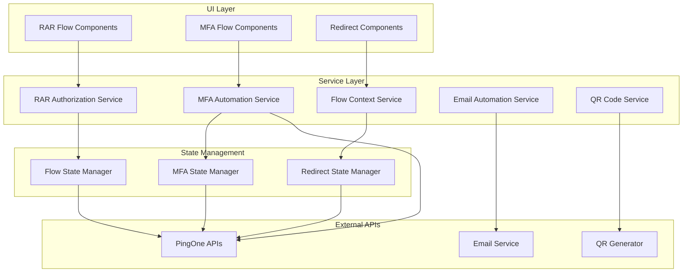

# Design Document

## Overview

This design addresses critical authentication flow issues in the PingOne OAuth Playground by implementing comprehensive fixes for Rich Authorization Requests (RAR), redirect handling, PingOne MFA enhancements, and email automation. The solution builds upon the existing V5/V6 service architecture while introducing new services and components to handle advanced authentication scenarios.

The design leverages existing patterns from the codebase, including the established service layer architecture, flow state management, and UI component patterns, while introducing minimal breaking changes to maintain backward compatibility.

## Architecture

### High-Level Architecture



### Service Integration Pattern

The design follows the established V5/V6 service architecture pattern:
- Services handle business logic and API interactions
- Components consume services through dependency injection
- State management is centralized through dedicated state managers
- Error handling follows existing patterns with enhanced error recovery

## Components and Interfaces

### 1. RAR Authorization Enhancement

#### RARAuthorizationService
```typescript
interface RARAuthorizationService {
  validateAuthorizationDetails(details: AuthorizationDetail[]): ValidationResult;
  buildAuthorizationRequest(config: RARConfig): AuthorizationRequest;
  parseAuthorizationResponse(response: AuthorizationResponse): RARTokens;
  getExampleAuthorizationDetails(): AuthorizationDetail[];
}

interface AuthorizationDetail {
  type: string;
  actions?: string[];
  datatypes?: string[];
  locations?: string[];
  // Additional fields based on type
  [key: string]: any;
}

interface RARConfig extends OAuthConfig {
  authorization_details: AuthorizationDetail[];
}
```

**Implementation Strategy:**
- Extend existing `rarService.ts` to support the customer_information example pattern
- Add validation for required fields based on authorization detail type
- Integrate with existing flow components (RARFlowV5.tsx, RARFlowV6.tsx)
- Maintain backward compatibility with existing RAR implementations

#### RAR UI Components
- **AuthorizationDetailsEditor**: JSON editor with validation and examples
- **RARExampleSelector**: Pre-built authorization detail templates
- **RARValidationDisplay**: Real-time validation feedback

### 2. Flow Context and Redirect Management

#### FlowContextService
```typescript
interface FlowContextService {
  saveFlowContext(flowId: string, context: FlowContext): void;
  getFlowContext(flowId: string): FlowContext | null;
  clearFlowContext(flowId: string): void;
  buildReturnPath(flowType: string, stepId?: string): string;
}

interface FlowContext {
  flowType: string;
  currentStep: number;
  returnPath: string;
  flowState: Record<string, any>;
  timestamp: number;
}
```

**Implementation Strategy:**
- Enhance existing `NewAuthContext.tsx` flow context handling
- Replace hardcoded `/dashboard` redirects with dynamic flow context returns
- Implement flow-specific return path generation
- Add flow context validation and recovery mechanisms

#### RedirectStateManager
```typescript
interface RedirectStateManager {
  preserveFlowState(flowId: string, state: FlowState): void;
  restoreFlowState(flowId: string): FlowState | null;
  handleRedirectReturn(callbackData: CallbackData): RedirectResult;
  validateRedirectSecurity(context: FlowContext): boolean;
}
```

### 3. MFA Enhancement Services

#### MFAAutomationService
```typescript
interface MFAAutomationService {
  generateQRCode(totpSecret: string, accountName: string): Promise<QRCodeData>;
  sendActivationEmail(userId: string, deviceId: string): Promise<EmailResult>;
  sendVerificationCode(userId: string, method: MFAMethod): Promise<CodeResult>;
  validateMFASetup(deviceId: string, verificationCode: string): Promise<ValidationResult>;
}

interface QRCodeData {
  qrCodeUrl: string;
  totpUri: string;
  backupCodes: string[];
  manualEntryKey: string;
}

interface EmailResult {
  success: boolean;
  messageId?: string;
  error?: string;
  retryAfter?: number;
}
```

**Implementation Strategy:**
- Extend existing `PingOneMfaService` with automation capabilities
- Integrate with PingOne MFA APIs for device registration and activation
- Add QR code generation using standard TOTP URI format
- Implement email service integration for automated delivery

#### QRCodeService
```typescript
interface QRCodeService {
  generateTOTPQRCode(secret: string, issuer: string, accountName: string): Promise<string>;
  generateManualEntryCode(secret: string): string;
  validateTOTPCode(secret: string, code: string): boolean;
}
```

#### EmailAutomationService
```typescript
interface EmailAutomationService {
  sendMFAActivationEmail(config: ActivationEmailConfig): Promise<EmailResult>;
  sendVerificationCode(config: CodeEmailConfig): Promise<EmailResult>;
  getEmailTemplate(templateType: EmailTemplateType): EmailTemplate;
  validateEmailDelivery(messageId: string): Promise<DeliveryStatus>;
}
```

### 4. Enhanced MFA Flow Components

#### MFADeviceRegistration Component
- Automatic QR code generation and display
- Manual entry fallback options
- Real-time validation feedback
- Backup code generation and display

#### MFAEmailVerification Component
- Automatic email sending with confirmation
- Resend functionality with rate limiting
- Email delivery status tracking
- Alternative verification methods

## Data Models

### Enhanced Flow State Model
```typescript
interface EnhancedFlowState {
  flowId: string;
  flowType: 'rar' | 'mfa' | 'standard';
  currentStep: number;
  stepHistory: FlowStep[];
  context: FlowContext;
  mfaState?: MFAFlowState;
  rarState?: RARFlowState;
  redirectState?: RedirectState;
}

interface MFAFlowState {
  deviceId?: string;
  registrationStatus: 'pending' | 'active' | 'failed';
  verificationMethod: 'totp' | 'email' | 'sms';
  qrCodeData?: QRCodeData;
  emailStatus?: EmailDeliveryStatus;
}

interface RARFlowState {
  authorizationDetails: AuthorizationDetail[];
  validationStatus: ValidationResult;
  approvedScopes?: string[];
}
```

### MFA Device Model Enhancement
```typescript
interface EnhancedMFADevice extends MfaDevice {
  qrCodeUrl?: string;
  totpSecret?: string;
  backupCodes?: string[];
  activationStatus: 'pending' | 'email_sent' | 'activated' | 'failed';
  emailDeliveryStatus?: EmailDeliveryStatus;
}
```

## Error Handling

### Comprehensive Error Recovery System

#### Error Categories and Handling
1. **RAR Validation Errors**
   - Real-time validation with specific field-level feedback
   - Example suggestions for common authorization detail types
   - Graceful degradation to standard OAuth when RAR fails

2. **Redirect Context Errors**
   - Flow context corruption detection and recovery
   - Fallback to safe default paths with user notification
   - Session state validation and cleanup

3. **MFA Setup Errors**
   - QR code generation fallback to manual entry
   - Email delivery failure with alternative methods
   - Device registration retry mechanisms

4. **Network and Service Errors**
   - Automatic retry with exponential backoff
   - Offline mode detection and user guidance
   - Service degradation notifications

#### Error Recovery Patterns
```typescript
interface ErrorRecoveryService {
  handleRARValidationError(error: RARError): RecoveryAction;
  handleRedirectContextError(error: ContextError): RecoveryAction;
  handleMFASetupError(error: MFAError): RecoveryAction;
  handleNetworkError(error: NetworkError): RecoveryAction;
}

interface RecoveryAction {
  type: 'retry' | 'fallback' | 'redirect' | 'manual';
  message: string;
  action?: () => Promise<void>;
  fallbackOptions?: string[];
}
```

## Testing Strategy

### Unit Testing Approach
1. **Service Layer Testing**
   - Mock PingOne API responses for all scenarios
   - Test error handling and recovery mechanisms
   - Validate state management and persistence

2. **Component Testing**
   - Test RAR authorization details editor with various inputs
   - Verify MFA QR code display and fallback behaviors
   - Test redirect flow preservation across navigation

3. **Integration Testing**
   - End-to-end flow testing with mock services
   - Cross-browser compatibility for QR code generation
   - Email delivery testing with test accounts

### Testing Tools and Patterns
- Jest for unit testing with existing patterns
- React Testing Library for component testing
- Mock Service Worker (MSW) for API mocking
- Cypress for end-to-end flow testing

### Test Data and Scenarios
```typescript
// Test authorization details for different scenarios
const testAuthorizationDetails = {
  customerInformation: {
    type: "customer_information",
    actions: ["read", "write"],
    datatypes: ["contacts", "photos"],
    locations: ["https://api.example.com/customers"]
  },
  paymentInitiation: {
    type: "payment_initiation",
    instructedAmount: { amount: "250.00", currency: "USD" },
    creditorName: "ABC Supplies",
    creditorAccount: { iban: "DE89370400440532013000" }
  }
};
```

## Security Considerations

### RAR Security Implementation
1. **Authorization Details Validation**
   - Strict JSON schema validation for all authorization detail types
   - Whitelist approach for allowed resource types and actions
   - Input sanitization to prevent injection attacks

2. **Scope Limitation**
   - Ensure authorization details don't exceed granted scopes
   - Validate resource access permissions
   - Implement principle of least privilege

### Flow Context Security
1. **State Protection**
   - Encrypt sensitive flow state data in session storage
   - Implement CSRF protection for flow transitions
   - Validate flow context integrity on restoration

2. **Redirect Security**
   - Strict redirect URI validation
   - Flow context tampering detection
   - Session hijacking prevention

### MFA Security Enhancements
1. **TOTP Implementation**
   - Secure random secret generation
   - Time-based validation with clock skew tolerance
   - Backup code generation and secure storage

2. **Email Security**
   - Rate limiting for email sending
   - Secure token generation for activation links
   - Email delivery confirmation without exposing sensitive data

## Performance Optimization

### Lazy Loading and Code Splitting
- Dynamic imports for MFA-specific components
- QR code generation on-demand
- Email service initialization only when needed

### Caching Strategy
- Cache QR code generation results
- Store email templates locally
- Implement flow state caching with TTL

### Resource Management
- Cleanup flow contexts on completion
- Garbage collection for expired states
- Memory-efficient QR code generation

## Migration and Deployment Strategy

### Backward Compatibility
- Maintain existing RAR service API compatibility
- Preserve current MFA flow functionality during enhancement
- Gradual rollout of new redirect handling

### Feature Flags
- Enable/disable enhanced RAR validation
- Toggle automatic email sending
- Control QR code generation availability

### Rollback Plan
- Maintain fallback to existing implementations
- Database migration reversibility
- Service degradation graceful handling

This design provides a comprehensive solution for the identified authentication flow issues while maintaining system stability and following established architectural patterns.