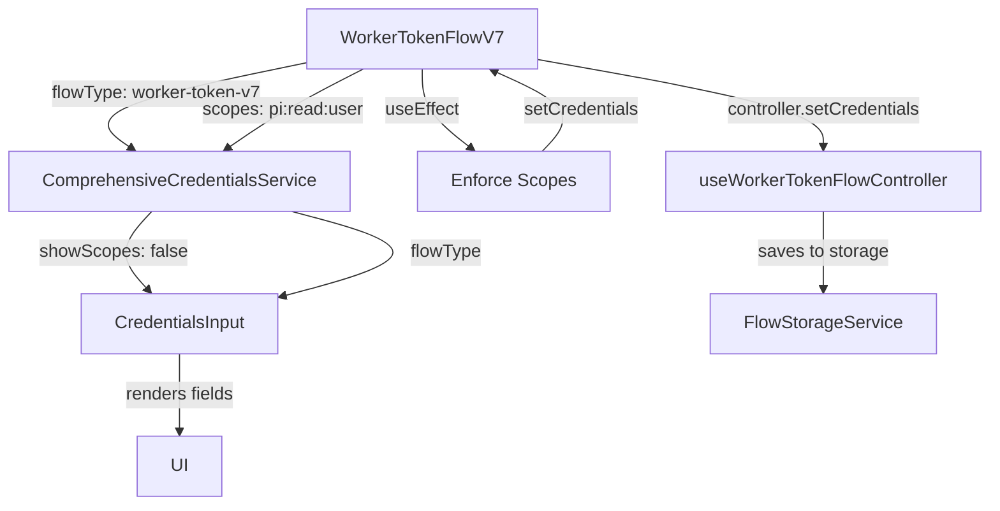

# Worker Token V7 Flow Cleanup - Design Document

## Overview

This design document outlines the technical approach for improving the Worker Token V7 Flow user experience by adding educational content, hiding unnecessary fields, and auto-configuring scopes. The solution focuses on three main areas:

1. **Educational Content Component** - A new reusable component to explain worker token concepts
2. **Field Visibility Logic** - Enhanced conditional rendering in CredentialsInput component
3. **Automatic Scope Management** - Enforced default scope configuration in WorkerTokenFlowV7

The design maintains backward compatibility with existing flows while providing a specialized experience for worker token authentication.

## Architecture

### Component Hierarchy

```
WorkerTokenFlowV7
├── FlowHeader (existing)
├── WorkerTokenEducationalPanel (new)
│   ├── OverviewSection
│   ├── AuthorizationModelSection
│   ├── TokenTypesSection
│   └── UseCaseSection
├── ComprehensiveCredentialsService (existing)
│   └── CredentialsInput (modified)
│       ├── EnvironmentIdInput
│       ├── ClientIdInput
│       ├── ClientSecretInput
│       ├── [Scopes Input - conditionally hidden]
│       └── [Response Type - already hidden]
└── StepNavigationButtons (existing)
```

### Data Flow



## Components and Interfaces

### 1. WorkerTokenEducationalPanel (New Component)

**Purpose**: Display educational content about worker tokens, authorization models, and token types.

**Location**: `src/components/WorkerTokenEducationalPanel.tsx`

**Props Interface**:
```typescript
interface WorkerTokenEducationalPanelProps {
  variant?: 'full' | 'compact';
  showAuthorizationModel?: boolean;
  showTokenTypes?: boolean;
  showUseCases?: boolean;
  className?: string;
}
```

**Sections**:

1. **Overview Section**
   - What worker tokens are
   - Client Credentials flow identification
   - PingOne Management API purpose

2. **Authorization Model Section**
   - PingOne Roles vs OAuth Scopes
   - Where to configure roles (PingOne Admin Console)
   - How roles control API permissions

3. **Token Types Section**
   - What you get: Access token
   - What you don't get: ID token, Refresh token
   - How to refresh access tokens

4. **Use Cases Section**
   - PingOne admin functions
   - Example API operations
   - When NOT to use worker tokens

**Styling**:
- Gradient background: `linear-gradient(135deg, #667eea 0%, #764ba2 100%)`
- White text with high contrast
- Rounded corners: `12px`
- Box shadow for elevation
- Responsive grid layout for sections
- Icons for visual hierarchy

### 2. CredentialsInput Component (Modified)

**Changes Required**:

Add new prop to control scopes field visibility:

```typescript
interface CredentialsInputProps {
  // ... existing props
  showScopes?: boolean; // NEW: Control scopes field visibility
  flowType?: string; // NEW: Flow type for conditional logic
}
```

**Conditional Rendering Logic**:

```typescript
// Determine if scopes should be shown
const shouldShowScopes = useMemo(() => {
  // If explicitly set, use that value
  if (showScopes !== undefined) return showScopes;
  
  // Hide for worker token flows
  if (flowType?.includes('worker-token') || flowType?.includes('client-credentials')) {
    return false;
  }
  
  // Show by default for other flows
  return true;
}, [showScopes, flowType]);
```

**Rendering**:

```typescript
{shouldShowScopes && (
  <InputGroup>
    <Label>Scopes</Label>
    <Input
      type="text"
      value={scopes || ''}
      onChange={(e) => onScopesChange?.(e.target.value)}
      placeholder="openid profile email"
    />
  </InputGroup>
)}
```

### 3. ComprehensiveCredentialsService (Modified)

**Changes Required**:

Pass `showScopes` prop to CredentialsInput based on flow type:

```typescript
// Determine if scopes should be shown
const shouldShowScopes = useMemo(() => {
  const normalizedFlowType = flowType?.toLowerCase().replace(/[-_]/g, '-') || '';
  
  // Hide scopes for flows that don't use them for authorization
  if (normalizedFlowType.includes('worker-token') || 
      normalizedFlowType.includes('client-credentials')) {
    return false;
  }
  
  return true;
}, [flowType]);

// Pass to CredentialsInput
<CredentialsInput
  // ... existing props
  showScopes={shouldShowScopes}
  flowType={flowType}
/>
```

### 4. WorkerTokenFlowV7 Component (Modified)

**Changes Required**:

1. **Add Educational Panel**:
```typescript
const renderStep0 = () => (
  <StepContainer>
    <StepTitle>
      <FiKey /> Configure Worker Token Credentials
    </StepTitle>
    
    {/* NEW: Educational Panel */}
    <WorkerTokenEducationalPanel 
      variant="full"
      showAuthorizationModel={true}
      showTokenTypes={true}
      showUseCases={true}
    />
    
    <ComprehensiveCredentialsService
      flowType="worker-token-v7"
      // ... rest of props
    />
  </StepContainer>
);
```

2. **Enforce Default Scopes**:
```typescript
// Initialize with default scope
const [credentials, setCredentials] = useState({
  ...controller.credentials,
  scopes: 'pi:read:user',
  scope: 'pi:read:user'
});

// Enforce scope on mount and credential changes
useEffect(() => {
  const enforcedCredentials = {
    ...controller.credentials,
    scopes: 'pi:read:user',
    scope: 'pi:read:user'
  };
  
  setCredentials(enforcedCredentials);
  controller.setCredentials(enforcedCredentials);
}, [controller.credentials.environmentId, controller.credentials.clientId]);

// Override saved credentials
useEffect(() => {
  if (hasSavedCredentials) {
    const credentials = checkSavedCredentials();
    if (credentials) {
      const updated = {
        ...credentials,
        scopes: 'pi:read:user', // Always override
        scope: 'pi:read:user'
      };
      setCredentials(updated);
      controller.setCredentials(updated);
    }
  }
}, [hasSavedCredentials]);
```

3. **Update Page Header**:
```typescript
<FlowHeader
  title="PingOne Worker Token Flow (Client Credentials)"
  description="Generate worker tokens for machine-to-machine authentication with PingOne Management APIs using OAuth 2.0 Client Credentials grant."
  flowId="worker-token-v7"
  version="7.0"
/>
```

## Data Models

### WorkerTokenCredentials

```typescript
interface WorkerTokenCredentials {
  environmentId: string;
  clientId: string;
  clientSecret: string;
  scopes: 'pi:read:user'; // Fixed value
  scope: 'pi:read:user'; // Fixed value (alias)
  grantType: 'client_credentials'; // Fixed value
  tokenEndpoint?: string;
  introspectionEndpoint?: string;
  userInfoEndpoint?: string;
  clientAuthMethod?: 'client_secret_post' | 'client_secret_basic';
}
```

### EducationalContent

```typescript
interface EducationalContent {
  overview: {
    title: string;
    description: string;
    keyPoints: string[];
  };
  authorizationModel: {
    title: string;
    rolesExplanation: string;
    scopesExplanation: string;
    configurationGuidance: string;
  };
  tokenTypes: {
    included: TokenType[];
    excluded: TokenType[];
    refreshGuidance: string;
  };
  useCases: {
    appropriate: string[];
    inappropriate: string[];
    examples: APIExample[];
  };
}

interface TokenType {
  name: string;
  description: string;
  icon: string;
}

interface APIExample {
  operation: string;
  endpoint: string;
  description: string;
}
```

## Error Handling

### Scope Override Validation

```typescript
// Validate and enforce scope
const validateAndEnforceScope = (credentials: any): WorkerTokenCredentials => {
  if (credentials.scopes !== 'pi:read:user' || credentials.scope !== 'pi:read:user') {
    console.warn('[WorkerToken] Overriding invalid scopes:', {
      provided: credentials.scopes,
      enforced: 'pi:read:user'
    });
    
    v4ToastManager.showInfo(
      'Worker token scope automatically set to pi:read:user',
      { duration: 3000 }
    );
  }
  
  return {
    ...credentials,
    scopes: 'pi:read:user',
    scope: 'pi:read:user'
  };
};
```

### Field Visibility Errors

```typescript
// Graceful fallback if flowType is undefined
const shouldShowScopes = useMemo(() => {
  try {
    if (showScopes !== undefined) return showScopes;
    if (!flowType) return true; // Default to showing
    
    const normalized = flowType.toLowerCase().replace(/[-_]/g, '-');
    return !normalized.includes('worker-token') && 
           !normalized.includes('client-credentials');
  } catch (error) {
    console.error('[CredentialsInput] Error determining scope visibility:', error);
    return true; // Fail open - show the field
  }
}, [showScopes, flowType]);
```

## Testing Strategy

### Unit Tests

1. **WorkerTokenEducationalPanel.test.tsx**
   - Renders all sections correctly
   - Respects variant prop (full vs compact)
   - Conditional section rendering based on props
   - Accessibility compliance (ARIA labels, semantic HTML)

2. **CredentialsInput.test.tsx**
   - Scopes field hidden when `showScopes={false}`
   - Scopes field hidden for worker-token flowType
   - Scopes field shown for other flow types
   - Backward compatibility (shows by default if no props)

3. **WorkerTokenFlowV7.test.tsx**
   - Educational panel renders in Step 0
   - Scopes automatically set to 'pi:read:user'
   - Scopes override saved credentials
   - Credentials sync with controller

### Integration Tests

1. **Worker Token Flow End-to-End**
   - User navigates to Worker Token Flow
   - Educational content displays
   - Scopes field is hidden
   - Response type field is hidden
   - Token request includes 'pi:read:user' scope
   - Token successfully generated

2. **Credential Persistence**
   - Save credentials with different scopes
   - Reload page
   - Verify scopes reset to 'pi:read:user'

3. **Cross-Flow Compatibility**
   - Navigate to Authorization Code Flow
   - Verify scopes field is visible
   - Navigate back to Worker Token Flow
   - Verify scopes field is hidden

### Visual Regression Tests

1. Educational panel styling
2. Credential form layout without scopes field
3. Responsive design on mobile/tablet
4. Dark mode compatibility (if applicable)

## Implementation Phases

### Phase 1: Educational Component (Requirements 1, 2, 5, 6, 7, 8)
- Create WorkerTokenEducationalPanel component
- Implement all content sections
- Add styling and responsive design
- Write unit tests

### Phase 2: Field Visibility (Requirements 3, 4)
- Add `showScopes` prop to CredentialsInput
- Implement conditional rendering logic
- Update ComprehensiveCredentialsService
- Verify response type already hidden
- Write unit tests

### Phase 3: Scope Auto-Configuration (Requirement 4)
- Update WorkerTokenFlowV7 initialization
- Add scope enforcement logic
- Override saved credentials
- Add validation and warnings
- Write unit tests

### Phase 4: Integration (All Requirements)
- Integrate educational panel into WorkerTokenFlowV7
- Update page header and descriptions
- End-to-end testing
- Visual regression testing
- Documentation updates

## Security Considerations

### Scope Enforcement

**Risk**: User manually modifies localStorage to set different scopes
**Mitigation**: Always validate and override scopes in useEffect hooks

```typescript
useEffect(() => {
  // Always enforce correct scope, even if storage is tampered
  const enforced = validateAndEnforceScope(credentials);
  if (enforced.scopes !== credentials.scopes) {
    setCredentials(enforced);
    controller.setCredentials(enforced);
  }
}, [credentials.scopes]);
```

### Client Secret Handling

**Risk**: Client secret exposed in educational examples
**Mitigation**: Never display actual client secret in educational content, use placeholders

```typescript
// In educational examples
const exampleCode = `
const clientSecret = 'YOUR_CLIENT_SECRET'; // Never hardcode in production
`;
```

### Token Storage

**Risk**: Worker token stored in localStorage accessible to XSS
**Mitigation**: Document security best practices in educational content

```typescript
<SecurityNote>
  ⚠️ Worker tokens should be used server-side only. Never expose client 
  credentials or worker tokens in client-side JavaScript in production.
</SecurityNote>
```

## Performance Considerations

### Component Rendering

- **Educational Panel**: Memoize with `React.memo` to prevent unnecessary re-renders
- **Conditional Logic**: Use `useMemo` for expensive computations
- **Scope Enforcement**: Debounce validation to avoid excessive updates

```typescript
const WorkerTokenEducationalPanel = React.memo<WorkerTokenEducationalPanelProps>(
  ({ variant, showAuthorizationModel, showTokenTypes, showUseCases }) => {
    // Component implementation
  }
);

// Debounced scope validation
const debouncedValidation = useMemo(
  () => debounce(validateAndEnforceScope, 300),
  []
);
```

### Bundle Size

- Educational content: ~5KB (text + JSX)
- No additional dependencies required
- Reuse existing styled-components
- Total impact: <10KB gzipped

## Accessibility

### WCAG 2.1 AA Compliance

1. **Color Contrast**
   - Educational panel text: 4.5:1 minimum
   - Gradient background with white text: 7:1 ratio
   - Icon colors meet contrast requirements

2. **Keyboard Navigation**
   - All interactive elements focusable
   - Logical tab order
   - Focus indicators visible

3. **Screen Reader Support**
   - Semantic HTML (section, article, aside)
   - ARIA labels for icons
   - Descriptive link text

```typescript
<section aria-labelledby="worker-token-overview">
  <h3 id="worker-token-overview">About Worker Tokens</h3>
  <p>Worker tokens are special access tokens...</p>
</section>
```

4. **Content Structure**
   - Proper heading hierarchy (h2 → h3 → h4)
   - Lists for scannable content
   - Clear visual hierarchy

## Browser Compatibility

- Chrome 90+ ✅
- Firefox 88+ ✅
- Safari 14+ ✅
- Edge 90+ ✅

No browser-specific features required. Uses standard React, styled-components, and ES6+ features supported by all modern browsers.

## Backward Compatibility

### Existing Flows

- Other flows (Authorization Code, Implicit, etc.) unaffected
- CredentialsInput defaults to showing scopes if `showScopes` prop not provided
- ComprehensiveCredentialsService maintains existing behavior for non-worker flows

### Saved Credentials

- Existing saved credentials with different scopes will be overridden
- User notification via toast message when override occurs
- No data loss - original credentials preserved in storage, just overridden in memory

### API Contracts

- No changes to token endpoint requests
- No changes to controller interfaces
- No changes to storage service APIs

## Migration Path

### For Users

1. Navigate to Worker Token Flow
2. See educational content (new)
3. Notice scopes field hidden (change)
4. Scope automatically set to 'pi:read:user' (change)
5. Generate token as before (unchanged)

### For Developers

1. No code changes required in consuming components
2. Educational panel available for reuse in other flows
3. `showScopes` prop available for other specialized flows
4. Scope enforcement pattern reusable for other flows

## Future Enhancements

### Potential Improvements

1. **Dynamic Scope Selection**
   - Allow advanced users to select from predefined PingOne Management API scopes
   - Dropdown with scope descriptions
   - Validation against available scopes

2. **Role Visualization**
   - Fetch and display assigned PingOne Roles
   - Show what API operations are permitted
   - Link to role configuration in Admin Console

3. **Interactive Examples**
   - Live API call tester
   - Copy-paste code snippets
   - Postman collection generator

4. **Educational Content Expansion**
   - Video tutorials
   - Interactive diagrams
   - Troubleshooting guide

5. **Scope Recommendations**
   - Analyze intended use case
   - Recommend appropriate scopes
   - Warn about over-permissioned scopes

## Documentation Updates

### User Documentation

- Update Worker Token Flow guide
- Add section on PingOne Roles vs OAuth Scopes
- Document automatic scope configuration
- Add troubleshooting section

### Developer Documentation

- Document WorkerTokenEducationalPanel component API
- Update CredentialsInput prop documentation
- Add examples of scope enforcement pattern
- Document testing strategies

### API Documentation

- No changes required (no API modifications)

## Rollout Plan

### Phase 1: Development (Week 1)
- Implement WorkerTokenEducationalPanel
- Add showScopes prop to CredentialsInput
- Write unit tests

### Phase 2: Integration (Week 1)
- Integrate into WorkerTokenFlowV7
- Add scope enforcement logic
- Integration testing

### Phase 3: QA (Week 2)
- Manual testing
- Visual regression testing
- Accessibility audit
- Cross-browser testing

### Phase 4: Deployment (Week 2)
- Deploy to staging
- User acceptance testing
- Deploy to production
- Monitor for issues

### Phase 5: Documentation (Week 2)
- Update user guides
- Update developer docs
- Create video tutorial
- Announce changes

## Success Metrics

### User Experience

- Reduced confusion about worker token purpose (survey)
- Decreased support tickets about scopes/response type
- Increased successful token generation rate
- Positive user feedback on educational content

### Technical

- Zero regression bugs in other flows
- <100ms performance impact
- 100% test coverage for new code
- Zero accessibility violations

### Adoption

- 90%+ of worker token users see educational content
- 100% of worker token requests use correct scope
- Zero manual scope configuration required
- Reduced time to first successful token

## Conclusion

This design provides a comprehensive solution for improving the Worker Token V7 Flow user experience. By adding educational content, hiding unnecessary fields, and auto-configuring scopes, we reduce confusion and ensure correct configuration. The design maintains backward compatibility, follows React best practices, and provides a foundation for future enhancements.
