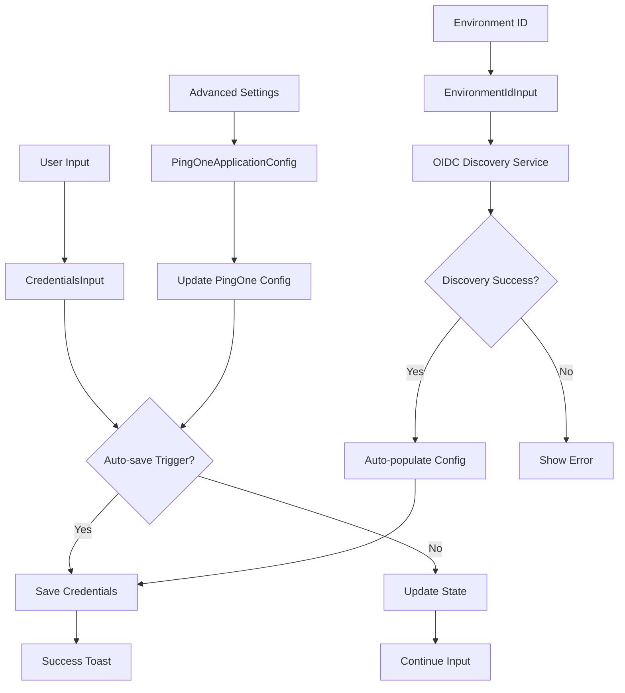

# OAuth Playground Credentials Services Mock

## What CredentialsInput Does

The `CredentialsInput` component is a comprehensive form that handles OAuth/OIDC credential input with the following features:

### Core Functionality:
- **Environment ID Input**: PingOne environment identifier with validation
- **Client ID Input**: OAuth application client identifier 
- **Client Secret Input**: OAuth application secret (with show/hide toggle)
- **Redirect URI Input**: OAuth callback URL
- **Scopes Input**: OAuth permission scopes
- **Login Hint Input**: Pre-populate user login field
- **Response Mode Selection**: OAuth response delivery method
- **Copy Functionality**: One-click copy for all fields
- **Validation**: Real-time field validation with error states
- **Auto-save Integration**: Triggers automatic credential persistence

## Three Key Services Integration

### 1. CredentialsInput Service
**Location**: `/src/components/CredentialsInput.tsx`
**Purpose**: Main credential input interface
**Key Features**:
- Grid-based form layout
- Field validation and error handling  
- Copy-to-clipboard functionality
- Integration with EnvironmentIdInput
- Response mode selection
- Auto-save callback triggers

### 2. OIDC Discovery Service  
**Location**: `/src/services/oidcDiscoveryService.ts`
**Purpose**: Automatic OIDC endpoint discovery
**Key Features**:
- Fetch `.well-known/openid_configuration`
- Extract authorization, token, userinfo endpoints
- Environment ID extraction from PingOne issuers
- Validation of OIDC provider capabilities
- Automatic configuration population

### 3. PingOne Application Configuration Service
**Location**: `/src/components/PingOneApplicationConfig.tsx` 
**Purpose**: Advanced PingOne-specific settings
**Key Features**:
- Client authentication methods (client_secret_post, private_key_jwt, etc.)
- PKCE enforcement settings
- Response types and grant types
- JWT authentication with private keys
- JWKS configuration
- Pushed Authorization Request (PAR) settings
- Advanced security features
- CORS and session management

## Mock Implementation Example

```typescript
import React, { useState, useCallback } from 'react';
import { CredentialsInput } from '../components/CredentialsInput';
import EnvironmentIdInput from '../components/EnvironmentIdInput';
import PingOneApplicationConfig, { PingOneApplicationState } from '../components/PingOneApplicationConfig';
import { oidcDiscoveryService } from '../services/oidcDiscoveryService';
import { v4ToastManager } from '../utils/v4ToastMessages';

interface MockCredentials {
  environmentId: string;
  clientId: string;
  clientSecret: string;
  redirectUri: string;
  scopes: string;
  loginHint: string;
}

export const CredentialsServicesMock: React.FC = () => {
  // 1. Core Credentials State
  const [credentials, setCredentials] = useState<MockCredentials>({
    environmentId: '',
    clientId: '',
    clientSecret: '',
    redirectUri: 'https://localhost:3000/callback',
    scopes: 'openid profile email',
    loginHint: ''
  });

  // 2. OIDC Discovery State
  const [discoveryResult, setDiscoveryResult] = useState<any>(null);
  const [isDiscovering, setIsDiscovering] = useState(false);

  // 3. PingOne Advanced Configuration State
  const [pingOneConfig, setPingOneConfig] = useState<PingOneApplicationState>({
    clientAuthMethod: 'client_secret_post',
    allowRedirectUriPatterns: false,
    pkceEnforcement: 'REQUIRED',
    responseTypeCode: true,
    responseTypeToken: false,
    responseTypeIdToken: true,
    grantTypeAuthorizationCode: true,
    initiateLoginUri: '',
    targetLinkUri: '',
    signoffUrls: [],
    requestParameterSignatureRequirement: 'DEFAULT',
    enableJWKS: false,
    jwksMethod: 'JWKS_URL',
    jwksUrl: '',
    jwks: '',
    requirePushedAuthorizationRequest: false,
    pushedAuthorizationRequestTimeout: 600,
    additionalRefreshTokenReplayProtection: false,
    includeX5tParameter: false,
    oidcSessionManagement: false,
    requestScopesForMultipleResources: false,
    terminateUserSessionByIdToken: false,
    corsOrigins: [],
    corsAllowAnyOrigin: false
  });

  // Auto-save functionality
  const autoSaveCredentials = useCallback(async () => {
    if (credentials.environmentId.trim() && credentials.clientId.trim()) {
      console.log('🔄 Auto-saving credentials:', credentials);
      // Here you would call your actual save service
      // await credentialsService.save(credentials);
      v4ToastManager.showSuccess('Credentials auto-saved successfully!');
    }
  }, [credentials]);

  // Handle field changes with auto-save
  const handleFieldChange = useCallback(async (field: keyof MockCredentials, value: string) => {
    const updatedCredentials = { ...credentials, [field]: value };
    setCredentials(updatedCredentials);
    
    // Auto-save logic
    if (field === 'environmentId' && value.trim() && updatedCredentials.clientId.trim()) {
      await autoSaveCredentials();
    } else if (field === 'clientId' && value.trim() && updatedCredentials.environmentId.trim()) {
      await autoSaveCredentials();
    } else if (field === 'clientSecret' && value.trim() && 
               updatedCredentials.environmentId.trim() && updatedCredentials.clientId.trim()) {
      await autoSaveCredentials();
    }
  }, [credentials, autoSaveCredentials]);

  // Handle OIDC Discovery
  const handleDiscoveryComplete = useCallback(async (result: any) => {
    setIsDiscovering(false);
    if (result.success && result.document) {
      console.log('🎯 OIDC Discovery completed:', result.document);
      setDiscoveryResult(result.document);
      
      // Auto-populate environment ID if it's a PingOne issuer
      const envId = oidcDiscoveryService.extractEnvironmentId(result.document.issuer);
      if (envId) {
        await handleFieldChange('environmentId', envId);
        if (credentials.clientId.trim()) {
          v4ToastManager.showSuccess('Configuration auto-saved after OIDC discovery');
        }
      }
    } else {
      v4ToastManager.showError('OIDC Discovery failed: ' + result.error);
    }
  }, [credentials.clientId, handleFieldChange]);

  // Handle PingOne config changes
  const handlePingOneConfigChange = useCallback(async (config: PingOneApplicationState) => {
    setPingOneConfig(config);
    console.log('⚙️ PingOne config updated:', config);
    
    // Auto-save if we have essential credentials
    if (credentials.environmentId.trim() && credentials.clientId.trim()) {
      await autoSaveCredentials();
      v4ToastManager.showSuccess('Configuration auto-saved after PingOne settings update');
    }
  }, [credentials, autoSaveCredentials]);

  // Copy functionality
  const handleCopy = useCallback((text: string, label: string) => {
    navigator.clipboard.writeText(text);
    v4ToastManager.showSuccess(`${label} copied to clipboard!`);
  }, []);

  return (
    <div style={{ padding: '2rem', maxWidth: '1200px', margin: '0 auto' }}>
      <h1>OAuth Playground Credentials Services Mock</h1>
      
      {/* 1. EnvironmentIdInput with OIDC Discovery */}
      <section style={{ marginBottom: '2rem' }}>
        <h2>🌐 OIDC Discovery Service</h2>
        <EnvironmentIdInput
          initialEnvironmentId={credentials.environmentId}
          onEnvironmentIdChange={(envId) => handleFieldChange('environmentId', envId)}
          onDiscoveryComplete={handleDiscoveryComplete}
          showSuggestions={true}
          autoDiscover={true}
        />
        
        {discoveryResult && (
          <div style={{ marginTop: '1rem', padding: '1rem', background: '#f0f9ff', border: '1px solid #0ea5e9', borderRadius: '8px' }}>
            <h4>🎯 Discovery Result:</h4>
            <pre style={{ fontSize: '0.875rem', overflow: 'auto' }}>
              {JSON.stringify(discoveryResult, null, 2)}
            </pre>
          </div>
        )}
      </section>

      {/* 2. CredentialsInput Component */}
      <section style={{ marginBottom: '2rem' }}>
        <h2>🔑 Credentials Input Service</h2>
        <CredentialsInput
          environmentId={credentials.environmentId}
          clientId={credentials.clientId}
          clientSecret={credentials.clientSecret}
          redirectUri={credentials.redirectUri}
          scopes={credentials.scopes}
          loginHint={credentials.loginHint}
          onEnvironmentIdChange={(value) => handleFieldChange('environmentId', value)}
          onClientIdChange={(value) => handleFieldChange('clientId', value)}
          onClientSecretChange={(value) => handleFieldChange('clientSecret', value)}
          onRedirectUriChange={(value) => handleFieldChange('redirectUri', value)}
          onScopesChange={(value) => handleFieldChange('scopes', value)}
          onLoginHintChange={(value) => handleFieldChange('loginHint', value)}
          onCopy={handleCopy}
          showRedirectUri={true}
          showLoginHint={true}
          showClientSecret={true}
          showEnvironmentIdInput={false} // Using separate EnvironmentIdInput above
          onDiscoveryComplete={handleDiscoveryComplete}
        />
      </section>

      {/* 3. PingOne Application Configuration */}
      <section style={{ marginBottom: '2rem' }}>
        <h2>⚙️ PingOne Advanced Configuration Service</h2>
        <PingOneApplicationConfig
          value={pingOneConfig}
          onChange={handlePingOneConfigChange}
        />
      </section>

      {/* Current State Display */}
      <section>
        <h2>📊 Current State</h2>
        <div style={{ display: 'grid', gridTemplateColumns: '1fr 1fr 1fr', gap: '1rem' }}>
          
          <div style={{ padding: '1rem', background: '#fef3c7', border: '1px solid #f59e0b', borderRadius: '8px' }}>
            <h4>Credentials</h4>
            <pre style={{ fontSize: '0.75rem', overflow: 'auto' }}>
              {JSON.stringify(credentials, null, 2)}
            </pre>
          </div>
          
          <div style={{ padding: '1rem', background: '#dbeafe', border: '1px solid #3b82f6', borderRadius: '8px' }}>
            <h4>Discovery Status</h4>
            <p>Discovering: {isDiscovering ? 'Yes' : 'No'}</p>
            <p>Result: {discoveryResult ? 'Available' : 'None'}</p>
            {discoveryResult && (
              <p>Issuer: {discoveryResult.issuer}</p>
            )}
          </div>
          
          <div style={{ padding: '1rem', background: '#dcfce7', border: '1px solid #22c55e', borderRadius: '8px' }}>
            <h4>PingOne Config</h4>
            <p>Auth Method: {pingOneConfig.clientAuthMethod}</p>
            <p>PKCE: {pingOneConfig.pkceEnforcement}</p>
            <p>Response Types: {[
              pingOneConfig.responseTypeCode && 'code',
              pingOneConfig.responseTypeToken && 'token', 
              pingOneConfig.responseTypeIdToken && 'id_token'
            ].filter(Boolean).join(', ')}</p>
          </div>
        </div>
      </section>
    </div>
  );
};

export default CredentialsServicesMock;
```

## Service Integration Flow



## Key Auto-save Triggers

1. **Environment ID + Client ID**: When both core identifiers are present
2. **OIDC Discovery + Client ID**: After successful discovery with client ID
3. **Client Secret Addition**: When completing the credential set
4. **PingOne Config Changes**: When updating advanced application settings

This mock demonstrates the complete integration of all three services working together with comprehensive auto-save functionality!