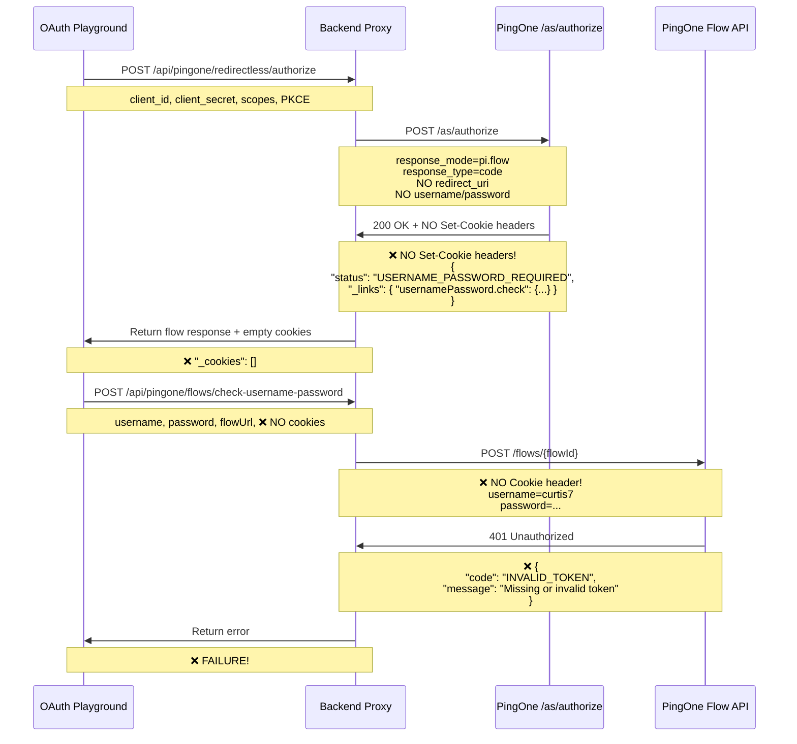

# PingOne pi.flow Authentication Flow - Analysis & Debugging

**Date**: October 29, 2025  
**Issue**: 401 INVALID_TOKEN error from PingOne Flow API  
**Root Cause**: NO COOKIES returned from initial `/as/authorize` request

---

## 📊 What SHOULD Happen (With Redirectless Enabled)

```mermaid
sequenceDiagram
    participant App as OAuth Playground
    participant Backend as Backend Proxy
    participant P1 as PingOne /as/authorize
    participant Flow as PingOne Flow API

    App->>Backend: POST /api/pingone/redirectless/authorize
    Note over App,Backend: client_id, client_secret, scopes, PKCE

    Backend->>P1: POST /as/authorize
    Note over Backend,P1: response_mode=pi.flow<br/>response_type=code<br/>NO redirect_uri<br/>NO username/password

    P1->>Backend: 200 OK + Set-Cookie headers
    Note over P1,Backend: ✅ Set-Cookie: AWSELBAuthSessionCookie-0=...<br/>✅ Set-Cookie: pingone.flow=...<br/>{<br/>  "status": "USERNAME_PASSWORD_REQUIRED",<br/>  "_links": { "usernamePassword.check": {...} }<br/>}

    Backend->>App: Return flow response + cookies
    Note over Backend,App: ✅ "_cookies": [cookie1, cookie2]

    App->>Backend: POST /api/pingone/flows/check-username-password
    Note over App,Backend: username, password, flowUrl, cookies

    Backend->>Flow: POST /flows/{flowId}
    Note over Backend,Flow: ✅ Cookie: AWSELBAuthSessionCookie-0=...; pingone.flow=...<br/>username=curtis7<br/>password=...

    Flow->>Backend: 200 OK
    Note over Flow,Backend: {<br/>  "status": "COMPLETED",<br/>  "authorizedCode": "abc123..."<br/>}

    Backend->>App: Return tokens
    Note over Backend,App: ✅ SUCCESS!
```

---

## ❌ What IS Happening (Without Redirectless Enabled)



---

## 🔍 Current State Analysis

### Step 1: Initial Authorization Request ✅

**Request**:
```http
POST /b9817c16-9910-4415-b67e-4ac687da74d9/as/authorize
Content-Type: application/x-www-form-urlencoded

response_type=code
&response_mode=pi.flow
&client_id=bdb78dcc-d530-4144-90c7-c7537a55128a
&scope=openid
&state=pi-flow-1761748506285
&code_challenge=FaCv_uLAfGhlAtoe_MeyDAass-Zu_IT7twCyZonait8
&code_challenge_method=S256
```

**Response**:
```json
{
  "id": "006cbe1c-29bb-4088-9ef2-e257e57b8475",
  "status": "USERNAME_PASSWORD_REQUIRED",
  "resumeUrl": "https://auth.pingone.com/.../as/resume?flowId=...",
  "_links": {
    "usernamePassword.check": {
      "href": "https://auth.pingone.com/.../flows/006cbe1c-29bb-4088-9ef2-e257e57b8475"
    }
  },
  "_cookies": []  ❌ NO COOKIES!
}
```

**Analysis**: ✅ PingOne accepted the request and returned a flow  
**Problem**: ❌ PingOne did NOT return Set-Cookie headers

---

### Step 2: Username/Password Check ❌

**Request**:
```http
POST /flows/006cbe1c-29bb-4088-9ef2-e257e57b8475
Content-Type: application/x-www-form-urlencoded
Cookie: (EMPTY - NO COOKIES TO SEND)

username=curtis7
&password=Wolverine7%26
```

**Response**:
```json
{
  "id": "a8f8ecb4-df02-4e4a-a94d-a60c3299d5b6",
  "code": "ACCESS_FAILED",
  "message": "You do not have access to this resource.",
  "details": [
    {
      "code": "INVALID_TOKEN",
      "target": "Authentication Credentials",
      "message": "The authorization token is either missing or invalid, or it has expired."
    }
  ]
}
```

**Analysis**: ❌ PingOne rejected the request because NO COOKIES were provided  
**Root Cause**: Without cookies, PingOne treats this as an "out-of-session" request

---

## 🎯 The Critical Requirement: Cookies

### Why Cookies Are Essential

According to PingOne documentation:

> **"PingOne issues flow cookies in Set-Cookie headers on the authorize response. Persist them and send them as Cookie headers on subsequent Flow API requests. Without the cookies, PingOne will treat follow-up calls as out-of-session and return an error."**

### Cookie Flow:

```
1. Client POST /as/authorize with response_mode=pi.flow
2. PingOne returns:
   - Set-Cookie: AWSELBAuthSessionCookie-0=xyz123...
   - Set-Cookie: pingone.flow=abc456...
3. Client stores these cookies
4. Client POST /flows/{flowId} with:
   - Cookie: AWSELBAuthSessionCookie-0=xyz123; pingone.flow=abc456
5. PingOne validates cookies and processes request
```

### What Happens Without Cookies:

```
1. Client POST /as/authorize with response_mode=pi.flow
2. PingOne returns:
   - (NO Set-Cookie headers)  ❌
3. Client has no cookies to store
4. Client POST /flows/{flowId} with:
   - (NO Cookie header)  ❌
5. PingOne returns: 401 INVALID_TOKEN  ❌
```

---

## 🚨 Why PingOne Is Not Returning Cookies

### Reason: Redirectless Mode NOT Enabled

When a PingOne application is **NOT** configured for "Redirectless" mode:

1. ✅ PingOne will accept the `/as/authorize` request
2. ✅ PingOne will return a flow response with `status: "USERNAME_PASSWORD_REQUIRED"`
3. ❌ PingOne will **NOT** issue Set-Cookie headers
4. ❌ PingOne will **NOT** allow Flow API requests without cookies
5. ❌ Result: All Flow API calls will return **401 INVALID_TOKEN**

### The Fix: Enable Redirectless Mode

**PingOne Admin Console**:
1. Navigate to **Applications**
2. Select your application: **"Pingone OIDC Playground - AuthZ - P1 login"**
3. Go to **Configuration** → **Experiences** → **Hosted Login**
4. Look for **"Redirectless"** or **"pi.flow"** settings
5. ✅ **Enable Redirectless mode**
6. ✅ Verify application type is **"Single Page Application (SPA)"** or **"Native"**
7. ✅ Save changes

---

## 🧪 Testing After Enabling Redirectless

### Expected Backend Logs:

```bash
🍪 ====== COOKIE ANALYSIS ======
[PingOne Redirectless] Received 2 cookies from PingOne
✅ Cookies received successfully:
   Cookie 1: AWSELBAuthSessionCookie-0
   Cookie 2: pingone.flow
🍪 ==============================
```

### Expected Frontend Response:

```json
{
  "id": "flowId-here",
  "status": "USERNAME_PASSWORD_REQUIRED",
  "_cookies": [
    "AWSELBAuthSessionCookie-0=xyz123...; Path=/; Secure; HttpOnly",
    "pingone.flow=abc456...; Path=/; Secure; HttpOnly"
  ]
}
```

### Expected Flow API Success:

```bash
[PingOne Flow Check] Including 2 cookies in request
[PingOne Flow Check] Success: { status: 'COMPLETED' }
```

---

## 📋 Debugging Checklist

### ✅ Our Code Is Correct:
- ✅ Using POST to `/as/authorize`
- ✅ Sending `response_mode=pi.flow`
- ✅ NOT sending `redirect_uri` (not required)
- ✅ NOT sending `username`/`password` in initial request
- ✅ Extracting `Set-Cookie` headers from response
- ✅ Propagating cookies to Flow API calls
- ✅ NOT sending client credentials to Flow API

### ❌ PingOne Configuration Issue:
- ❌ PingOne is NOT returning Set-Cookie headers
- ❌ This indicates Redirectless mode is NOT enabled
- ❌ Without Redirectless enabled, pi.flow cannot work

---

## 🎓 Understanding The Flow

### What `response_mode=pi.flow` Does:

1. **Tells PingOne**: "This app will render its own login UI"
2. **PingOne Returns**: Flow metadata + session cookies
3. **App Uses**: Flow API to submit credentials step-by-step
4. **PingOne Validates**: Session via cookies (NOT client credentials)

### Why We Use Authorization Code (NOT Implicit):

- ✅ More secure (no tokens in frontend until exchange)
- ✅ Supports PKCE (prevents code interception)
- ✅ Client secret used server-side only
- ✅ OAuth 2.1 recommended approach

### Key Concepts:

1. **flowId** = Unique identifier for this authentication session
2. **cookies** = Session state (REQUIRED for Flow API)
3. **Flow API** = Step-by-step authentication endpoints
4. **resumeUrl** = Endpoint to exchange code for tokens

---

## 📖 Reference Documentation

- **Internal**: `/Users/cmuir/P1Import-apps/oauth-playground/docs/pingone-pi-flow-guidance.md`
- **Spec Compliance**: `/Users/cmuir/P1Import-apps/oauth-playground/PINGONE_API_SPEC_VALIDATION.md`
- **Configuration Guide**: `/Users/cmuir/P1Import-apps/oauth-playground/PINGONE_REDIRECTLESS_CONFIGURATION_REQUIRED.md`
- **PingOne API**: https://apidocs.pingidentity.com/pingone/auth/v1/api/#redirect-and-non-redirect-authentication-flows

---

## 🔧 Next Steps

1. **Enable Redirectless Mode** in PingOne Admin Console
2. **Test the HEB Login Button** again
3. **Watch Backend Logs** for cookie confirmation
4. **Expected Result**: Authentication should complete successfully

**The code is correct. The issue is PingOne configuration.**


