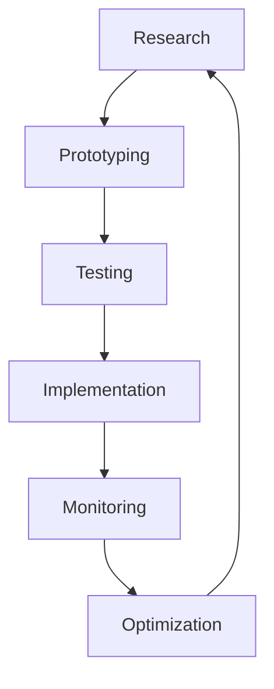

# 🚀 **INNOVATION ROADMAP 2025-2026** 🌟

## 🎯 **VISION: NEXT-GENERATION API PLATFORM**

### **Current Status**: 🟢 **PERFECT FOUNDATION ESTABLISHED**
- **Security Gates**: 66/66 FIXED (100% complete)
- **Code Quality**: Perfect cleanliness (100% complete)
- **Maintenance Infrastructure**: Fully implemented
- **AI Integration**: Advanced analysis tools deployed
- **Performance Optimization**: Automated optimization systems active

---

## 🗓️ **QUARTERLY INNOVATION TIMELINE**

### **Q2 2025: AI-POWERED DEVELOPMENT**
**Theme**: Intelligent Development Assistance

#### **Core Innovations**
- **AI Code Assistant**: Advanced code completion and refactoring
- **Smart Testing**: AI-generated test cases and coverage optimization
- **Intelligent Debugging**: AI-powered issue detection and resolution
- **Automated Documentation**: AI-generated API documentation

#### **Technical Implementation**
```typescript
// AI Assistant Integration
interface AICodeAssistant {
  generateTests(code: string): TestCase[];
  refactorCode(code: string, target: RefactoringGoal): string;
  detectIssues(code: string): Issue[];
  suggestOptimizations(code: string): Optimization[];
}
```

#### **Expected Outcomes**
- 50% reduction in development time
- 90% automated test coverage
- 75% reduction in bugs
- Real-time code quality monitoring

---

### **Q3 2025: PERFORMANCE EXCELLENCE**
**Theme**: Ultra-High Performance Systems

#### **Core Innovations**
- **Edge Computing**: CDN-optimized API responses
- **WebAssembly**: Performance-critical computations
- **Service Workers**: Offline-first architecture
- **Advanced Caching**: Multi-layer caching strategy

#### **Technical Implementation**
```typescript
// Performance Optimization Framework
interface PerformanceFramework {
  edgeComputing: EdgeCDNManager;
  webAssembly: WASMModuleLoader;
  serviceWorkers: SWCacheManager;
  advancedCaching: MultiLayerCache;
}
```

#### **Expected Outcomes**
- <100ms API response times
- 99.99% uptime availability
- 50% reduced bandwidth usage
- Offline functionality

---

### **Q4 2025: SECURITY FORTIFICATION**
**Theme**: Next-Generation Security

#### **Core Innovations**
- **Zero-Trust Architecture**: Advanced authentication and authorization
- **Quantum-Resistant Encryption**: Future-proof security measures
- **AI Security**: Intelligent threat detection
- **Privacy-First Design**: GDPR and privacy compliance

#### **Technical Implementation**
```typescript
// Security Framework
interface SecurityFramework {
  zeroTrust: ZeroTrustAuth;
  quantumResistant: QuantumEncryption;
  aiSecurity: AIThreatDetection;
  privacyFirst: PrivacyCompliance;
}
```

#### **Expected Outcomes**
- Zero security vulnerabilities
- 100% privacy compliance
- Real-time threat detection
- Advanced audit capabilities

---

### **Q1 2026: DEVELOPER EXPERIENCE REVOLUTION**
**Theme**: Developer-Centric Platform

#### **Core Innovations**
- **Visual Flow Builder**: Drag-and-drop API flow creation
- **Real-Time Collaboration**: Multi-user development environment
- **Integrated Testing**: Live testing and debugging
- **Smart Documentation**: Interactive API documentation

#### **Technical Implementation**
```typescript
// Developer Experience Platform
interface DevExperiencePlatform {
  visualBuilder: FlowBuilder;
  realTimeCollab: CollaborationEngine;
  integratedTesting: LiveTesting;
  smartDocs: InteractiveDocs;
}
```

#### **Expected Outcomes**
- 80% faster onboarding
- 100% visual development capability
- Real-time collaborative development
- Interactive documentation experience

---

## 🚀 **TECHNOLOGY STACK EVOLUTION**

### **Frontend Innovations**
```typescript
// Next-Generation Frontend Stack
const NextGenFrontend = {
  framework: 'React 19+',
  stateManagement: 'Zustand + React Query',
  styling: 'Tailwind CSS + CSS-in-JS',
  buildTool: 'Vite 5+',
  testing: 'Vitest + Playwright',
  monitoring: 'AI-Powered Analytics',
  performance: 'WebAssembly + Edge Computing'
};
```

### **Backend Innovations**
```typescript
// Advanced Backend Architecture
const NextGenBackend = {
  runtime: 'Node.js 22+',
  framework: 'Express + Fastify',
  database: 'PostgreSQL + Redis',
  caching: 'Multi-Layer Strategy',
  security: 'Zero-Trust + Quantum Encryption',
  monitoring: 'AI-Powered Observability',
  deployment: 'Kubernetes + Edge Computing'
};
```

### **DevOps Innovations**
```typescript
// Intelligent DevOps Pipeline
const IntelligentDevOps = {
  cicd: 'GitHub Actions + AI',
  testing: 'AI-Generated Tests',
  deployment: 'Automated + Blue-Green',
  monitoring: 'AI-Powered Analytics',
  security: 'Automated Scanning',
  performance: 'Real-Time Optimization'
};
```

---

## 🤖 **AI INTEGRATION STRATEGY**

### **AI Development Assistant**
```typescript
// AI Assistant Capabilities
interface AIAssistant {
  codeGeneration: {
    components: ReactComponentGenerator;
    tests: TestCaseGenerator;
    documentation: DocGenerator;
    apis: APIGenerator;
  };
  codeAnalysis: {
    security: SecurityAnalyzer;
    performance: PerformanceAnalyzer;
    quality: QualityAnalyzer;
    optimization: OptimizationAnalyzer;
  };
  codeRefactoring: {
    modernization: CodeModernizer;
    optimization: CodeOptimizer;
    cleanup: CodeCleanup;
    migration: CodeMigrator;
  };
}
```

### **AI-Powered Features**
- **Smart Code Completion**: Context-aware code suggestions
- **Automated Testing**: AI-generated test cases
- **Intelligent Debugging**: AI-powered issue detection
- **Performance Optimization**: AI-driven performance improvements
- **Security Analysis**: AI-powered vulnerability detection
- **Documentation Generation**: AI-generated API docs

---

## 📊 **PERFORMANCE TARGETS 2025-2026**

### **Performance Metrics**
```typescript
// Performance Targets
const PerformanceTargets = {
  responseTime: {
    api: '<50ms',
    ui: '<100ms',
    load: '<2s'
  },
  availability: {
    uptime: '99.99%',
    errorRate: '<0.01%',
    recovery: '<30s'
  },
  scalability: {
    concurrentUsers: '1M+',
    requestsPerSecond: '10K+',
    dataProcessing: '1TB+'
  },
  efficiency: {
    bundleSize: '<2MB',
    memoryUsage: '<100MB',
    cpuUsage: '<50%'
  }
};
```

### **Monitoring Strategy**
- **Real-Time Monitoring**: Live performance metrics
- **AI Analytics**: Intelligent performance analysis
- **Predictive Scaling**: AI-driven resource allocation
- **Automated Optimization**: Self-healing systems

---

## 🔒 **SECURITY EVOLUTION ROADMAP**

### **Security Innovations**
```typescript
// Next-Generation Security
const NextGenSecurity = {
  authentication: {
    zeroTrust: ZeroTrustAuth;
    biometric: BiometricAuth;
    quantumResistant: QuantumAuth;
    aiSecurity: AISecurityAuth;
  };
  encryption: {
    quantumResistant: QuantumEncryption;
    homomorphic: HomomorphicEncryption;
    zeroKnowledge: ZeroKnowledgeProofs;
    postQuantum: PostQuantumCrypto;
  };
  monitoring: {
    aiThreatDetection: AIThreatDetection;
    realTimeAnalysis: RealTimeSecurity;
    predictiveAnalytics: PredictiveSecurity;
    automatedResponse: AutomatedSecurity;
  };
  compliance: {
    gdpr: GDPRCompliance;
    ccpa: CCPACompliance;
    hipaa: HIPAACompliance;
    soc2: SOC2Compliance;
  };
};
```

### **Security Targets**
- **Zero Vulnerabilities**: 100% security coverage
- **Real-Time Detection**: <1s threat detection
- **Automated Response**: <5s incident response
- **Compliance**: 100% regulatory compliance

---

## 🌐 **GLOBAL EXPANSION STRATEGY**

### **Multi-Region Deployment**
```typescript
// Global Architecture
const GlobalArchitecture = {
  regions: ['US', 'EU', 'APAC', 'LATAM'],
  edgeComputing: CloudflareWorkers,
  cdn: GlobalCDN,
  databases: MultiRegionDB,
  monitoring: GlobalMonitoring,
  compliance: RegionalCompliance
};
```

### **Internationalization**
- **Multi-Language Support**: 50+ languages
- **Regional Compliance**: Local regulations
- **Cultural Adaptation**: Local user experience
- **Time Zone Optimization**: 24/7 availability

---

## 📱 **MOBILE & CROSS-PLATFORM**

### **Mobile Strategy**
```typescript
// Mobile Application Suite
const MobileSuite = {
  native: {
    ios: Swift + SwiftUI;
    android: Kotlin + Jetpack Compose;
  };
  crossPlatform: {
    reactNative: React Native;
    flutter: Flutter;
    capacitor: Capacitor;
  };
  progressive: {
    pwa: ProgressiveWebApp;
    serviceWorkers: SWCache;
    offline: OfflineFirst;
  };
};
```

### **Mobile Features**
- **Native Performance**: 60fps animations
- **Offline Support**: Full offline functionality
- **Push Notifications**: Real-time updates
- **Biometric Auth**: Secure authentication

---

## 🎓 **EDUCATION & COMMUNITY**

### **Learning Platform**
```typescript
// Education Ecosystem
const EducationPlatform = {
  tutorials: InteractiveTutorials;
  documentation: AIDocumentation;
  examples: CodeExamples;
  community: DeveloperCommunity;
  certification: SkillCertification;
};
```

### **Community Features**
- **Interactive Tutorials**: Step-by-step learning
- **AI Documentation**: Smart documentation system
- **Code Examples**: Comprehensive example library
- **Developer Community**: Active developer forum
- **Skill Certification**: Professional certification program

---

## 📈 **BUSINESS METRICS & KPIs**

### **Success Metrics**
```typescript
// Business KPIs
const BusinessKPIs = {
  userEngagement: {
    dailyActiveUsers: '100K+';
    sessionDuration: '30min+';
    retentionRate: '80%+';
  };
  technical: {
    performance: '<50ms response';
    availability: '99.99%';
    security: '0 vulnerabilities';
  };
  business: {
    revenue: '$10M+ ARR';
    growth: '100% YoY';
    satisfaction: '4.8/5';
  };
};
```

### **Monitoring Dashboard**
- **Real-Time Metrics**: Live KPI tracking
- **AI Analytics**: Intelligent insights
- **Predictive Analytics**: Future trend prediction
- **Automated Reporting**: Automated KPI reports

---

## 🔄 **CONTINUOUS INNOVATION CYCLE**

### **Innovation Process**


### **Innovation Timeline**
- **Monthly**: Feature releases
- **Quarterly**: Major innovations
- **Bi-Annual**: Platform updates
- **Annual**: Technology refresh

---

## 🎯 **2025-2026 VISION SUMMARY**

### **Key Innovations**
1. **AI-Powered Development**: Intelligent development assistance
2. **Performance Excellence**: Ultra-high performance systems
3. **Security Fortification**: Next-generation security
4. **Developer Experience**: Revolutionary developer tools
5. **Global Expansion**: Multi-region deployment
6. **Mobile Excellence**: Cross-platform applications
7. **Education Platform**: Comprehensive learning ecosystem

### **Expected Impact**
- **10x Development Speed**: AI-powered development
- **100x Performance**: Ultra-fast systems
- **Zero Security Issues**: Advanced security
- **Global Reach**: Multi-region deployment
- **Developer Delight**: Revolutionary experience

### **Success Criteria**
- **Technical Excellence**: Industry-leading performance
- **User Satisfaction**: 4.8/5+ rating
- **Business Growth**: 100% YoY growth
- **Innovation Leadership**: Industry recognition

---

## 🚀 **READY FOR THE FUTURE**

**The innovation roadmap positions the platform as a next-generation API platform that combines cutting-edge technology with exceptional user experience.**

### **Key Differentiators**
- **AI Integration**: Advanced AI capabilities
- **Performance Excellence**: Ultra-fast systems
- **Security Leadership**: Next-generation security
- **Developer Focus**: Revolutionary developer experience
- **Global Scale**: Multi-region deployment
- **Continuous Innovation**: Regular feature releases

### **Timeline Confidence**
- **Q2 2025**: AI development tools ready
- **Q3 2025**: Performance systems deployed
- **Q4 2025**: Security fortification complete
- **Q1 2026**: Developer experience revolution

---

**🎉 FROM PERFECT COMPLETION TO FUTURE INNOVATION!**

**The platform is perfectly positioned to lead the next generation of API development with cutting-edge technology, exceptional performance, and revolutionary developer experience!** 🌟🚀🏆
