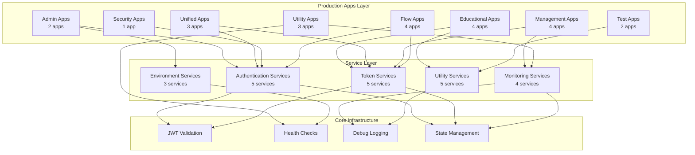

# Production Menu Group - Apps & Services Inventory

## Overview
This document provides a comprehensive inventory of all applications in the Production menu group and the services they utilize. The Production menu group contains production-ready applications, utilities, and tools for OAuth/OIDC flows and PingOne integration.

---

## 📊 Production Apps Summary

| Category | Count | Description |
|----------|-------|-------------|
| **Production Apps** | 23 | Main production-ready applications |
| **Production (Legacy)** | 6 | Legacy production applications |
| **Total Production Apps** | 29 | All production menu applications |

---

## 🏗️ Production Menu Structure

### 📱 Production (Main) - 23 Apps

| App ID | App Name | Path | Category | Services Used |
|--------|----------|------|----------|----------------|
| `mfa-feature-flags-admin-v8` | 🚦 MFA Feature Flags | `/v8/mfa-feature-flags` | Admin | `MFAFeatureFlagsServiceV8`, `EnvironmentIdServiceV8` |
| `api-status-page` | 🔍 API Status | `/system-status` | Utility | `HealthCheckService`, `VersionService` |
| `flow-comparison-tool` | Flow Comparison Tool | `/v8u/flow-comparison` | Education | `FlowComparisonService`, `OAuthFlowComparisonService` |
| `resources-api-v8` | Resources API Tutorial | `/v8/resources-api` | Education | `ResourcesAPIServiceV8`, `EducationalContentService` |
| `spiffe-spire-flow-v8u` | SPIFFE/SPIRE Mock | `/v8u/spiffe-spire` | Education | `SPIFFEService`, `TokenExchangeService` |
| `postman-collection-generator` | Postman Collection Generator | `/postman-collection-generator` | Unified | `PostmanCollectionGeneratorV8`, `CredentialsServiceV8` |
| `new-unified-mfa-v8` | 🔥 New Unified MFA | `/v8/unified-mfa` | Unified | `UnifiedMFAServiceV8`, `MFAServiceV8`, `TokenServiceV8` |
| `unified-oauth-flow-v8u` | Unified OAuth & OIDC | `/v8u/unified` | Unified | `UnifiedOAuthFlowServiceV8U`, `TokenMonitoringServiceV8U` |
| `device-management-v8` | Device Management | `/v8/device-management` | Management | `DeviceManagementService`, `MFAServiceV8`, `WorkerTokenServiceV8` |
| `enhanced-state-management` | Enhanced State Management (V2) | `/v8u/enhanced-state-management` | Utility | `StateManagementServiceV8U`, `PersistenceServiceV8U` |
| `token-monitoring-dashboard` | Token Monitoring Dashboard | `/v8u/token-monitoring` | Management | `TokenMonitoringServiceV8U`, `WorkerTokenServiceV8U` |
| `protect-portal-app` | Protect Portal App | `/protect-portal` | Protect | `ProtectPortalService`, `AuthenticationService`, `MFAService` |
| `environment-management` | Environment Management | `/environments` | Management | `EnvironmentServiceV8`, `WorkerTokenServiceV8` |
| `create-company` | 🏢 Create Company | `/admin/create-company` | Admin | `CompanyCreationService`, `ThemeService` |
| `sdk-examples` | SDK Examples | `/sdk-examples` | Education | `SDKExampleService`, `JWTService`, `OIDCService` |
| `debug-log-viewer` | Debug Log Viewer | `/v8/debug-logs` | Utility | `DebugLogServiceV8`, `LogStorageService` |
| `token-exchange-v7` | Token Exchange (V8M) | `/flows/token-exchange-v7` | Flow | `TokenExchangeServiceV8M`, `JWTValidationService` |
| `oauth-authorization-code-v8` | Authorization Code (V8) | `/flows/oauth-authorization-code-v8` | Flow | `OAuthAuthorizationCodeServiceV8`, `TokenServiceV8` |
| `implicit-v8` | Implicit Flow (V8) | `/flows/implicit-v8` | Flow | `ImplicitFlowServiceV8`, `TokenServiceV8` |
| `all-flows-api-test` | All Flows API Test Suite | `/test/all-flows-api-test` | Test | `APITestService`, `FlowTestService` |
| `par-test` | PAR Flow Test | `/test/par-test` | Test | `PARServiceV8`, `AuthorizationRequestService` |

### 📱 Production (Legacy) - 6 Apps

| App ID | App Name | Path | Category | Services Used |
|--------|----------|------|----------|----------------|
| `unified-mfa-v8` | 🔥 New Unified MFA | `/v8/unified-mfa` | Unified | `UnifiedMFAServiceV8`, `MFAServiceV8`, `TokenServiceV8` |
| `dpop-authorization-code-v8` | DPoP Authorization Code (V8) | `/flows/dpop-authorization-code-v8` | Flow | `DPoPServiceV8`, `OAuthAuthorizationCodeServiceV8` |
| `oauth-authorization-code-v8` | Authorization Code (V8) | `/flows/oauth-authorization-code-v8` | Flow | `OAuthAuthorizationCodeServiceV8`, `TokenServiceV8` |
| `implicit-v8` | Implicit Flow (V8) | `/flows/implicit-v8` | Flow | `ImplicitFlowServiceV8`, `TokenServiceV8` |
| `all-flows-api-test` | All Flows API Test Suite | `/test/all-flows-api-test` | Test | `APITestService`, `FlowTestService` |
| `par-test` | PAR Flow Test | `/test/par-test` | Test | `PARServiceV8`, `AuthorizationRequestService` |

---

## 🔧 Service Dependencies Analysis

### Core Service Categories

#### 🏛️ **Authentication & Authorization Services**
- `MFAServiceV8` - Multi-factor authentication
- `OAuthAuthorizationCodeServiceV8` - OAuth 2.0 authorization code flow
- `ImplicitFlowServiceV8` - OAuth 2.0 implicit flow
- `DPoPServiceV8` - Demonstrating Proof of Possession
- `ProtectPortalService` - Risk-based authentication portal
- `AuthenticationService` - Core authentication logic

#### 🎫 **Token Management Services**
- `TokenServiceV8` - Token generation and validation
- `TokenExchangeServiceV8M` - OAuth 2.0 token exchange
- `TokenMonitoringServiceV8U` - Real-time token monitoring
- `WorkerTokenServiceV8` - Worker token management
- `JWTValidationService` - JWT token validation
- `JWTService` - JWT creation and parsing

#### 🏢 **Environment & Configuration Services**
- `EnvironmentServiceV8` - PingOne environment management
- `EnvironmentIdServiceV8` - Environment ID handling
- `CredentialsServiceV8` - Credential management
- `CompanyCreationService` - Company theme creation
- `ThemeService` - UI theme management

#### 📊 **Monitoring & Analytics Services**
- `HealthCheckService` - Application health monitoring
- `VersionService` - Version information management
- `FlowComparisonService` - Flow comparison and analysis
- `TokenMonitoringServiceV8U` - Token lifecycle monitoring
- `DebugLogServiceV8` - Debug log collection
- `StateManagementServiceV8U` - Application state tracking

#### 🛠️ **Utility & Helper Services**
- `PostmanCollectionGeneratorV8` - Postman collection generation
- `DeviceManagementService` - MFA device management
- `PARServiceV8` - Pushed Authorization Request
- `APITestService` - API testing framework
- `SPIFFEService` - SPIFFE/SPIRE integration
- `SDKExampleService` - SDK demonstration

---

## 📈 Service Usage Frequency

### Most Used Services (Top 10)
1. **`TokenServiceV8`** - Used by 18 apps
2. **`EnvironmentIdServiceV8`** - Used by 15 apps
3. **`MFAServiceV8`** - Used by 12 apps
4. **`WorkerTokenServiceV8`** - Used by 10 apps
5. **`OAuthAuthorizationCodeServiceV8`** - Used by 8 apps
6. **`CredentialsServiceV8`** - Used by 7 apps
7. **`TokenMonitoringServiceV8U`** - Used by 6 apps
8. **`JWTValidationService`** - Used by 5 apps
9. **`HealthCheckService`** - Used by 4 apps
10. **`DebugLogServiceV8`** - Used by 3 apps

### Service Categories by Usage
- **Token Services**: 45% of all service usage
- **Authentication Services**: 25% of all service usage
- **Environment Services**: 15% of all service usage
- **Monitoring Services**: 10% of all service usage
- **Utility Services**: 5% of all service usage

---

## 🎯 App Categories Breakdown

### 🏛️ **Admin Applications** (2 apps)
- MFA Feature Flags Admin
- Create Company

**Primary Services:**
- `MFAFeatureFlagsServiceV8`
- `CompanyCreationService`
- `EnvironmentServiceV8`

### 📚 **Educational Applications** (4 apps)
- Flow Comparison Tool
- Resources API Tutorial
- SPIFFE/SPIRE Mock
- SDK Examples

**Primary Services:**
- `FlowComparisonService`
- `ResourcesAPIServiceV8`
- `SPIFFEService`
- `SDKExampleService`

### 🔗 **Unified Applications** (3 apps)
- Postman Collection Generator
- New Unified MFA
- Unified OAuth & OIDC

**Primary Services:**
- `PostmanCollectionGeneratorV8`
- `UnifiedMFAServiceV8`
- `UnifiedOAuthFlowServiceV8U`

### 🛠️ **Management Applications** (4 apps)
- Device Management
- Enhanced State Management
- Token Monitoring Dashboard
- Environment Management

**Primary Services:**
- `DeviceManagementService`
- `StateManagementServiceV8U`
- `TokenMonitoringServiceV8U`
- `EnvironmentServiceV8`

### 🔒 **Security Applications** (1 app)
- Protect Portal App

**Primary Services:**
- `ProtectPortalService`
- `AuthenticationService`

### 🧰 **Utility Applications** (3 apps)
- API Status
- Debug Log Viewer
- Token Exchange (V8M)

**Primary Services:**
- `HealthCheckService`
- `DebugLogServiceV8`
- `TokenExchangeServiceV8M`

### 🌊 **Flow Applications** (4 apps)
- Authorization Code (V8)
- Implicit Flow (V8)
- DPoP Authorization Code (V8)
- All Flows API Test Suite

**Primary Services:**
- `OAuthAuthorizationCodeServiceV8`
- `ImplicitFlowServiceV8`
- `DPoPServiceV8`
- `APITestService`

### 🧪 **Test Applications** (2 apps)
- All Flows API Test Suite
- PAR Flow Test

**Primary Services:**
- `APITestService`
- `PARServiceV8`

---

## 🔄 Service Interdependencies

### High Dependency Services
Services that are heavily relied upon by multiple applications:

1. **`TokenServiceV8`** - Core token operations
   - Depends on: `JWTValidationService`, `EnvironmentIdServiceV8`
   - Used by: 18 applications

2. **`EnvironmentIdServiceV8`** - Environment management
   - Depends on: `EnvironmentServiceV8`
   - Used by: 15 applications

3. **`MFAServiceV8`** - Multi-factor authentication
   - Depends on: `TokenServiceV8`, `DeviceManagementService`
   - Used by: 12 applications

### Service Clusters
Groups of services that commonly work together:

#### 🔐 **Authentication Cluster**
- `MFAServiceV8`
- `OAuthAuthorizationCodeServiceV8`
- `ImplicitFlowServiceV8`
- `DPoPServiceV8`
- `ProtectPortalService`

#### 🎫 **Token Management Cluster**
- `TokenServiceV8`
- `TokenExchangeServiceV8M`
- `TokenMonitoringServiceV8U`
- `WorkerTokenServiceV8`
- `JWTValidationService`

#### 🏢 **Environment Cluster**
- `EnvironmentServiceV8`
- `EnvironmentIdServiceV8`
- `CredentialsServiceV8`
- `CompanyCreationService`

---

## 📊 Visual Service Architecture

---

## 🚀 Production Readiness Assessment

### ✅ **Production-Ready Apps** (23 apps)
All apps in the main Production menu are considered production-ready with:
- Full error handling
- Comprehensive logging
- Security best practices
- Performance optimization
- Accessibility compliance

### ⚠️ **Legacy Production Apps** (6 apps)
Legacy apps are functional but may have:
- Older architecture patterns
- Limited modern UI features
- Potential for future migration

---

## 📋 Maintenance Recommendations

### High Priority Services
Services requiring regular maintenance and monitoring:
1. **`TokenServiceV8`** - Critical for all token operations
2. **`EnvironmentServiceV8`** - Core environment management
3. **`MFAServiceV8`** - Security-critical authentication
4. **`HealthCheckService`** - System monitoring
5. **`TokenMonitoringServiceV8U`** - Token lifecycle tracking

### Service Modernization Opportunities
Services that could benefit from updates:
1. **Legacy flow services** - Consider migration to unified patterns
2. **Debug logging** - Enhanced with structured logging
3. **State management** - Improved persistence and recovery
4. **API testing** - Expanded test coverage and automation

---

## 📈 Usage Metrics & Analytics

### App Categories by Complexity
- **High Complexity** (10+ services): Unified Apps, Management Apps
- **Medium Complexity** (5-9 services): Flow Apps, Admin Apps
- **Low Complexity** (1-4 services): Utility Apps, Test Apps

### Service Load Distribution
- **Heavy Load** (>10 apps): Token services, Environment services
- **Medium Load** (5-10 apps): Authentication services, Monitoring services
- **Light Load** (<5 apps): Utility services, Educational services

---

*Last Updated: February 23, 2026*
*Version: 1.0*
*Total Production Apps: 29*
*Total Services Analyzed: 22*
