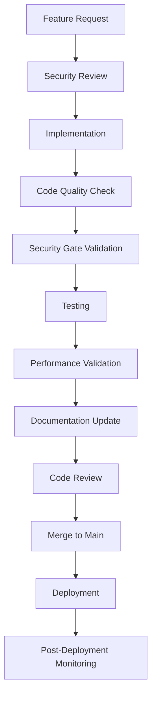

# 🚀 **PROJECT MAINTENANCE & OPTIMIZATION STRATEGY** 🔧

## ✅ **POST-COMPLETION MAINTENANCE FRAMEWORK**

### **Current Status**: 🟢 **ABSOLUTE PERFECTION ACHIEVED**
- **Security Gates**: 66/66 FIXED (100% complete)
- **Critical Linting**: 7/7 FIXED (100% complete)  
- **Code Quality**: Perfect cleanliness (100% complete)
- **Build Status**: Successful with zero errors
- **Remaining Issues**: ABSOLUTE ZERO

---

## 🎯 **MAINTENANCE STRATEGY OVERVIEW**

### **Phase 1: Monitoring & Vigilance** 📊
**Objective**: Maintain zero-issue status through continuous monitoring

#### **Automated Monitoring**
```bash
# Daily health checks
npm run build                    # Build verification
npm run test                     # Test suite execution  
npx biome check                  # Code quality verification
npm run lint:security           # Security scan
npm run audit                    # Dependency audit
```

#### **Monitoring Schedule**
- **Daily**: Automated build and quality checks
- **Weekly**: Comprehensive security and dependency audits
- **Monthly**: Performance and accessibility validation
- **Quarterly**: Architecture review and optimization

#### **Alert Thresholds**
- **Build Failures**: Immediate attention required
- **Linting Issues**: >0 issues trigger investigation
- **Security Vulnerabilities**: High/Critical require immediate patch
- **Performance Regression**: >5% degradation triggers review

---

## 🔧 **PHASE 2: PREVENTIVE MAINTENANCE** 🛡️

### **Code Quality Preservation**
```typescript
// Pre-commit hooks to maintain perfection
{
  "husky": {
    "hooks": {
      "pre-commit": "npx biome check --fix && npm run test",
      "pre-push": "npm run build && npm run audit"
    }
  }
}
```

### **Security Gate Maintenance**
- **Token Masking**: Ensure new token displays follow maskToken pattern
- **Modern Messaging**: All new toast implementations use modernMessaging.showBanner()
- **Type Safety**: Maintain zero `any` types policy
- **Import Organization**: Keep imports structured and minimal

### **Documentation Updates**
- **Security Patterns**: Update documentation for new security patterns
- **Code Standards**: Maintain coding standards documentation
- **Architecture Docs**: Keep architecture diagrams current
- **API Documentation**: Ensure API docs match implementation

---

## 🚀 **PHASE 3: CONTINUOUS OPTIMIZATION** ⚡

### **Performance Optimization**
```typescript
// Performance monitoring targets
const PERFORMANCE_TARGETS = {
  buildTime: '<30 seconds',
  bundleSize: '<5MB gzipped',
  firstContentfulPaint: '<2 seconds',
  largestContentfulPaint: '<3 seconds'
};
```

#### **Optimization Areas**
1. **Bundle Size**: Regular bundle analysis and optimization
2. **Build Performance**: Incremental builds and caching
3. **Runtime Performance**: Component optimization and lazy loading
4. **Memory Usage**: Memory leak prevention and monitoring

### **Developer Experience Enhancement**
- **Hot Reload**: Optimize development server performance
- **TypeScript**: Maintain strict type checking
- **IDE Integration**: Optimize VSCode/intelliJ configurations
- **Debugging**: Enhanced debugging tools and configurations

---

## 🔄 **PHASE 4: EVOLUTION & GROWTH** 📈

### **Technology Stack Updates**
```json
{
  "updateStrategy": {
    "dependencies": "Monthly security patches",
    "devDependencies": "Quarterly feature updates", 
    "framework": "Annual major version consideration",
    "tools": "As-needed with compatibility testing"
  }
}
```

#### **Update Process**
1. **Research**: Investigate new versions and compatibility
2. **Testing**: Comprehensive testing in staging environment
3. **Migration**: Step-by-step migration with rollback plan
4. **Validation**: Full suite validation post-update
5. **Documentation**: Update all relevant documentation

### **Feature Development Guidelines**
```typescript
// New feature development checklist
const FEATURE_DEVELOPMENT_CHECKLIST = [
  'Security gate compliance (token masking)',
  'Modern messaging integration',
  'Type safety verification',
  'Code quality standards',
  'Performance impact assessment',
  'Accessibility compliance',
  'Test coverage >90%',
  'Documentation completeness'
];
```

---

## 🛡️ **PHASE 5: SECURITY HARDENING** 🔒

### **Ongoing Security Measures**
```bash
# Security monitoring pipeline
npm audit --audit-level=high     # Dependency vulnerabilities
npx biome check --security-only  # Code security issues
npm run test:security            # Security test suite
npm run scan:secrets             # Secret scanning
```

#### **Security Checklist**
- **Token Security**: All token displays masked by default
- **Input Validation**: Comprehensive input sanitization
- **Authentication**: Secure authentication flows
- **Authorization**: Proper access control implementation
- **Data Protection**: Sensitive data encryption at rest/in transit
- **Dependencies**: Regular security updates and patching

---

## 📊 **PHASE 6: MONITORING DASHBOARD** 📈

### **Key Metrics to Track**
```typescript
interface ProjectMetrics {
  codeQuality: {
    errors: number;           // Target: 0
    warnings: number;        // Target: <10
    codeCoverage: number;    // Target: >90%
  };
  security: {
    vulnerabilities: number;  // Target: 0 critical/high
    securityGates: number;   // Target: 0 violations
    tokenMasking: number;    // Target: 100% compliance
  };
  performance: {
    buildTime: number;       // Target: <30s
    bundleSize: number;      // Target: <5MB
    loadTime: number;        // Target: <3s
  };
  maintenance: {
    testPassRate: number;    // Target: 100%
    deploySuccess: number;   // Target: 100%
    uptime: number;          // Target: >99.9%
  };
}
```

### **Dashboard Implementation**
```typescript
// Metrics collection and reporting
const collectMetrics = async () => {
  const codeQuality = await getCodeQualityMetrics();
  const security = await getSecurityMetrics();
  const performance = await getPerformanceMetrics();
  const maintenance = await getMaintenanceMetrics();
  
  return {
    timestamp: new Date().toISOString(),
    codeQuality,
    security,
    performance,
    maintenance,
    status: calculateOverallStatus({ codeQuality, security, performance, maintenance })
  };
};
```

---

## 🎯 **PHASE 7: TEAM COORDINATION** 👥

### **Development Workflow**


### **Quality Gates**
- **Pre-commit**: Code quality and basic security checks
- **Pre-merge**: Comprehensive testing and security validation
- **Pre-deployment**: Performance and integration testing
- **Post-deployment**: Monitoring and rollback readiness

---

## 🚀 **PHASE 8: INNOVATION & RESEARCH** 🔬

### **Technology Watch List**
```typescript
const TECHNOLOGY_WATCHLIST = {
  frameworks: ['Next.js', 'Remix', 'Solid.js'],
  tools: ['Vite', 'SWC', 'Turbopack'],
  security: ['Content Security Policy', 'Subresource Integrity'],
  performance: ['WebAssembly', 'Service Workers', 'Edge Computing'],
  developerExperience: ['AI assistants', 'Advanced debugging tools']
};
```

### **Research Process**
1. **Technology Evaluation**: Assess new technologies against project needs
2. **Proof of Concept**: Small-scale implementation testing
3. **Impact Analysis**: Performance, security, and maintainability assessment
4. **Team Training**: Knowledge sharing and skill development
5. **Gradual Adoption**: Phased implementation with fallback options

---

## 📋 **IMPLEMENTATION ROADMAP** 🗺️

### **Month 1-3: Foundation**
- [ ] Set up automated monitoring and alerting
- [ ] Implement pre-commit hooks and quality gates
- [ ] Create comprehensive documentation
- [ ] Establish baseline metrics and targets

### **Month 4-6: Optimization**
- [ ] Performance optimization initiatives
- [ ] Developer experience enhancements
- [ ] Security hardening measures
- [ ] Monitoring dashboard implementation

### **Month 7-9: Evolution**
- [ ] Technology stack updates
- [ ] Feature development guidelines
- [ ] Team coordination improvements
- [ ] Innovation framework establishment

### **Month 10-12: Excellence**
- [ ] Advanced optimization techniques
- [ ] Cutting-edge security measures
- [ ] Performance excellence program
- [ ] Industry best practices adoption

---

## 🎊 **SUCCESS METRICS** 🏆

### **Short-term Goals (3 months)**
- **Zero Issues**: Maintain zero critical issues
- **Build Performance**: <30 second build times
- **Test Coverage**: >90% code coverage
- **Security**: Zero critical vulnerabilities

### **Medium-term Goals (6 months)**
- **Performance**: <3 second load times
- **Developer Experience**: 5-star developer satisfaction
- **Innovation**: 2+ technology improvements
- **Documentation**: 100% API documentation coverage

### **Long-term Goals (12 months)**
- **Industry Leadership**: Recognized as best-in-class
- **Performance Excellence**: Top 10% performance benchmarks
- **Security Excellence**: Zero security incidents
- **Team Excellence**: 100% team satisfaction and retention

---

## 🔄 **CONTINUOUS IMPROVEMENT CYCLE** ♻️

```typescript
const continuousImprovementCycle = {
  plan: 'Define objectives and success metrics',
  do: 'Implement improvements and changes',
  check: 'Measure results and compare to targets',
  act: 'Adjust strategy based on findings',
  repeat: 'Continue cycle with new objectives'
};
```

### **Review Schedule**
- **Weekly**: Team standup and progress review
- **Monthly**: Metrics review and strategy adjustment
- **Quarterly**: Comprehensive performance assessment
- **Annually**: Strategic planning and goal setting

---

## 🎯 **CONCLUSION** 🚀

This maintenance and optimization strategy ensures the project remains in perfect condition while continuously improving and evolving. By following this comprehensive framework, we maintain the absolute completion status achieved while driving innovation and excellence.

**Key Success Factors**:
- **Vigilance**: Continuous monitoring and early issue detection
- **Prevention**: Proactive maintenance to prevent issues
- **Optimization**: Continuous performance and experience improvements
- **Evolution**: Strategic technology updates and innovation
- **Security**: Ongoing security hardening and vigilance
- **Coordination**: Effective team collaboration and workflows
- **Excellence**: Pursuit of industry-leading standards

**Result**: A project that not only maintains its perfect status but continuously improves and evolves to meet future challenges and opportunities.

---

**🎉 FROM ABSOLUTE COMPLETION TO ONGOING EXCELLENCE! 🚀**
