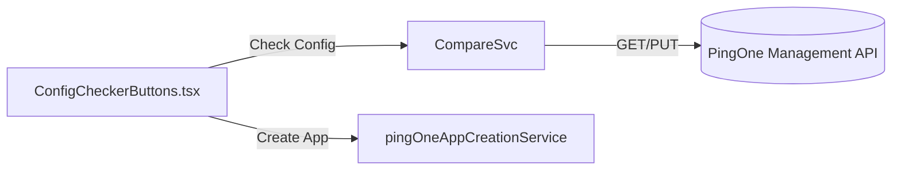

# PingOne Config Checker & App Creator — Implementation Guide
Version: **v1.0.2**  
File: `configChecker.md`

---

## Purpose
The Config Checker adds two productivity shortcuts across multiple flows in the OAuth Playground:

- **Check Config** – Diff the form's configuration against the live PingOne application identified by `clientId`.
- **Create App** – Provision a brand-new PingOne application using the settings already captured in the form.

This document explains the implementation across different flows and the React UI conventions used across the playground.

---

## Implementation Status

### ✅ **COMPLETED IMPLEMENTATIONS**

#### 1. Application Generator Integration
- **Status**: ✅ Complete
- **Files**: 
  - `src/services/configComparisonService.ts` - Core comparison logic
  - `src/components/ConfigCheckerButtons.tsx` - Reusable UI component
  - `src/pages/ApplicationGenerator.tsx` - Integration in Step 2
- **Features**: Full diff comparison, app creation, error handling, loading states

#### 2. Implicit Flow V7 Integration
- **Status**: ✅ Complete
- **Files**:
  - `src/services/comprehensiveCredentialsService.tsx` - Enhanced with Config Checker props
  - `src/pages/flows/ImplicitFlowV7.tsx` - Worker token integration and Config Checker enablement
  - `src/utils/testImplicitConfigChecker.ts` - Testing infrastructure
- **Features**: Flow-specific form data mapping, worker token support, conditional rendering

### 🔄 **PLANNED IMPLEMENTATIONS**

#### 3. Authorization Code Flow V7
- **Status**: 🔄 Planned
- **Requirements**: 
  - Grant types: `['authorization_code']`
  - Response types: `['code']`
  - Client secret support for confidential clients
  - PKCE configuration

#### 4. Device Authorization Flow V7
- **Status**: 🔄 Planned
- **Requirements**:
  - Grant types: `['urn:ietf:params:oauth:grant-type:device_code']`
  - Token endpoint auth method: typically `'none'` for public clients
  - Device flow specific configuration

#### 5. Client Credentials Flow V7
- **Status**: 🔄 Planned
- **Requirements**:
  - Grant types: `['client_credentials']`
  - Client secret and token endpoint auth method handling
  - Service application configuration

#### 6. OIDC Hybrid Flow V7
- **Status**: 🔄 Planned
- **Requirements**:
  - Grant types: `['authorization_code']`
  - Response types: `['code', 'token', 'id_token']`
  - Hybrid flow specific configuration

---

## Token Endpoint Authentication Method Dropdown

### **Current Implementation**
The `ComprehensiveCredentialsService` includes a `ClientAuthMethodSelector` component that displays a dropdown for "Token Endpoint Authentication Method" with the following options:

- **None** - No client authentication (public clients)
- **Client Secret Basic** - HTTP Basic authentication with client secret
- **Client Secret Post** - Client secret in POST body
- **Client Secret JWT** - JWT-based authentication with client secret
- **Private Key JWT** - JWT-based authentication with private key

### **Flow-Specific Requirements**

#### **Implicit Flow V7** ✅
- **Allowed Methods**: `['none']` only
- **Reason**: Implicit flow is deprecated and doesn't use token endpoint
- **Current Status**: Correctly configured

#### **Authorization Code Flow V7** 🔄
- **Allowed Methods**: `['client_secret_basic', 'client_secret_post', 'client_secret_jwt', 'private_key_jwt']`
- **Reason**: Authorization code flow supports confidential clients
- **Implementation Needed**: Update `allowedAuthMethods` prop

#### **Device Authorization Flow V7** 🔄
- **Allowed Methods**: `['none', 'client_secret_basic', 'client_secret_post']`
- **Reason**: Device flow can be public or confidential
- **Implementation Needed**: Update `allowedAuthMethods` prop

#### **Client Credentials Flow V7** 🔄
- **Allowed Methods**: `['client_secret_basic', 'client_secret_post', 'client_secret_jwt', 'private_key_jwt']`
- **Reason**: Client credentials flow requires client authentication
- **Implementation Needed**: Update `allowedAuthMethods` prop

#### **OIDC Hybrid Flow V7** 🔄
- **Allowed Methods**: `['client_secret_basic', 'client_secret_post', 'client_secret_jwt', 'private_key_jwt']`
- **Reason**: Hybrid flow supports confidential clients
- **Implementation Needed**: Update `allowedAuthMethods` prop

### **Implementation Plan for Token Auth Dropdown**

1. **Enhance ComprehensiveCredentialsService**:
   ```tsx
   // Add flow-specific auth method configuration
   const getFlowAuthMethods = (flowType?: string): ClientAuthMethod[] => {
     switch (flowType) {
       case 'implicit-oauth-v7':
       case 'implicit-oidc-v7':
         return ['none'];
       case 'authorization-code-v7':
       case 'oidc-hybrid-v7':
         return ['client_secret_basic', 'client_secret_post', 'client_secret_jwt', 'private_key_jwt'];
       case 'device-authorization-v7':
         return ['none', 'client_secret_basic', 'client_secret_post'];
       case 'client-credentials-v7':
         return ['client_secret_basic', 'client_secret_post', 'client_secret_jwt', 'private_key_jwt'];
       default:
         return ['client_secret_basic', 'client_secret_post', 'client_secret_jwt', 'private_key_jwt'];
     }
   };
   ```

2. **Update Flow Components**:
   - Pass `allowedAuthMethods={getFlowAuthMethods(flowType)}` to `ComprehensiveCredentialsService`
   - Ensure proper default values for each flow type

3. **Validation Logic**:
   - Add validation to ensure selected auth method is compatible with flow type
   - Show appropriate error messages for incompatible combinations

---

## Implementation Plan — Integrate Into `ComprehensiveCredentialsService`

1. **[Audit layout]** Review `src/services/comprehensiveCredentialsService.tsx` to understand where discovery, credentials, and advanced sections render so the Config Checker can slot in without disrupting the flow.
2. **[Add helpers]** Introduce memoized helpers (`implicitFormData`, `handleCreateImplicitApp`) plus local state (`workerToken`, `workerRegion`, `isCreatingPingOneApp`) scoped to the service component.
3. **[Render UI]** Conditionally render a `ConfigCheckerSection` when `isImplicitFlow` is true, including styled worker token/region inputs and a `ConfigCheckerButtons` instance wired to the new helpers.
4. **[Satisfy types]** Ensure required props are concrete (`environmentId ?? ''`, defaulted `allowedAuthMethods`, etc.) to satisfy `exactOptionalPropertyTypes` and prevent runtime null checks.
5. **[Clean up V7]** Remove the redundant Config Checker block from `src/pages/flows/ImplicitFlowV7.tsx`, leaving the service as the single integration point, then run TypeScript checks to confirm.

---

## Prerequisites
- React 18 with the existing `styled-components` design system (same approach used across flows).
- Worker token already plumbed into the page (`ApplicationGenerator` retrieves it from the router state).
- Toasts via `v4ToastManager` and logging via `logger` (already used by `pingOneAppCreationService.ts`).

---

## Architecture Overview
- **Services**: reuse `pingOneAppCreationService.ts` for creates, add a small `configComparisonService.ts` for diffs.
- **Component**: a toolbar fragment that renders two buttons and a modal. It can live beside the Export/Import panel inside `ApplicationGenerator` step 2.
- **State**: piggy-back on existing `formData` and `selectedAppType` state. No additional global store is required.



---

## Service Surface

### `configComparisonService.ts`
Drop this alongside `pingOneAppCreationService.ts`.

```ts
// src/services/configComparisonService.ts
import { createPingOneClient, makeApiRequest } from '../utils/apiClient';

export interface ConfigDiffResult {
  hasDiffs: boolean;
  diffs: Array<{
    path: string;
    expected?: unknown;
    actual?: unknown;
    change: 'added' | 'removed' | 'changed';
  }>;
  normalizedRemote: Record<string, unknown>;
  normalizedDesired: Record<string, unknown>;
}

export class ConfigComparisonService {
  constructor(private token: string, private environmentId: string, private region: string) {}

  async compare(clientId: string, formData: Record<string, unknown>): Promise<ConfigDiffResult> {
    const client = createPingOneClient(this.token, this.environmentId, this.region);
    const response = await makeApiRequest<any>(client, `/applications?filter=${encodeURIComponent(`clientId eq "${clientId}"`)}`);
    const app = response._embedded?.applications?.[0];
    if (!app) {
      return {
        hasDiffs: true,
        diffs: [{ path: 'application', expected: 'Existing PingOne app', actual: 'Not found', change: 'removed' }],
        normalizedRemote: {},
        normalizedDesired: this.normalize(formData),
      };
    }
    const normalizedRemote = this.normalize(app);
    const normalizedDesired = this.normalize(formData);
    return {
      hasDiffs: JSON.stringify(normalizedRemote) !== JSON.stringify(normalizedDesired),
      diffs: this.diff(normalizedDesired, normalizedRemote),
      normalizedRemote,
      normalizedDesired,
    };
  }

  private normalize(source: Record<string, unknown>): Record<string, unknown> {
    const pick = (key: string) => source[key];
    return {
      name: pick('name'),
      description: pick('description'),
      grantTypes: this.normalizeArray(pick('grantTypes') as string[] | undefined || pick('grant_types') as string[] | undefined),
      responseTypes: this.normalizeArray(pick('responseTypes') as string[] | undefined || pick('response_types') as string[] | undefined),
      redirectUris: this.normalizeArray(pick('redirectUris') as string[] | undefined || pick('redirect_uris') as string[] | undefined),
      postLogoutRedirectUris: this.normalizeArray(pick('postLogoutRedirectUris') as string[] | undefined || pick('post_logout_redirect_uris') as string[] | undefined),
      scopes: this.normalizeArray(pick('scopes') as string[] | undefined),
      tokenEndpointAuthMethod: pick('tokenEndpointAuthMethod') ?? pick('token_endpoint_auth_method'),
      pkceEnforcement: pick('pkceEnforcement') ?? pick('pkce_enforcement'),
    };
  }

  private normalizeArray(values?: string[]): string[] | undefined {
    if (!values || values.length === 0) return undefined;
    return Array.from(new Set(values.map((value) => value.trim()))).sort();
  }

  private diff(expected: Record<string, unknown>, actual: Record<string, unknown> = {}): ConfigDiffResult['diffs'] {
    const keys = new Set([...Object.keys(expected), ...Object.keys(actual)]);
    const diffs: ConfigDiffResult['diffs'] = [];
    keys.forEach((key) => {
      const e = expected[key];
      const a = actual[key];
      if (e === undefined && a === undefined) return;
      if (e !== undefined && a === undefined) {
        diffs.push({ path: key, expected: e, actual: undefined, change: 'added' });
      } else if (e === undefined && a !== undefined) {
        diffs.push({ path: key, expected: undefined, actual: a, change: 'removed' });
      } else if (JSON.stringify(e) !== JSON.stringify(a)) {
        diffs.push({ path: key, expected: e, actual: a, change: 'changed' });
      }
    });
    return diffs;
  }
}
```

> The comparison intentionally shares `createPingOneClient` and `makeApiRequest` so we do not introduce a duplicate HTTP stack.

---

## UI Integration (`ConfigCheckerButtons.tsx`)
Place this component inside `ApplicationGenerator` (step 2) near the Export/Import panel. The example below sticks to `styled-components`, matching the rest of the playground.

```tsx
// src/components/ConfigCheckerButtons.tsx
import React, { useMemo, useState } from 'react';
import styled from 'styled-components';
import { FiAlertTriangle, FiCheckCircle, FiCopy, FiLoader } from 'react-icons/fi';
import { v4ToastManager } from '../utils/v4ToastMessages';
import { pingOneAppCreationService } from '../services/pingOneAppCreationService';
import { ConfigComparisonService } from '../services/configComparisonService';

const ActionBar = styled.div`
  display: flex;
  gap: 0.75rem;
  flex-wrap: wrap;
`;

const Button = styled.button<{ $variant?: 'primary' | 'secondary' }>`
  display: inline-flex;
  align-items: center;
  gap: 0.5rem;
  padding: 0.625rem 1.25rem;
  border-radius: 0.5rem;
  border: none;
  background: ${({ $variant }) => ($variant === 'secondary' ? '#e5e7eb' : '#2563eb')};
  color: ${({ $variant }) => ($variant === 'secondary' ? '#1f2937' : '#ffffff')};
  font-weight: 600;
  cursor: pointer;
  transition: background 120ms ease;

  &:disabled {
    opacity: 0.6;
    cursor: not-allowed;
  }

  &:hover:not(:disabled) {
    background: ${({ $variant }) => ($variant === 'secondary' ? '#d1d5db' : '#1e40af')};
  }
`;

const ModalBackdrop = styled.div`
  position: fixed;
  inset: 0;
  background: rgba(15, 23, 42, 0.45);
  display: flex;
  align-items: center;
  justify-content: center;
  z-index: 1000;
`;

const ModalContent = styled.div`
  width: min(640px, calc(100vw - 2rem));
  max-height: calc(100vh - 4rem);
  background: #ffffff;
  border-radius: 0.75rem;
  box-shadow: 0 20px 45px rgba(15, 23, 42, 0.18);
  padding: 1.5rem;
  display: flex;
  flex-direction: column;
  gap: 1.25rem;
`;

const ModalHeader = styled.div`
  display: flex;
  flex-direction: column;
  gap: 0.5rem;
`;

const ModalTitle = styled.h3`
  font-size: 1.25rem;
  font-weight: 700;
  color: #0f172a;
`;

const Badge = styled.span<{ $tone: 'warning' | 'success' }>`
  display: inline-flex;
  align-items: center;
  gap: 0.35rem;
  padding: 0.25rem 0.75rem;
  border-radius: 999px;
  font-size: 0.75rem;
  font-weight: 600;
  background: ${({ $tone }) => ($tone === 'warning' ? 'rgba(251, 191, 36, 0.2)' : 'rgba(16, 185, 129, 0.2)')};
  color: ${({ $tone }) => ($tone === 'warning' ? '#92400e' : '#065f46')};
`;

const ScrollArea = styled.pre`
  margin: 0;
  padding: 1rem;
  background: #f8fafc;
  border-radius: 0.75rem;
  border: 1px solid #e2e8f0;
  font-family: 'Fira Code', 'SFMono-Regular', ui-monospace, SFMono-Regular, Menlo, Monaco, Consolas, 'Liberation Mono', 'Courier New', monospace;
  font-size: 0.75rem;
  line-height: 1.5;
  max-height: 18rem;
  overflow: auto;
`;

const ModalFooter = styled.div`
  display: flex;
  justify-content: space-between;
  align-items: center;
  gap: 0.75rem;
  flex-wrap: wrap;
`;

interface Props {
  formData: Record<string, unknown>;
  clientId?: string;
  workerToken: string;
  environmentId: string;
  region?: string;
}

export const ConfigCheckerButtons: React.FC<Props> = ({ formData, clientId, workerToken, environmentId, region = 'NA' }) => {
  const [open, setOpen] = useState(false);
  const [loading, setLoading] = useState<'check' | 'create' | null>(null);
  const [diffs, setDiffs] = useState<Awaited<ReturnType<ConfigComparisonService['compare']>> | null>(null);

  const comparisonService = useMemo(() => new ConfigComparisonService(workerToken, environmentId, region), [workerToken, environmentId, region]);

  const handleCheck = async () => {
    if (!clientId) {
      v4ToastManager.showError('Enter a client ID before checking.');
      return;
    }
    setLoading('check');
    try {
      const result = await comparisonService.compare(clientId, formData);
      setDiffs(result);
      setOpen(true);
      if (!result.hasDiffs) {
        v4ToastManager.showSuccess('No differences detected.');
      }
    } catch (error) {
      v4ToastManager.showError(error instanceof Error ? error.message : String(error));
    } finally {
      setLoading(null);
    }
  };

  const handleCreate = async () => {
    setLoading('create');
    try {
      const result = await pingOneAppCreationService.createOIDCWebApp({
        type: 'OIDC_WEB_APP',
        name: String(formData.name ?? ''),
        redirectUris: (formData.redirectUris as string[] | undefined) ?? [],
        postLogoutRedirectUris: (formData.postLogoutRedirectUris as string[] | undefined) ?? [],
        grantTypes: (formData.grantTypes as string[] | undefined) ?? ['authorization_code'],
        responseTypes: (formData.responseTypes as string[] | undefined) ?? ['code'],
        tokenEndpointAuthMethod: String(formData.tokenEndpointAuthMethod ?? 'client_secret_basic') as any,
        scopes: (formData.scopes as string[] | undefined) ?? ['openid'],
      });
      if (result.success && result.app) {
        v4ToastManager.showSuccess(`Created PingOne app: ${result.app.name}`);
      } else {
        v4ToastManager.showError(result.error ?? 'Unknown creation error');
      }
    } catch (error) {
      v4ToastManager.showError(error instanceof Error ? error.message : String(error));
    } finally {
      setLoading(null);
    }
  };

  const closeModal = () => {
    setOpen(false);
  };

  return (
    <>
      <ActionBar>
        <Button onClick={handleCheck} disabled={!workerToken || loading !== null}>
          {loading === 'check' && <FiLoader className="spinner" />}
          Check Config
        </Button>
        <Button $variant="secondary" onClick={handleCreate} disabled={loading !== null}>
          {loading === 'create' && <FiLoader className="spinner" />}
          Create App
        </Button>
      </ActionBar>

      {open && (
        <ModalBackdrop role="dialog" aria-modal="true" aria-labelledby="config-checker-title">
          <ModalContent>
            <ModalHeader>
              <ModalTitle id="config-checker-title">PingOne Configuration Differences</ModalTitle>
              {diffs && (
                <Badge $tone={diffs.hasDiffs ? 'warning' : 'success'}>
                  {diffs.hasDiffs ? <FiAlertTriangle /> : <FiCheckCircle />}
                  {diffs.hasDiffs ? 'Differences detected' : 'No differences'}
                </Badge>
              )}
            </ModalHeader>

            {diffs && (
              <ScrollArea>{JSON.stringify(diffs, null, 2)}</ScrollArea>
            )}

            <ModalFooter>
              <Button
                $variant="secondary"
                onClick={() => diffs && navigator.clipboard.writeText(JSON.stringify(diffs, null, 2))}
                disabled={!diffs}
              >
                <FiCopy /> Copy JSON
              </Button>
              <Button onClick={closeModal}>Close</Button>
            </ModalFooter>
          </ModalContent>
        </ModalBackdrop>
      )}
    </>
  );
};
```

> The creation handler above calls `createOIDCWebApp()` as a default. Swap in the appropriate method depending on `selectedAppType` using the same branching logic `ApplicationGenerator` already uses.

---

## Wiring into `ApplicationGenerator`
1. **Import the component**:
   ```tsx
   import { ConfigCheckerButtons } from '../components/ConfigCheckerButtons';
   ```
2. **Render inside step 2**, passing `formData`, `selectedAppType`, `workerToken`, and `environmentId`.
   ```tsx
   <ConfigCheckerButtons
     formData={formData}
     clientId={formData.clientId as string | undefined}
     workerToken={workerToken}
     environmentId={environmentId}
   />
   ```
3. **Guard worker token**: if the page already redirects when the token is missing, the component will remain disabled until the token arrives.

---

## Telemetry & Events
- Use `logger.info`/`logger.error` with the tag `CONFIG-CHECKER` for filtered logs.
- Emit optional bus events: `configChecker.check.started`, `.completed`, `.failed`, plus `configChecker.create.started`/`.completed`.
- Every event should include the `clientId`, `selectedAppType`, and elapsed milliseconds when available.

---

## Testing Checklist
- **Unit**: stub `makeApiRequest` and assert that diffs are generated for mismatched arrays (`redirectUris`, `scopes`).
- **Integration**: verify Worker token is requested only once per action; re-using cached tokens prevents rate limits.
- **Visual**: confirm the modal respects focus trap and keyboard shortcuts provided by shadcn/ui.
- **Regression**: ensure `ApplicationGenerator` validation still blocks step 3 navigation until required fields are filled.

---

## Implementation Steps for Remaining Flows

### **Step 1: Add Flow-Specific Auth Methods**
Update `ComprehensiveCredentialsService` to support flow-specific authentication methods:

```tsx
// Add to ComprehensiveCredentialsService
const getFlowAuthMethods = (flowType?: string): ClientAuthMethod[] => {
  switch (flowType) {
    case 'implicit-oauth-v7':
    case 'implicit-oidc-v7':
      return ['none'];
    case 'authorization-code-v7':
    case 'oidc-hybrid-v7':
      return ['client_secret_basic', 'client_secret_post', 'client_secret_jwt', 'private_key_jwt'];
    case 'device-authorization-v7':
      return ['none', 'client_secret_basic', 'client_secret_post'];
    case 'client-credentials-v7':
      return ['client_secret_basic', 'client_secret_post', 'client_secret_jwt', 'private_key_jwt'];
    default:
      return ['client_secret_basic', 'client_secret_post', 'client_secret_jwt', 'private_key_jwt'];
  }
};
```

### **Step 2: Update Each Flow Component**
For each remaining flow, add the following:

1. **Worker Token Support**:
   ```tsx
   const location = useLocation();
   const [workerToken, setWorkerToken] = useState<string>('');
   
   useEffect(() => {
     const token = location.state?.workerToken;
     if (token) {
       setWorkerToken(token);
     }
   }, [location.state]);
   ```

2. **Config Checker Integration**:
   ```tsx
   <ComprehensiveCredentialsService
     // ... existing props
     showConfigChecker={true}
     workerToken={workerToken}
     region={'NA'}
     allowedAuthMethods={getFlowAuthMethods(flowType)}
   />
   ```

3. **Flow-Specific Form Data Mapping**:
   ```tsx
   // In ConfigCheckerButtons formData prop
   formData={{
     name: resolvedCredentials.clientId || 'Flow App',
     clientId: resolvedCredentials.clientId,
     environmentId: resolvedCredentials.environmentId,
     redirectUris: resolvedCredentials.redirectUri ? [resolvedCredentials.redirectUri] : [],
     scopes: (resolvedCredentials.scope || resolvedCredentials.scopes || '').split(' ').filter(Boolean),
     grantTypes: getFlowGrantTypes(flowType),
     responseTypes: getFlowResponseTypes(flowType),
     tokenEndpointAuthMethod: resolvedCredentials.clientAuthMethod || 'client_secret_basic',
   }}
   ```

### **Step 3: Flow-Specific Configuration Functions**
Create helper functions for each flow type:

```tsx
const getFlowGrantTypes = (flowType?: string): string[] => {
  switch (flowType) {
    case 'authorization-code-v7':
      return ['authorization_code'];
    case 'implicit-oauth-v7':
    case 'implicit-oidc-v7':
      return ['implicit'];
    case 'device-authorization-v7':
      return ['urn:ietf:params:oauth:grant-type:device_code'];
    case 'client-credentials-v7':
      return ['client_credentials'];
    case 'oidc-hybrid-v7':
      return ['authorization_code'];
    default:
      return ['authorization_code'];
  }
};

const getFlowResponseTypes = (flowType?: string): string[] => {
  switch (flowType) {
    case 'authorization-code-v7':
      return ['code'];
    case 'implicit-oauth-v7':
      return ['token'];
    case 'implicit-oidc-v7':
      return ['token', 'id_token'];
    case 'oidc-hybrid-v7':
      return ['code', 'token', 'id_token'];
    case 'device-authorization-v7':
    case 'client-credentials-v7':
      return []; // These flows don't use response_type
    default:
      return ['code'];
  }
};
```

### **Step 4: Testing Checklist**
For each flow implementation:

- [ ] Worker token loads from location state
- [ ] Config Checker appears when worker token is available
- [ ] Token auth dropdown shows correct options for flow type
- [ ] Form data mapping is correct for flow type
- [ ] Check Config functionality works
- [ ] Create App functionality works
- [ ] Error handling works properly
- [ ] Loading states work correctly

---

## Future Enhancements
- Add PATCH support directly in the component to auto-resolve diffs once confirmed by the user.
- Extend diff rendering to show human-readable helper text (e.g., "Missing redirect URI: https://example.com/cb").
- Integrate with the recently added V7 flow rewrite once the unified flow state service is finalized.
- Add flow-specific validation rules for token endpoint authentication methods.
- Implement automatic form data validation based on flow type requirements.

---

By following this guide you get a focused diff-and-create experience without rewriting the existing PingOne creation service or the Application Generator form logic.
