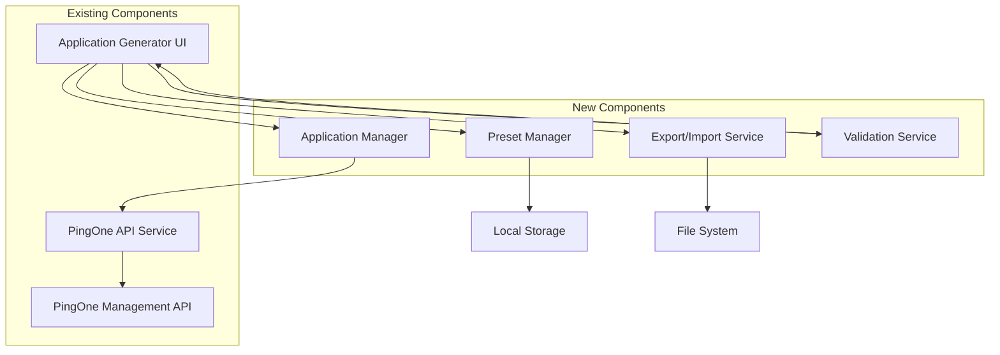

# Design Document

## Overview

This design enhances the existing PingOne Application Generator with advanced configuration presets, application management capabilities, and export/import functionality. The solution builds upon the current React/TypeScript architecture and integrates seamlessly with the existing `pingOneAppCreationService` and UI components.

## Architecture

### High-Level Architecture



### Component Integration

The new features integrate with existing components:
- **ApplicationGenerator.tsx**: Enhanced with new UI sections
- **pingOneAppCreationService**: Extended with read/update/delete operations
- **Existing form components**: Reused for consistency

## Components and Interfaces

### 1. Configuration Preset Manager

**Purpose**: Manages predefined and custom configuration presets

```typescript
interface ConfigurationPreset {
  id: string;
  name: string;
  description: string;
  category: 'built-in' | 'custom';
  appType: BuilderAppType;
  configuration: Partial<FormDataState>;
  metadata: {
    createdAt: string;
    updatedAt: string;
    useCase: string;
    securityLevel: 'basic' | 'enhanced' | 'enterprise';
  };
}

interface PresetManagerService {
  getBuiltInPresets(): ConfigurationPreset[];
  getCustomPresets(): ConfigurationPreset[];
  saveCustomPreset(preset: Omit<ConfigurationPreset, 'id' | 'metadata'>): void;
  deleteCustomPreset(id: string): void;
  updateCustomPreset(id: string, updates: Partial<ConfigurationPreset>): void;
  applyPreset(presetId: string): FormDataState;
}
```

**Built-in Presets Include**:
- **Enterprise Web App**: High security, comprehensive scopes, strict PKCE
- **Mobile App**: Native app with PKCE required, device-specific settings
- **SPA Development**: Development-friendly settings with localhost redirects
- **Microservice API**: Service-to-service with minimal scopes
- **Legacy Integration**: Backward compatibility settings

### 2. Application Management Service

**Purpose**: Manages existing PingOne applications (read, update, delete)

```typescript
interface ExistingApplication {
  id: string;
  name: string;
  type: string;
  enabled: boolean;
  createdAt: string;
  lastModified: string;
  configuration: any; // Full PingOne app configuration
}

interface ApplicationManagerService {
  listApplications(workerToken: string, environmentId: string): Promise<ExistingApplication[]>;
  getApplication(workerToken: string, environmentId: string, appId: string): Promise<ExistingApplication>;
  updateApplication(workerToken: string, environmentId: string, appId: string, config: any): Promise<void>;
  deleteApplication(workerToken: string, environmentId: string, appId: string): Promise<void>;
  convertToFormData(pingOneConfig: any): FormDataState;
  convertFromFormData(formData: FormDataState, appType: BuilderAppType): any;
}
```

### 3. Export/Import Service

**Purpose**: Handles configuration export/import functionality

```typescript
interface ExportedConfiguration {
  version: string;
  exportedAt: string;
  appType: BuilderAppType;
  configuration: FormDataState;
  metadata: {
    name: string;
    description: string;
    source: 'generator' | 'existing-app';
  };
}

interface ExportImportService {
  exportConfiguration(formData: FormDataState, appType: BuilderAppType, metadata: any): void;
  importConfiguration(file: File): Promise<ExportedConfiguration>;
  validateImportedConfiguration(config: ExportedConfiguration): ValidationResult;
}
```

### 4. Enhanced Validation Service

**Purpose**: Provides comprehensive validation with detailed error messages

```typescript
interface ValidationError {
  field: string;
  message: string;
  severity: 'error' | 'warning' | 'info';
  suggestion?: string;
}

interface ValidationResult {
  isValid: boolean;
  errors: ValidationError[];
  warnings: ValidationError[];
}

interface ValidationService {
  validateConfiguration(formData: FormDataState, appType: BuilderAppType): ValidationResult;
  validateField(field: string, value: any, context: FormDataState): ValidationError[];
  getFieldSuggestions(field: string, appType: BuilderAppType): string[];
}
```

## Data Models

### Enhanced Form Data State

Extends existing `FormDataState` with preset tracking:

```typescript
interface EnhancedFormDataState extends FormDataState {
  // Existing fields remain unchanged
  
  // New preset tracking
  appliedPreset?: {
    id: string;
    name: string;
    appliedAt: string;
  };
  
  // Enhanced validation state
  validationState?: {
    [field: string]: ValidationError[];
  };
}
```

### Preset Categories

Built-in presets organized by categories:

```typescript
const PRESET_CATEGORIES = {
  WEB_APPLICATIONS: {
    'enterprise-web': 'Enterprise Web Application',
    'development-web': 'Development Web Application',
    'public-web': 'Public Web Application'
  },
  MOBILE_APPLICATIONS: {
    'ios-app': 'iOS Mobile Application',
    'android-app': 'Android Mobile Application',
    'cross-platform': 'Cross-Platform Mobile App'
  },
  SINGLE_PAGE_APPS: {
    'react-spa': 'React Single Page Application',
    'angular-spa': 'Angular Single Page Application',
    'vue-spa': 'Vue Single Page Application'
  },
  SERVICES: {
    'microservice': 'Microservice API',
    'batch-job': 'Batch Processing Service',
    'integration-service': 'Integration Service'
  }
};
```

## Error Handling

### Enhanced Error Management

```typescript
interface AppGeneratorError {
  type: 'validation' | 'api' | 'network' | 'configuration';
  code: string;
  message: string;
  details?: any;
  suggestions: string[];
  retryable: boolean;
}

class ErrorHandler {
  static handleApiError(error: any): AppGeneratorError;
  static handleValidationError(errors: ValidationError[]): AppGeneratorError;
  static handleNetworkError(error: any): AppGeneratorError;
  static getSuggestions(errorType: string, context: any): string[];
}
```

### Error Recovery Strategies

1. **API Errors**: Retry with exponential backoff
2. **Validation Errors**: Field-level guidance and auto-correction suggestions
3. **Network Errors**: Connection troubleshooting and offline mode
4. **Configuration Errors**: Template suggestions and preset recommendations

## Testing Strategy

### Unit Testing

1. **Preset Manager Tests**
   - Built-in preset loading and validation
   - Custom preset CRUD operations
   - Preset application and form population

2. **Application Manager Tests**
   - API integration with PingOne
   - Configuration conversion between formats
   - Error handling for API failures

3. **Export/Import Tests**
   - File format validation
   - Configuration serialization/deserialization
   - Import error handling and recovery

4. **Validation Service Tests**
   - Field-level validation rules
   - Cross-field validation dependencies
   - Error message generation and suggestions

### Integration Testing

1. **End-to-End Workflows**
   - Complete preset-to-application creation flow
   - Existing application management workflow
   - Export/import round-trip testing

2. **API Integration**
   - PingOne API compatibility testing
   - Error response handling
   - Rate limiting and retry logic

### User Experience Testing

1. **Usability Testing**
   - Preset selection and application flow
   - Error message clarity and actionability
   - Form validation feedback timing

2. **Performance Testing**
   - Large application list loading
   - Bulk operation performance
   - File import/export speed

## Implementation Phases

### Phase 1: Configuration Presets
- Implement preset manager service
- Create built-in preset definitions
- Add preset selection UI to existing generator
- Implement custom preset save/load functionality

### Phase 2: Application Management
- Extend pingOneAppCreationService with read/update/delete operations
- Create application list and management UI
- Implement configuration conversion utilities
- Add update and delete confirmation flows

### Phase 3: Export/Import
- Implement export/import service
- Add file handling and validation
- Create import/export UI components
- Implement error handling and recovery

### Phase 4: Enhanced Validation
- Implement comprehensive validation service
- Add real-time field validation
- Create validation error display components
- Implement suggestion and auto-correction features

### Phase 5: Integration and Polish
- Integrate all features into cohesive UI
- Implement comprehensive error handling
- Add loading states and progress indicators
- Perform end-to-end testing and optimization