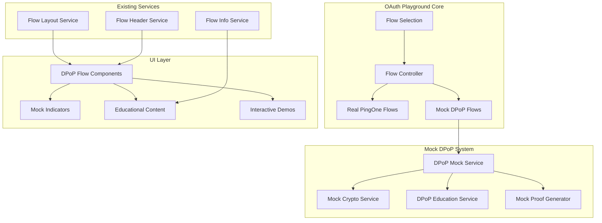

# Design Document

## Overview

The DPoP Mock Flows feature implements educational demonstrations of DPoP (Demonstration of Proof-of-Possession) per RFC 9449 within the OAuth Playground's existing architecture. This design ensures clear separation between mock educational content and real PingOne integrations while providing comprehensive learning experiences for OAuth security patterns.

The implementation follows the established V5/V6 service architecture, integrating seamlessly with existing flows while maintaining clear boundaries between educational mock features and production-ready PingOne functionality.

## Architecture

### High-Level Architecture



### Service Layer Architecture

The DPoP mock implementation follows the established service pattern with clear separation of concerns:

- **MockDPoPService**: Core DPoP proof generation and validation
- **DPoPEducationService**: Educational content and explanations
- **MockCryptoService**: Browser-compatible cryptographic operations
- **DPoPFlowIntegrationService**: Integration with existing flow architecture

## Components and Interfaces

### Core Services

#### MockDPoPService

```typescript
interface MockDPoPService {
  // Core DPoP proof operations
  generateDPoPProof(params: DPoPProofParams): MockDPoPProof;
  validateDPoPProof(proof: string): DPoPValidationResult;
  
  // Key management
  generateMockKeyPair(): Promise<MockDPoPKeyPair>;
  getMockPublicKey(): MockJWK;
  
  // Educational helpers
  explainProofStructure(proof: MockDPoPProof): DPoPExplanation;
  demonstrateSecurityBenefits(): SecurityDemo;
}

interface DPoPProofParams {
  httpMethod: string;
  uri: string;
  accessToken?: string;
  nonce?: string;
}

interface MockDPoPProof {
  header: DPoPHeader;
  payload: DPoPPayload;
  signature: string; // Mock signature for educational purposes
  rawJWT: string;
  isMock: true; // Always true for mock implementations
}

interface DPoPHeader {
  typ: "dpop+jwt";
  alg: "ES256" | "RS256";
  jwk: MockJWK;
}

interface DPoPPayload {
  jti: string;
  htm: string;
  htu: string;
  iat: number;
  ath?: string; // Access token hash when applicable
}
```

#### DPoPEducationService

```typescript
interface DPoPEducationService {
  // Educational content
  getFlowExplanation(flowType: DPoPFlowType): FlowExplanation;
  getSecurityBenefits(): SecurityBenefit[];
  getImplementationGuidance(): ImplementationGuide;
  
  // Interactive demonstrations
  demonstrateTokenReplayPrevention(): ReplayDemo;
  showKeyBindingConcepts(): KeyBindingDemo;
  explainRFC9449Compliance(): ComplianceExplanation;
  
  // Comparison content
  compareDPoPVsBearerTokens(): SecurityComparison;
  showProductionConsiderations(): ProductionGuidance;
}

enum DPoPFlowType {
  AUTHORIZATION_CODE = "authorization_code",
  CLIENT_CREDENTIALS = "client_credentials", 
  REFRESH_TOKEN = "refresh_token"
}

interface FlowExplanation {
  title: string;
  description: string;
  securityBenefits: string[];
  implementationSteps: Step[];
  codeExamples: CodeExample[];
  rfcReferences: RFCReference[];
}
```

#### MockCryptoService

```typescript
interface MockCryptoService {
  // Key generation for educational purposes
  generateECKeyPair(): Promise<MockECKeyPair>;
  generateRSAKeyPair(): Promise<MockRSAKeyPair>;
  
  // Mock signing operations
  signMockJWT(payload: object, privateKey: MockPrivateKey): string;
  
  // Hash operations for educational display
  generateMockATHash(accessToken: string): string;
  generateJTI(): string;
  
  // Educational crypto explanations
  explainKeyGeneration(): CryptoExplanation;
  demonstrateSigningProcess(): SigningDemo;
}

interface MockECKeyPair {
  privateKey: MockPrivateKey;
  publicKey: MockPublicKey;
  jwk: MockJWK;
  isMock: true;
}
```

### Flow Integration Components

#### DPoPAuthorizationCodeFlow

```typescript
interface DPoPAuthorizationCodeFlow extends BaseFlow {
  // Enhanced authorization code flow with DPoP
  generateAuthorizationURL(params: AuthzParams & DPoPParams): string;
  exchangeCodeForTokens(code: string, dpopProof: MockDPoPProof): Promise<DPoPTokenResponse>;
  makeProtectedAPICall(accessToken: string, dpopProof: MockDPoPProof): Promise<APIResponse>;
  
  // Educational demonstrations
  demonstrateTokenBinding(): TokenBindingDemo;
  showSecurityImprovement(): SecurityDemo;
}

interface DPoPTokenResponse extends TokenResponse {
  token_type: "DPoP"; // Always DPoP for mock flows
  dpop_bound: true;   // Educational indicator
  mock_implementation: true;
}
```

#### DPoPClientCredentialsFlow

```typescript
interface DPoPClientCredentialsFlow extends BaseFlow {
  // Client credentials with DPoP demonstration
  requestTokenWithDPoP(credentials: ClientCredentials, dpopProof: MockDPoPProof): Promise<DPoPTokenResponse>;
  demonstrateServerToServerSecurity(): ServerSecurityDemo;
  
  // Machine-to-machine specific features
  showContinuousProofGeneration(): ContinuousDemo;
  explainServerImplementation(): ServerImplementationGuide;
}
```

### UI Components

#### DPoPFlowHeader

```typescript
interface DPoPFlowHeader extends React.FC {
  flowType: DPoPFlowType;
  mockIndicator: boolean; // Always true
  educationalBadge: boolean; // Always true
}

// Extends existing flowHeaderService with DPoP-specific styling
const DPoPFlowHeader: React.FC<DPoPFlowHeaderProps> = ({
  flowType,
  title,
  description
}) => {
  return (
    <FlowHeader
      title={`${title} + DPoP (Mock)`}
      description={description}
      badge="Educational Demo"
      variant="mock"
      icon="🔐"
    />
  );
};
```

#### MockIndicatorBanner

```typescript
interface MockIndicatorBanner extends React.FC {
  message?: string;
  rfcLink?: boolean;
  productionWarning?: boolean;
}

const MockIndicatorBanner: React.FC<MockIndicatorProps> = ({
  message = "This is a mock DPoP implementation for educational purposes only",
  rfcLink = true,
  productionWarning = true
}) => {
  return (
    <InfoBox variant="warning" className="mock-dpop-banner">
      <div className="mock-indicator">
        <Icon name="info" />
        <span className="mock-label">MOCK IMPLEMENTATION</span>
      </div>
      <p>{message}</p>
      {rfcLink && (
        <a href="https://tools.ietf.org/rfc/rfc9449.html" target="_blank">
          📖 Read RFC 9449 - DPoP Specification
        </a>
      )}
      {productionWarning && (
        <p className="production-warning">
          ⚠️ PingOne does not support DPoP. For production DPoP implementation, 
          use a DPoP-compatible authorization server.
        </p>
      )}
    </InfoBox>
  );
};
```

#### DPoPProofDisplay

```typescript
interface DPoPProofDisplay extends React.FC {
  proof: MockDPoPProof;
  explanation?: boolean;
  interactive?: boolean;
}

const DPoPProofDisplay: React.FC<DPoPProofDisplayProps> = ({
  proof,
  explanation = true,
  interactive = false
}) => {
  return (
    <div className="dpop-proof-display">
      <CollapsibleHeader title="DPoP Proof Structure" variant="blue">
        <CodeBlock language="json" copyable>
          {JSON.stringify(proof, null, 2)}
        </CodeBlock>
        
        {explanation && (
          <div className="proof-explanation">
            <h4>Proof Components:</h4>
            <ul>
              <li><strong>jti:</strong> Unique identifier prevents replay attacks</li>
              <li><strong>htm:</strong> HTTP method binds proof to specific request</li>
              <li><strong>htu:</strong> HTTP URI binds proof to specific endpoint</li>
              <li><strong>iat:</strong> Issued at time prevents old proof reuse</li>
              {proof.payload.ath && (
                <li><strong>ath:</strong> Access token hash binds proof to token</li>
              )}
            </ul>
          </div>
        )}
        
        {interactive && (
          <InteractiveDPoPDemo proof={proof} />
        )}
      </CollapsibleHeader>
    </div>
  );
};
```

## Data Models

### DPoP Configuration

```typescript
interface DPoPFlowConfig {
  enabled: boolean;
  flowType: DPoPFlowType;
  keyAlgorithm: "ES256" | "RS256";
  educationalMode: boolean; // Always true for mock flows
  
  // Educational settings
  showProofStructure: boolean;
  showSecurityExplanations: boolean;
  interactiveMode: boolean;
  
  // Mock-specific settings
  mockSignatures: boolean; // Always true
  generateRealKeys: boolean; // For educational crypto operations
}

interface DPoPFlowState {
  config: DPoPFlowConfig;
  keyPair: MockDPoPKeyPair | null;
  generatedProofs: MockDPoPProof[];
  currentStep: DPoPFlowStep;
  
  // Educational state
  explanationsViewed: string[];
  interactiveDemosCompleted: string[];
}

enum DPoPFlowStep {
  INTRODUCTION = "introduction",
  KEY_GENERATION = "key_generation", 
  AUTHORIZATION = "authorization",
  TOKEN_EXCHANGE = "token_exchange",
  API_CALLS = "api_calls",
  SECURITY_REVIEW = "security_review"
}
```

### Educational Content Models

```typescript
interface SecurityBenefit {
  title: string;
  description: string;
  demonstration: SecurityDemo;
  rfcSection?: string;
}

interface SecurityDemo {
  scenario: string;
  withoutDPoP: AttackScenario;
  withDPoP: ProtectionScenario;
  explanation: string;
}

interface AttackScenario {
  description: string;
  steps: string[];
  vulnerability: string;
  impact: string;
}

interface ProtectionScenario {
  description: string;
  protection: string[];
  mechanism: string;
  result: string;
}
```

## Error Handling

### Mock-Specific Error Handling

```typescript
interface DPoPMockError extends Error {
  type: DPoPErrorType;
  educational: boolean; // Always true
  suggestion?: string;
  rfcReference?: string;
}

enum DPoPErrorType {
  MOCK_KEY_GENERATION_FAILED = "mock_key_generation_failed",
  MOCK_PROOF_GENERATION_FAILED = "mock_proof_generation_failed",
  EDUCATIONAL_CONTENT_LOAD_FAILED = "educational_content_load_failed",
  BROWSER_CRYPTO_UNAVAILABLE = "browser_crypto_unavailable"
}

class DPoPMockErrorHandler {
  static handleError(error: DPoPMockError): ErrorResponse {
    return {
      message: error.message,
      type: error.type,
      educational: true,
      suggestion: error.suggestion || "This is a mock implementation for learning purposes",
      fallback: "Continue with simplified demonstration",
      rfcReference: error.rfcReference
    };
  }
  
  static createFallbackContent(errorType: DPoPErrorType): FallbackContent {
    // Provide educational content even when mock crypto fails
    switch (errorType) {
      case DPoPErrorType.BROWSER_CRYPTO_UNAVAILABLE:
        return {
          title: "Crypto API Unavailable",
          content: "Showing pre-generated examples for educational purposes",
          examples: this.getPreGeneratedExamples()
        };
      default:
        return this.getDefaultFallback();
    }
  }
}
```

### Integration Error Handling

```typescript
interface FlowIntegrationError extends Error {
  flowType: DPoPFlowType;
  step: DPoPFlowStep;
  recoverable: boolean;
}

class DPoPFlowErrorRecovery {
  static recoverFromError(error: FlowIntegrationError): RecoveryAction {
    // Ensure mock errors don't break real flows
    if (error.recoverable) {
      return {
        action: "continue_without_dpop",
        message: "Continuing with standard OAuth flow",
        educational: true
      };
    }
    
    return {
      action: "show_educational_content",
      message: "Showing DPoP concepts without interactive demo",
      fallbackContent: this.getEducationalFallback(error.flowType)
    };
  }
}
```

## Testing Strategy

### Mock Implementation Testing

```typescript
describe("DPoP Mock Implementation", () => {
  describe("MockDPoPService", () => {
    it("should generate valid mock DPoP proofs", () => {
      const service = new MockDPoPService();
      const proof = service.generateDPoPProof({
        httpMethod: "POST",
        uri: "https://example.com/token"
      });
      
      expect(proof.isMock).toBe(true);
      expect(proof.header.typ).toBe("dpop+jwt");
      expect(proof.payload.htm).toBe("POST");
      expect(proof.payload.htu).toBe("https://example.com/token");
    });
    
    it("should include educational indicators", () => {
      const service = new MockDPoPService();
      const proof = service.generateDPoPProof({
        httpMethod: "GET",
        uri: "https://api.example.com/data"
      });
      
      expect(proof.signature).toContain("mock_signature");
      expect(proof.isMock).toBe(true);
    });
  });
  
  describe("DPoP Flow Integration", () => {
    it("should not interfere with real PingOne flows", () => {
      // Test that DPoP mock features don't affect real flows
      const realFlow = new AuthorizationCodeFlow();
      const mockDPoPFlow = new DPoPAuthorizationCodeFlow();
      
      // Ensure real flow remains unaffected
      expect(realFlow.generateAuthorizationURL).toBeDefined();
      expect(mockDPoPFlow.generateAuthorizationURL).toBeDefined();
      
      // Ensure they operate independently
      const realURL = realFlow.generateAuthorizationURL(realParams);
      const mockURL = mockDPoPFlow.generateAuthorizationURL(mockParams);
      
      expect(realURL).not.toContain("dpop");
      expect(mockURL).toContain("mock");
    });
  });
});
```

### Educational Content Testing

```typescript
describe("DPoP Educational Content", () => {
  describe("DPoPEducationService", () => {
    it("should provide comprehensive flow explanations", () => {
      const service = new DPoPEducationService();
      const explanation = service.getFlowExplanation(DPoPFlowType.AUTHORIZATION_CODE);
      
      expect(explanation.title).toBeDefined();
      expect(explanation.securityBenefits).toHaveLength.greaterThan(0);
      expect(explanation.rfcReferences).toContain("RFC 9449");
    });
    
    it("should demonstrate security benefits clearly", () => {
      const service = new DPoPEducationService();
      const demo = service.demonstrateTokenReplayPrevention();
      
      expect(demo.withoutDPoP.vulnerability).toBeDefined();
      expect(demo.withDPoP.protection).toBeDefined();
      expect(demo.explanation).toContain("replay attack");
    });
  });
});
```

### UI Component Testing

```typescript
describe("DPoP UI Components", () => {
  describe("MockIndicatorBanner", () => {
    it("should clearly indicate mock implementation", () => {
      render(<MockIndicatorBanner />);
      
      expect(screen.getByText(/mock implementation/i)).toBeInTheDocument();
      expect(screen.getByText(/educational purposes/i)).toBeInTheDocument();
      expect(screen.getByText(/PingOne does not support DPoP/i)).toBeInTheDocument();
    });
  });
  
  describe("DPoPProofDisplay", () => {
    it("should display proof structure with explanations", () => {
      const mockProof = createMockDPoPProof();
      render(<DPoPProofDisplay proof={mockProof} explanation={true} />);
      
      expect(screen.getByText(/jti/)).toBeInTheDocument();
      expect(screen.getByText(/prevents replay attacks/i)).toBeInTheDocument();
    });
  });
});
```

## Performance Considerations

### Mock Crypto Performance

- **Key Generation**: Use Web Crypto API when available, fallback to educational examples
- **Proof Generation**: Optimize for educational clarity over cryptographic performance
- **Caching**: Cache generated key pairs and proofs for consistent educational experience
- **Lazy Loading**: Load DPoP educational content only when accessed

### Memory Management

```typescript
class DPoPMockPerformance {
  private static keyPairCache = new Map<string, MockDPoPKeyPair>();
  private static proofCache = new Map<string, MockDPoPProof>();
  
  static async getOrGenerateKeyPair(algorithm: string): Promise<MockDPoPKeyPair> {
    const cacheKey = `keypair_${algorithm}`;
    
    if (this.keyPairCache.has(cacheKey)) {
      return this.keyPairCache.get(cacheKey)!;
    }
    
    const keyPair = await this.generateKeyPair(algorithm);
    this.keyPairCache.set(cacheKey, keyPair);
    return keyPair;
  }
  
  static clearCache(): void {
    this.keyPairCache.clear();
    this.proofCache.clear();
  }
}
```

## Security Considerations

### Mock Implementation Security

- **No Real Cryptography**: All signatures are mock for educational purposes
- **Clear Labeling**: Every DPoP feature clearly marked as mock/educational
- **Isolation**: Mock features completely isolated from real PingOne integrations
- **No Sensitive Data**: Mock implementations never handle real credentials or tokens

### Educational Security Awareness

```typescript
interface SecurityEducation {
  // Teach proper DPoP security practices
  keyRotation: KeyRotationGuidance;
  proofUniqueness: ProofUniquenessEducation;
  replayPrevention: ReplayPreventionDemo;
  
  // Warn about implementation pitfalls
  commonMistakes: SecurityMistake[];
  productionConsiderations: ProductionSecurity[];
}

interface SecurityMistake {
  mistake: string;
  consequence: string;
  prevention: string;
  example: CodeExample;
}
```

This design provides a comprehensive foundation for implementing DPoP mock flows that are educational, clearly distinguished from production features, and seamlessly integrated with the existing OAuth Playground architecture.