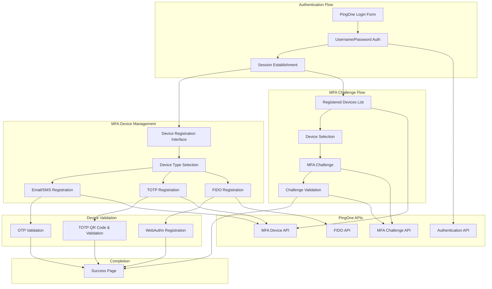
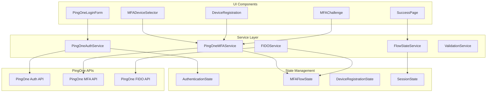

# Design Document

## Overview

This design implements a comprehensive end-to-end PingOne MFA flow that demonstrates real-world authentication scenarios using actual PingOne MFA APIs. The solution provides a complete user journey from initial authentication through device registration, MFA verification, and success tracking, all integrated with live PingOne services.

The architecture follows a multi-step flow pattern with proper state management, real API integration, and comprehensive error handling to ensure a production-ready MFA implementation that can serve as both a functional tool and educational reference.

## Architecture

### High-Level Flow Architecture



### Service Layer Architecture



## Components and Interfaces

### 1. PingOne Authentication Service

#### PingOneAuthService
```typescript
interface PingOneAuthService {
  authenticate(credentials: LoginCredentials): Promise<AuthenticationResult>;
  validateSession(token: string): Promise<SessionValidation>;
  refreshToken(refreshToken: string): Promise<TokenRefresh>;
  logout(sessionId: string): Promise<void>;
  getEnvironmentConfig(): EnvironmentConfig;
}

interface LoginCredentials {
  username: string;
  password: string;
  environmentId: string;
}

interface AuthenticationResult {
  success: boolean;
  accessToken?: string;
  refreshToken?: string;
  sessionId?: string;
  userId?: string;
  error?: AuthenticationError;
  mfaRequired?: boolean;
}

interface SessionValidation {
  valid: boolean;
  userId?: string;
  expiresAt?: Date;
  permissions?: string[];
}
```

**Implementation Strategy:**
- Use PingOne Authentication API for username/password authentication
- Implement proper token lifecycle management with refresh capabilities
- Handle authentication errors with user-friendly messages
- Support environment-specific configuration for different PingOne setups

### 2. Enhanced PingOne MFA Service

#### PingOneMFAService (Extended)
```typescript
interface PingOneMFAService {
  // Device Management
  getRegisteredDevices(userId: string): Promise<MFADevice[]>;
  registerDevice(userId: string, deviceConfig: DeviceConfig): Promise<DeviceRegistrationResult>;
  activateDevice(userId: string, deviceId: string, activationData: ActivationData): Promise<ActivationResult>;
  deleteDevice(userId: string, deviceId: string): Promise<void>;
  
  // Challenge Flow
  initiateChallenge(userId: string, deviceId: string): Promise<ChallengeResult>;
  validateChallenge(userId: string, challengeId: string, response: string): Promise<ValidationResult>;
  
  // Device-Specific Methods
  sendOTP(userId: string, deviceId: string, method: 'EMAIL' | 'SMS'): Promise<OTPResult>;
  validateOTP(userId: string, deviceId: string, code: string): Promise<ValidationResult>;
  generateTOTPSecret(userId: string): Promise<TOTPSecretResult>;
  validateTOTP(userId: string, deviceId: string, code: string): Promise<ValidationResult>;
}

interface DeviceConfig {
  type: 'EMAIL' | 'SMS' | 'TOTP' | 'FIDO';
  nickname: string;
  email?: string;
  phoneNumber?: string;
  totpConfig?: TOTPConfig;
}

interface DeviceRegistrationResult {
  success: boolean;
  device?: MFADevice;
  qrCode?: string;
  secret?: string;
  backupCodes?: string[];
  error?: string;
}

interface ChallengeResult {
  challengeId: string;
  method: string;
  expiresAt: Date;
  deliveryStatus?: 'SENT' | 'DELIVERED' | 'FAILED';
}
```

### 3. FIDO WebAuthn Service

#### FIDOService
```typescript
interface FIDOService {
  checkWebAuthnSupport(): WebAuthnSupport;
  registerDevice(userId: string, options: FIDORegistrationOptions): Promise<FIDORegistrationResult>;
  authenticateDevice(userId: string, challengeData: FIDOChallenge): Promise<FIDOAuthResult>;
  getRegistrationOptions(userId: string): Promise<PublicKeyCredentialCreationOptions>;
  getAuthenticationOptions(userId: string, deviceId?: string): Promise<PublicKeyCredentialRequestOptions>;
}

interface WebAuthnSupport {
  supported: boolean;
  browserInfo: string;
  platformAuthenticator: boolean;
  crossPlatformAuthenticator: boolean;
}

interface FIDORegistrationOptions {
  nickname: string;
  authenticatorType: 'platform' | 'cross-platform' | 'both';
  userVerification: 'required' | 'preferred' | 'discouraged';
}

interface FIDORegistrationResult {
  success: boolean;
  deviceId?: string;
  credentialId?: string;
  error?: string;
  attestationResult?: AttestationResult;
}
```

### 4. Flow State Management

#### FlowStateService
```typescript
interface FlowStateService {
  initializeFlow(flowType: MFAFlowType): string; // Returns flowId
  updateFlowState(flowId: string, state: Partial<MFAFlowState>): void;
  getFlowState(flowId: string): MFAFlowState | null;
  completeFlow(flowId: string, result: FlowCompletionResult): void;
  clearFlow(flowId: string): void;
  
  // Step management
  advanceStep(flowId: string, stepData?: any): void;
  goBackStep(flowId: string): void;
  getCurrentStep(flowId: string): FlowStep | null;
}

interface MFAFlowState {
  flowId: string;
  flowType: MFAFlowType;
  currentStep: number;
  steps: FlowStep[];
  userId?: string;
  sessionToken?: string;
  selectedDevice?: MFADevice;
  registrationData?: DeviceRegistrationData;
  challengeData?: ChallengeData;
  completionData?: FlowCompletionResult;
  startTime: Date;
  lastActivity: Date;
}

type MFAFlowType = 'DEVICE_REGISTRATION' | 'MFA_AUTHENTICATION' | 'DEVICE_MANAGEMENT';

interface FlowStep {
  stepId: string;
  stepType: string;
  title: string;
  completed: boolean;
  data?: any;
  timestamp?: Date;
}
```

### 5. UI Components (V6 Architecture)

All components will use the V6 Service Architecture for consistent theming and reusable components.

#### V6 Theme Configuration
```typescript
// Use 'blue' theme for PingOne MFA flows to maintain consistency
const { Layout, Collapsible, Info, Cards } = V6FlowService.createFlowComponents('blue');
```

#### PingOneLoginForm Component (V6)
```typescript
interface PingOneLoginFormProps {
  onAuthenticationSuccess: (result: AuthenticationResult) => void;
  onAuthenticationError: (error: AuthenticationError) => void;
  environmentId?: string;
  theme?: 'blue' | 'green' | 'purple';
}
```

**V6 Implementation Pattern:**
```tsx
const PingOneLoginFormV6: React.FC<PingOneLoginFormProps> = ({ theme = 'blue', ...props }) => {
  const { Layout, Collapsible, Info } = V6FlowService.createFlowComponents(theme);
  
  return (
    <Layout.Container>
      <Layout.ContentWrapper>
        <Layout.MainCard>
          <Layout.StepHeader>
            <Layout.StepHeaderLeft>
              <Layout.VersionBadge>V6.0 - Service Architecture</Layout.VersionBadge>
              <Layout.StepHeaderTitle>PingOne Authentication</Layout.StepHeaderTitle>
            </Layout.StepHeaderLeft>
          </Layout.StepHeader>
          <Layout.StepContentWrapper>
            {/* Login form content using V6 components */}
          </Layout.StepContentWrapper>
        </Layout.MainCard>
      </Layout.ContentWrapper>
    </Layout.Container>
  );
};
```

**Features:**
- V6 standardized layout and theming
- ComprehensiveDiscoveryInput for environment configuration
- Real-time validation using V6 form patterns
- Error display using V6 Info components
- Collapsible sections for advanced options

#### MFADeviceSelector Component (V6)
```typescript
interface MFADeviceSelectorProps {
  userId: string;
  onDeviceSelected: (device: MFADevice) => void;
  onRegisterNewDevice: () => void;
  showRegistrationOption: boolean;
  theme?: 'blue' | 'green' | 'purple';
}
```

**V6 Implementation Pattern:**
```tsx
const MFADeviceSelectorV6: React.FC<MFADeviceSelectorProps> = ({ theme = 'blue', ...props }) => {
  const { Layout, Collapsible, Info, Cards } = V6FlowService.createFlowComponents(theme);
  
  return (
    <Layout.Container>
      <Layout.ContentWrapper>
        <Layout.MainCard>
          <Layout.StepHeader>
            <Layout.StepHeaderLeft>
              <Layout.VersionBadge>V6.0 - Service Architecture</Layout.VersionBadge>
              <Layout.StepHeaderTitle>Select MFA Device</Layout.StepHeaderTitle>
            </Layout.StepHeaderLeft>
          </Layout.StepHeader>
          <Layout.StepContentWrapper>
            <Cards.FlowSuitability>
              {/* Device cards using V6 Cards components */}
            </Cards.FlowSuitability>
          </Layout.StepContentWrapper>
        </Layout.MainCard>
      </Layout.ContentWrapper>
    </Layout.Container>
  );
};
```

**Features:**
- V6 Cards components for device display
- Collapsible sections for device management
- V6 Info components for device status
- Standardized V6 layout and theming

#### DeviceRegistrationWizard Component (V6)
```typescript
interface DeviceRegistrationWizardProps {
  userId: string;
  onRegistrationComplete: (device: MFADevice) => void;
  onRegistrationCancel: () => void;
  allowedDeviceTypes?: DeviceType[];
  theme?: 'blue' | 'green' | 'purple';
}
```

**V6 Implementation Pattern:**
```tsx
const DeviceRegistrationWizardV6: React.FC<DeviceRegistrationWizardProps> = ({ theme = 'blue', ...props }) => {
  const { Layout, Collapsible, Info, Cards } = V6FlowService.createFlowComponents(theme);
  const { currentStep, setCurrentStep, collapsedSections, toggleSection } = useV6StepManagement();
  
  return (
    <Layout.Container>
      <Layout.ContentWrapper>
        <Layout.MainCard>
          <Layout.StepHeader>
            <Layout.StepHeaderLeft>
              <Layout.VersionBadge>V6.0 - Service Architecture</Layout.VersionBadge>
              <Layout.StepHeaderTitle>Register MFA Device</Layout.StepHeaderTitle>
            </Layout.StepHeaderLeft>
            <Layout.StepHeaderRight>
              <Layout.StepNumber>{currentStep}</Layout.StepNumber>
              <Layout.StepTotal>of 4</Layout.StepTotal>
            </Layout.StepHeaderRight>
          </Layout.StepHeader>
          <Layout.StepContentWrapper>
            {/* Device type selection using V6 Cards */}
            <Cards.FlowSuitability>
              <Cards.SuitabilityCard $variant="success">
                <h4>TOTP Authenticator</h4>
                <ul><li>Most secure option</li><li>Works offline</li></ul>
              </Cards.SuitabilityCard>
              {/* Additional device type cards */}
            </Cards.FlowSuitability>
            
            {/* Collapsible sections for each device type */}
            <Collapsible.CollapsibleSection>
              <Collapsible.CollapsibleHeaderButton onClick={() => toggleSection('totp')}>
                <Collapsible.CollapsibleTitle>
                  <FiSmartphone /> TOTP Setup
                </Collapsible.CollapsibleTitle>
                <Collapsible.CollapsibleToggleIcon $collapsed={collapsedSections.totp}>
                  <FiChevronDown />
                </Collapsible.CollapsibleToggleIcon>
              </Collapsible.CollapsibleHeaderButton>
              {!collapsedSections.totp && (
                <Collapsible.CollapsibleContent>
                  {/* TOTP setup content */}
                </Collapsible.CollapsibleContent>
              )}
            </Collapsible.CollapsibleSection>
          </Layout.StepContentWrapper>
        </Layout.MainCard>
      </Layout.ContentWrapper>
    </Layout.Container>
  );
};
```

**Features:**
- V6 step management with useV6StepManagement hook
- Collapsible sections for each device type
- V6 Cards for device type selection
- Progress indicators using V6 Layout components

#### MFAChallengeForm Component (V6)
```typescript
interface MFAChallengeFormProps {
  device: MFADevice;
  challengeData: ChallengeResult;
  onChallengeComplete: (result: ValidationResult) => void;
  onChallengeCancel: () => void;
  theme?: 'blue' | 'green' | 'purple';
}
```

**V6 Implementation Pattern:**
```tsx
const MFAChallengeFormV6: React.FC<MFAChallengeFormProps> = ({ theme = 'blue', device, ...props }) => {
  const { Layout, Collapsible, Info, Cards } = V6FlowService.createFlowComponents(theme);
  
  return (
    <Layout.Container>
      <Layout.ContentWrapper>
        <Layout.MainCard>
          <Layout.StepHeader>
            <Layout.StepHeaderLeft>
              <Layout.VersionBadge>V6.0 - Service Architecture</Layout.VersionBadge>
              <Layout.StepHeaderTitle>MFA Challenge</Layout.StepHeaderTitle>
              <Layout.StepHeaderSubtitle>{device.nickname} ({device.type})</Layout.StepHeaderSubtitle>
            </Layout.StepHeaderLeft>
          </Layout.StepHeader>
          <Layout.StepContentWrapper>
            <Info.InfoBox $variant="info">
              <FiShield size={20} />
              <div>
                <Info.InfoTitle>Verification Required</Info.InfoTitle>
                <Info.InfoText>
                  Enter the verification code from your {device.type} device.
                </Info.InfoText>
              </div>
            </Info.InfoBox>
            
            <Cards.GeneratedContentBox>
              <Cards.GeneratedLabel>Challenge Details</Cards.GeneratedLabel>
              {/* Challenge form content */}
            </Cards.GeneratedContentBox>
          </Layout.StepContentWrapper>
        </Layout.MainCard>
      </Layout.ContentWrapper>
    </Layout.Container>
  );
};
```

**Features:**
- V6 Info components for challenge instructions
- V6 Cards for challenge form display
- Device-specific challenge forms using V6 patterns
- Real-time validation with V6 styling

#### SuccessPage Component (V6)
```typescript
interface SuccessPageProps {
  flowResult: FlowCompletionResult;
  onContinue: () => void;
  onRegisterAnotherDevice: () => void;
  theme?: 'blue' | 'green' | 'purple';
}

interface FlowCompletionResult {
  flowType: MFAFlowType;
  completedSteps: FlowStep[];
  authenticationMethod: string;
  deviceUsed?: MFADevice;
  newDevicesRegistered?: MFADevice[];
  securityInfo: SecurityInfo;
  duration: number;
}
```

**V6 Implementation Pattern:**
```tsx
const SuccessPageV6: React.FC<SuccessPageProps> = ({ theme = 'blue', flowResult, ...props }) => {
  const { Layout, Collapsible, Info, Cards } = V6FlowService.createFlowComponents(theme);
  const { collapsedSections, toggleSection } = useV6StepManagement();
  
  return (
    <Layout.Container>
      <Layout.ContentWrapper>
        <Layout.MainCard>
          <Layout.StepHeader>
            <Layout.StepHeaderLeft>
              <Layout.VersionBadge>V6.0 - Service Architecture</Layout.VersionBadge>
              <Layout.StepHeaderTitle>Authentication Complete</Layout.StepHeaderTitle>
              <Layout.StepHeaderSubtitle>Flow completed successfully</Layout.StepHeaderSubtitle>
            </Layout.StepHeaderLeft>
          </Layout.StepHeader>
          <Layout.StepContentWrapper>
            <Info.InfoBox $variant="success">
              <FiCheckCircle size={20} />
              <div>
                <Info.InfoTitle>Authentication Successful</Info.InfoTitle>
                <Info.InfoText>
                  Your {flowResult.flowType} flow completed in {flowResult.duration}ms
                </Info.InfoText>
              </div>
            </Info.InfoBox>
            
            <Collapsible.CollapsibleSection>
              <Collapsible.CollapsibleHeaderButton onClick={() => toggleSection('summary')}>
                <Collapsible.CollapsibleTitle>
                  <FiInfo /> Flow Summary
                </Collapsible.CollapsibleTitle>
                <Collapsible.CollapsibleToggleIcon $collapsed={collapsedSections.summary}>
                  <FiChevronDown />
                </Collapsible.CollapsibleToggleIcon>
              </Collapsible.CollapsibleHeaderButton>
              {!collapsedSections.summary && (
                <Collapsible.CollapsibleContent>
                  <Cards.ParameterGrid>
                    <Cards.ParameterLabel>Authentication Method</Cards.ParameterLabel>
                    <Cards.ParameterValue>{flowResult.authenticationMethod}</Cards.ParameterValue>
                    {/* Additional flow details */}
                  </Cards.ParameterGrid>
                </Collapsible.CollapsibleContent>
              )}
            </Collapsible.CollapsibleSection>
          </Layout.StepContentWrapper>
        </Layout.MainCard>
      </Layout.ContentWrapper>
    </Layout.Container>
  );
};
```

**Features:**
- V6 success styling with Info components
- Collapsible sections for detailed flow summary
- V6 Cards for parameter display
- Security information using V6 patterns

## Data Models

### Enhanced MFA Device Model
```typescript
interface MFADevice {
  id: string;
  userId: string;
  type: 'EMAIL' | 'SMS' | 'TOTP' | 'FIDO';
  nickname: string;
  status: 'PENDING' | 'ACTIVE' | 'SUSPENDED' | 'EXPIRED';
  createdAt: Date;
  lastUsed?: Date;
  
  // Type-specific properties
  email?: string;
  phoneNumber?: string;
  totpSecret?: string; // Server-side only
  fidoCredentialId?: string;
  
  // Metadata
  registrationIP?: string;
  userAgent?: string;
  activationMethod?: string;
  backupCodes?: string[]; // Encrypted
}
```

### Authentication Session Model
```typescript
interface AuthenticationSession {
  sessionId: string;
  userId: string;
  accessToken: string;
  refreshToken: string;
  expiresAt: Date;
  refreshExpiresAt: Date;
  
  // Session metadata
  ipAddress: string;
  userAgent: string;
  createdAt: Date;
  lastActivity: Date;
  
  // MFA status
  mfaCompleted: boolean;
  mfaDeviceUsed?: string;
  mfaTimestamp?: Date;
  
  // Security flags
  riskScore: number;
  requiresReauth: boolean;
  securityFlags: string[];
}
```

### Challenge Data Model
```typescript
interface ChallengeData {
  challengeId: string;
  deviceId: string;
  userId: string;
  challengeType: string;
  status: 'PENDING' | 'COMPLETED' | 'EXPIRED' | 'FAILED';
  createdAt: Date;
  expiresAt: Date;
  
  // Challenge-specific data
  otpDeliveryStatus?: 'SENT' | 'DELIVERED' | 'FAILED';
  totpTimeWindow?: number;
  fidoChallenge?: string;
  
  // Attempt tracking
  attemptCount: number;
  maxAttempts: number;
  lastAttempt?: Date;
}
```

## Error Handling

### Comprehensive Error Management System

#### Error Categories and Recovery Strategies

1. **Authentication Errors**
   - Invalid credentials with account lockout protection
   - Session expiration with automatic refresh attempts
   - Environment configuration errors with troubleshooting guidance

2. **MFA Device Errors**
   - Device registration failures with specific error codes
   - OTP delivery failures with alternative method suggestions
   - TOTP synchronization issues with time adjustment guidance
   - FIDO registration errors with browser compatibility checks

3. **API Integration Errors**
   - PingOne service unavailability with status page links
   - Rate limiting with backoff and retry mechanisms
   - Network connectivity issues with offline mode detection
   - API response parsing errors with fallback handling

4. **User Experience Errors**
   - Form validation errors with inline feedback
   - Browser compatibility issues with feature detection
   - Mobile device limitations with responsive alternatives
   - Accessibility issues with screen reader support

#### Error Recovery Service
```typescript
interface ErrorRecoveryService {
  handleAuthenticationError(error: AuthenticationError): RecoveryAction[];
  handleMFADeviceError(error: MFADeviceError): RecoveryAction[];
  handleAPIError(error: APIError): RecoveryAction[];
  handleValidationError(error: ValidationError): RecoveryAction[];
  
  // Recovery actions
  suggestAlternativeMethod(currentMethod: string): AlternativeMethod[];
  initiateErrorRecovery(errorType: string, context: ErrorContext): Promise<RecoveryResult>;
  logSecurityEvent(event: SecurityEvent): void;
}

interface RecoveryAction {
  type: 'RETRY' | 'ALTERNATIVE' | 'CONTACT_SUPPORT' | 'RESTART_FLOW';
  title: string;
  description: string;
  action?: () => Promise<void>;
  priority: number;
}
```

## Testing Strategy

### Comprehensive Testing Framework

#### Unit Testing
1. **Service Layer Testing**
   - Mock PingOne API responses for all scenarios
   - Test error handling and recovery mechanisms
   - Validate state management and session handling
   - Test FIDO WebAuthn integration with mock credentials

2. **Component Testing**
   - Test form validation and user interactions
   - Verify responsive design across device sizes
   - Test accessibility compliance with screen readers
   - Validate error display and recovery options

#### Integration Testing
1. **API Integration Testing**
   - Test with real PingOne sandbox environment
   - Validate API request/response formats
   - Test rate limiting and error scenarios
   - Verify security token handling

2. **End-to-End Flow Testing**
   - Complete authentication and MFA flows
   - Cross-browser compatibility testing
   - Mobile device testing with real authenticators
   - Performance testing under load

#### Security Testing
1. **Authentication Security**
   - Token lifecycle and refresh testing
   - Session management and timeout validation
   - CSRF and XSS protection verification
   - Secure storage of sensitive data

2. **MFA Security**
   - TOTP time synchronization testing
   - OTP replay attack prevention
   - FIDO credential security validation
   - Backup code generation and usage

### Test Data and Scenarios
```typescript
// Test scenarios for different MFA methods
const testScenarios = {
  emailMFA: {
    validEmail: 'test@example.com',
    invalidEmail: 'invalid-email',
    validOTP: '123456',
    expiredOTP: '000000'
  },
  smsMFA: {
    validPhone: '+1234567890',
    invalidPhone: 'invalid-phone',
    validOTP: '654321',
    expiredOTP: '000000'
  },
  totpMFA: {
    validSecret: 'JBSWY3DPEHPK3PXP',
    validCode: '123456',
    invalidCode: '000000',
    expiredCode: '999999'
  },
  fidoMFA: {
    supportedBrowser: true,
    platformAuthenticator: true,
    validCredential: 'mock-credential-id'
  }
};
```

## Security Considerations

### Authentication Security
1. **Token Management**
   - Secure token storage using httpOnly cookies or secure localStorage
   - Automatic token refresh with proper error handling
   - Token revocation on logout or security events

2. **Session Security**
   - Session timeout with configurable duration
   - Concurrent session management
   - IP address and user agent validation

### MFA Security Implementation
1. **TOTP Security**
   - Secure random secret generation using cryptographically strong methods
   - Time window validation with clock skew tolerance
   - Replay attack prevention with used code tracking

2. **OTP Security**
   - Rate limiting for OTP generation and validation
   - Secure OTP delivery with delivery confirmation
   - OTP expiration and cleanup

3. **FIDO Security**
   - WebAuthn best practices implementation
   - Credential storage security
   - Attestation validation for device verification

### Data Protection
1. **Sensitive Data Handling**
   - No client-side storage of TOTP secrets
   - Encrypted backup code storage
   - Secure transmission of all authentication data

2. **Privacy Protection**
   - Minimal data collection and storage
   - User consent for data processing
   - Data retention and deletion policies

## Performance Optimization

### Client-Side Optimization
- Lazy loading of MFA components
- Efficient state management with minimal re-renders
- Optimized bundle splitting for different flow types
- Progressive enhancement for advanced features

### API Optimization
- Request caching for device lists and configuration
- Batch API calls where possible
- Connection pooling for multiple API requests
- Retry mechanisms with exponential backoff

### User Experience Optimization
- Preloading of next steps in the flow
- Optimistic UI updates with rollback capability
- Offline detection and graceful degradation
- Performance monitoring and user experience metrics

This design provides a comprehensive foundation for implementing a complete PingOne MFA flow that demonstrates real-world authentication scenarios while maintaining security, usability, and performance standards.