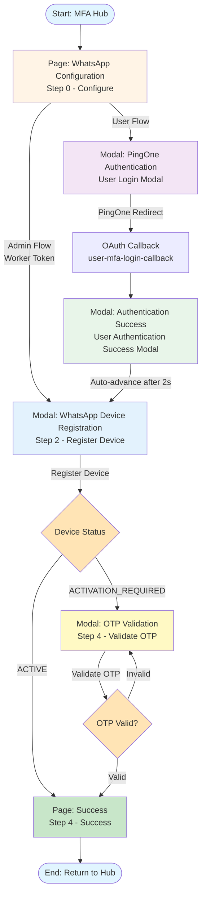

# WhatsApp Registration UI Flow

This document provides a visual diagram of the UI page flow for WhatsApp device registration. WhatsApp follows the same UI pattern as SMS, using a modal structure for device registration.

## Flow Diagram



## Detailed Step Descriptions

### Step 0: WhatsApp Configuration Page
- **Route:** `/v8/mfa/register/whatsapp/config` or `/v8/mfa/register/whatsapp/device` (if configured)
- **Purpose:** Configure WhatsApp registration settings
- **Fields:**
  - Environment ID
  - Username
  - Device Authentication Policy (dropdown)
  - Worker Token (for Admin Flow) OR User Token (for User Flow)
  - **User Token Button/Display:** Shows user token status and "Login with PingOne" button when User Flow is selected (tokenType === 'user')
- **Actions:**
  - **Admin Flow:** "Proceed to Registration" button (enabled when worker token is valid)
  - **User Flow:** "Start Authentication" button → Opens PingOne Authentication Modal
  - **User Token Management:** User token display with "Clear" button (when token exists) or "Login with PingOne" button (when token is missing)
- **Fallback:** "Next Step" button is always available in the footer as a backup for manual progression to Step 1 (enabled when all prerequisites are met: environment ID, username, device policy, and valid token (worker or user))
- **'oauth_completed' Placeholder:**
  - After successful OAuth authentication, `userToken` is set to `'oauth_completed'` (placeholder, not actual token)
  - This placeholder indicates successful authentication and is accepted by validation logic
  - Device registration operations automatically use worker token even in user flows (see "User Token Handling" section below)

### Step: PingOne Authentication (User Flow Only)
- **Modal:** User Login Modal (`UserLoginModalV8`)
- **Purpose:** Authenticate user to get user token
- **Process:**
  1. User clicks "Start Authentication"
  2. Redirects to PingOne authorization endpoint
  3. User authenticates
  4. PingOne redirects back to `/user-mfa-login-callback`
  5. OAuth callback is processed
  6. User token is received and saved

### Step: Authentication Success Modal (User Flow Only)
- **Component:** User Authentication Success Modal (`UserAuthenticationSuccessModalV8`)
- **Display:** Modal overlay (fixed position, centered)
- **Purpose:** Confirm successful authentication and display user data from PingOne
- **Features:**
  - Shows user information from PingOne (username, email, name, etc.)
  - Displays session details (token type, expires in, scopes, environment ID)
  - Displays subject (sub) - User ID from PingOne
  - Auto-advances to Device Registration Modal after 2 seconds (for MFA flows)
  - Manual "Continue to Device Registration" button available
  - Close button (X) and ESC key support
- **Navigation:** Auto-navigates to Step 2 (Device Registration Modal) after 2 seconds
- **Fallback:** "Continue to Device Registration" button is always available for manual navigation if auto-advance fails or user wants to proceed immediately

### Step 1: WhatsApp Device Selection
- **Route:** `/v8/mfa/register/whatsapp/device` (Step 1)
- **Purpose:** Select an existing WhatsApp device or choose to register a new one
- **Display:** Inline content (not a modal)
- **Features:**
  - Lists existing WhatsApp devices (if any)
  - "Register New Device" button to proceed to registration
  - Device selection for existing devices
- **Note:** This step is skipped during registration flow when coming from configuration page (`isConfigured === true`)

### Step 2: WhatsApp Device Registration Modal
- **Route:** `/v8/mfa/register/whatsapp/device` (Step 2)
- **Display:** **Modal overlay (fixed position, draggable, centered)**
- **Purpose:** Register new WhatsApp device for user
- **Modal Structure:**
  - **Modal Overlay:** Fixed position (`position: fixed`), semi-transparent backdrop (`rgba(0, 0, 0, 0.5)`)
  - **Modal Container:** White background, rounded corners, box shadow, centered on screen
  - **Modal Header:** 
    - Draggable header with PingIdentity logo
    - Title: "Register MFA Device"
    - Subtitle: "Add a new device for multi-factor authentication"
    - Close button (X) in top right corner
  - **Modal Body:**
    - Username display (read-only, gray background box)
    - Phone Number field (with country code picker)
    - Device Name field
    - Phone Number Preview box (yellow background, shows formatted phone number)
    - Worker Token Status indicator
    - API Display Toggle checkbox
    - Action buttons: Cancel (left) and Register WhatsApp Device (right, primary)
- **Fields:**
  - **Phone Number:** Required, with country code picker (47 countries with flags)
  - **Device Name:** Required, friendly name to identify the device (e.g., "My WhatsApp", "Work WhatsApp")
- **Actions:**
  - "Cancel" button - Closes modal and returns to previous step
  - "Register WhatsApp Device" button - Validates and registers device
- **Modal Behavior:**
  - Modal is displayed as a fixed overlay (`position: fixed`) on top of the page
  - Centered on screen with semi-transparent backdrop (`rgba(0, 0, 0, 0.5)`)
  - Modal content is centered vertically and horizontally when first opened
  - **Draggable:** User can drag the modal by clicking and dragging the header
  - Has a close button (X) in the header to return to previous step
  - Backdrop click does NOT close modal (requires explicit close action)
- **Process:**
  1. User enters phone number (with country code)
  2. User enters device name
  3. Clicks "Register WhatsApp Device" button
  4. API call: `POST /v1/environments/{envId}/users/{userId}/devices` with `type: "WHATSAPP"`
  5. PingOne responds with device status:
     - **ACTIVE:** Device is immediately ready → Show Success Page (Step 4)
     - **ACTIVATION_REQUIRED:** OTP automatically sent by PingOne → Auto-advance to Step 4 (Validate OTP), skipping Step 3
- **Fallback:** "Next Step" button is always available in the footer as a backup for manual progression if auto-advance fails or user wants to proceed immediately

### Step 3: Send OTP Code
- **Route:** `/v8/mfa/register/whatsapp/device` (Step 3)
- **Purpose:** Send OTP code to registered WhatsApp phone number
- **Behavior:**
  - **For ACTIVATION_REQUIRED devices:** This step is automatically skipped - PingOne sends OTP during device registration
  - **For existing ACTIVE devices:** User can manually send OTP for device authentication
- **Features:**
  - "Send OTP Code" button
  - "Resend OTP Code" button (after initial send)
  - Device ID and phone number display
  - Success message after OTP is sent
  - Error handling for send failures
- **Process:**
  1. User clicks "Send OTP Code" button
  2. API call: `POST /v1/environments/{envId}/users/{userId}/devices/{deviceId}/otp/send`
  3. OTP is sent to WhatsApp phone number
  4. Navigate to Step 4 (Validate OTP)
- **Note:** For newly registered devices with `ACTIVATION_REQUIRED` status, this step is skipped because PingOne automatically sends the OTP during device registration.

### Step 4: Validate OTP OR Success Page (Conditional)
- **Route:** `/v8/mfa/register/whatsapp/device` (Step 4)
- **Display:** 
  - OTP Validation: **Modal overlay (fixed position, draggable, centered)**
  - Success: Full page component
- **Purpose:** Validate OTP code (if ACTIVATION_REQUIRED) OR show success (if ACTIVE)
- **Behavior:**
  - **If device status is ACTIVE:** Shows Success Page immediately
  - **If device status is ACTIVATION_REQUIRED:** Shows OTP Validation modal
- **OTP Validation Modal Structure:**
  - **Modal Overlay:** Fixed position (`position: fixed`), semi-transparent backdrop (`rgba(0, 0, 0, 0.5)`)
  - **Modal Container:** White background, rounded corners, box shadow, centered on screen
  - **Modal Header:**
    - Draggable header with PingIdentity logo
    - Title: "Validate OTP Code"
    - Subtitle: "Enter the code sent to your WhatsApp"
    - Close button (X) in top right corner
  - **Modal Body:**
    - OTP input field (6 digits)
    - "Validate OTP" button
    - "Resend OTP" button (if needed)
    - Error display for invalid OTP attempts
- **OTP Validation Features:**
  - OTP input field (6 digits)
  - "Validate OTP" button
  - "Resend OTP" button (if needed)
  - Error display for invalid OTP attempts
- **OTP Validation Process:**
  1. User receives OTP code via WhatsApp (automatically sent by PingOne during registration, or manually sent from Step 3)
  2. User enters OTP code
  3. API call: `POST /v1/environments/{envId}/users/{userId}/devices/{deviceId}/otp/check`
  4. If valid → Device status changes to ACTIVE → Success Page is shown (same Step 4, re-renders automatically)
  5. If invalid → Show error, allow retry on same step
- **Fallback:** "Next Step" button is always available in the footer as a backup for manual progression if needed (though typically not needed since OTP validation triggers automatic re-render to Success Page)
- **Success Page Features:**
  - Success message
  - Device details (ID, phone number, nickname, status)
  - "Start Again" button (returns to MFA Hub via `navigateToMfaHubWithCleanup`)
  - API calls display (collapsible, via `SuperSimpleApiDisplayV8`)
  - Documentation button (opens documentation modal)
- **Navigation:**
  - After successful OTP validation, device status becomes ACTIVE
  - Step 4 re-renders and shows Success Page (no navigation to Step 5)

## Flow Paths Summary

### Admin Flow Path (Worker Token)
```
MFA Hub 
  → WhatsApp Configuration (Step 0)
  → WhatsApp Device Selection (Step 1 - skipped during registration flow)
  → WhatsApp Device Registration Modal (Step 2)
  → [ACTIVE] Success Page (Step 4)
  OR
  → [ACTIVATION_REQUIRED] Skip Step 3 (Send OTP - automatic)
    → OTP Validation Modal (Step 4)
      → After successful OTP validation: Success Page (Step 4 - re-renders)
```

### User Flow Path (User Token via PingOne Auth)
```
MFA Hub
  → WhatsApp Configuration (Step 0)
  → PingOne Authentication Modal
  → OAuth Callback
  → Authentication Success Modal
  → WhatsApp Device Selection (Step 1 - skipped during registration flow)
  → WhatsApp Device Registration Modal (Step 2)
  → [ACTIVE] Success Page (Step 4)
  OR
  → [ACTIVATION_REQUIRED] Skip Step 3 (Send OTP - automatic)
    → OTP Validation Modal (Step 4)
      → After successful OTP validation: Success Page (Step 4 - re-renders)
```

**Note:** Step 3 (Send OTP) is automatically skipped for devices registered with `ACTIVATION_REQUIRED` status because PingOne sends the OTP automatically during device registration. Step 4 is a conditional step that shows either OTP Validation Modal OR Success Page depending on device status. After successful OTP validation, the device status becomes `ACTIVE` and Step 4 re-renders to show the Success Page (no navigation to Step 5).

## Key Differences: Admin vs User Flow

| Aspect | Admin Flow | User Flow |
|--------|-----------|-----------|
| **Token Type** | Worker Token | User Token (from PingOne Auth) |
| **Authentication** | Not required | Required (PingOne OAuth) |
| **Device Status** | Can be ACTIVE or ACTIVATION_REQUIRED | Always ACTIVATION_REQUIRED |
| **OTP Step (Step 3)** | Optional (only if ACTIVATION_REQUIRED) - automatically skipped, OTP sent by PingOne | Always required - automatically skipped, OTP sent by PingOne |
| **Validation Step (Step 4)** | Required (if ACTIVATION_REQUIRED) | Always required |
| **Auto-advance** | From Config → Device Registration Modal | From Auth Success Modal → Device Registration Modal |
| **Fallback Buttons** | "Next Step" button always available in footer | "Next Step" button always available in footer |

## Step Structure

The WhatsApp Registration flow uses **5 steps** (Step 0, Step 1, Step 2, Step 3, Step 4):
- **Step Labels:** `['Configure', 'Select Device', 'Register Device', 'Send OTP', 'Validate']`
- **Step 0:** Configuration Page
- **Step 1:** Device Selection (inline content, skipped during registration flow)
- **Step 2:** Device Registration Modal (modal overlay, draggable)
- **Step 3:** Send OTP Code (can be skipped for ACTIVATION_REQUIRED devices - OTP is sent automatically)
- **Step 4:** Validate OTP Modal (conditional - shows Success Page if device is ACTIVE)

**Important:** When a device is registered with `ACTIVATION_REQUIRED` status, Step 3 (Send OTP) is automatically skipped and the flow navigates directly to Step 4 (Validate) because PingOne automatically sends the OTP during device registration.

After successful OTP validation in Step 4, the device status becomes `ACTIVE` and Step 4 re-renders to show the Success Page.

## Notes

- **OTP Auto-send:** When a device is registered with `ACTIVATION_REQUIRED` status, PingOne automatically sends an OTP code to the WhatsApp phone number. No separate "Send OTP" step is required.
- **Token Persistence:** User tokens are saved to localStorage immediately upon receipt to ensure they persist across page refreshes.
- **State Preservation After PingOne Authentication (User Flows Only):**
  - Before redirecting to PingOne for user authentication, the current page path (including query parameters) is stored in `sessionStorage` under the key `user_login_return_to_mfa`.
  - After successful PingOne authentication, the OAuth callback handler (`CallbackHandlerV8U`) retrieves the stored return path and redirects the user back to the exact page they were on (e.g., `/v8/mfa/register/whatsapp/device?step=2`).
  - The callback handler also sets a marker `mfa_oauth_callback_return` in `sessionStorage` to signal that state restoration should occur.
  - `MFAFlowBaseV8` detects this marker and automatically advances the flow from Step 0 to Step 2 if a user token is present and Step 0 validation passes.
  - This ensures users return to the exact step they were on (not the MFA Hub) and can seamlessly continue their device registration flow.
  - **Storage Keys Used:**
    - `user_login_return_to_mfa`: Stores the return path as a plain string (e.g., `/v8/mfa/register/whatsapp/device?step=2`)
    - `mfa_oauth_callback_return`: Marker set to `'true'` after OAuth callback to trigger state restoration
  - **Note:** This state preservation mechanism only applies to User Flows that require PingOne authentication. Admin Flows (using worker tokens) do not require this mechanism.
- **Phone Number Validation:** Uses the same phone validation logic as SMS (E.164 format, country code picker with 47 countries)
- **Step 4 Conditional Rendering:** Step 4 uses conditional logic to show either OTP Validation Modal OR Success Page based on device status (`deviceRegisteredActive` state or `mfaState.deviceStatus`).
- **Fallback Navigation:** All steps include "Next Step" buttons in the footer (via `StepActionButtonsV8` component) as a backup mechanism for manual progression, even when auto-advance is active. These buttons are enabled when step prerequisites are met (valid credentials, required fields filled, etc.). This ensures users can always progress manually if auto-advance fails or if they prefer manual control.

## UI Modal Structure (Step 2: Device Registration)

The WhatsApp device registration modal follows the same structure as SMS:

### Modal Overlay
- **Position:** `position: fixed`
- **Dimensions:** Full viewport (`top: 0, left: 0, right: 0, bottom: 0`)
- **Background:** Semi-transparent backdrop (`rgba(0, 0, 0, 0.5)`)
- **Display:** Centered using flexbox when modal is first opened (`display: flex, alignItems: center, justifyContent: center`)
- **Z-index:** `1000`

### Modal Container
- **Background:** White (`#ffffff`)
- **Border Radius:** `16px` (rounded corners)
- **Padding:** `0` (content uses internal padding)
- **Max Width:** `550px`
- **Width:** `90%` (responsive)
- **Box Shadow:** `0 20px 60px rgba(0, 0, 0, 0.3)` (elevated appearance)
- **Overflow:** `hidden`
- **Draggable:** Yes, using `useDraggableModal` hook

### Modal Header
- **Background:** Linear gradient (`135deg, #10b981 0%, #059669 100%`) - Green theme for WhatsApp
- **Padding:** `16px 20px 12px 20px`
- **Text Alignment:** Center
- **Position:** Relative (for close button positioning)
- **Cursor:** `grab` (indicates draggable)
- **User Select:** `none` (prevents text selection during drag)
- **Components:**
  - PingIdentity Logo (36px size)
  - Title: "Register MFA Device" (18px, white, font-weight 600)
  - Subtitle: "Add a new device for multi-factor authentication" (12px, rgba(255, 255, 255, 0.9))
  - Close Button (X): Absolute positioned top-right, circular button with transparent white background

### Modal Body
- **Padding:** `16px 20px`
- **Components:**
  - Username Display (gray background box)
  - Phone Number Field (with country code picker)
  - Device Name Field
  - Phone Number Preview (yellow background box)
  - Worker Token Status indicator
  - API Display Toggle checkbox
  - Action Buttons: Cancel (left) and Register WhatsApp Device (right, primary green button)

### Modal Footer (Action Buttons)
- **Layout:** Flexbox with gap (`12px`)
- **Cancel Button:**
  - Background: Light gray (`#f3f4f6`)
  - Border: Gray (`#d1d5db`)
  - Color: Dark gray (`#374151`)
  - Flex: `1`
- **Register Button:**
  - Background: Green (`#10b981`) when enabled, gray (`#d1d5db`) when disabled
  - Color: White
  - Flex: `2`
  - Box Shadow: Green glow when enabled
  - Hover Effect: Darker green (`#059669`)

## UI Modal Structure (Step 4: OTP Validation)

The WhatsApp OTP validation modal follows the same structure as SMS:

### Modal Overlay
- Same as Step 2 (Device Registration Modal)

### Modal Container
- Same structure as Step 2

### Modal Header
- **Background:** Linear gradient (same green theme)
- **Title:** "Validate OTP Code"
- **Subtitle:** "Enter the code sent to your WhatsApp"

### Modal Body
- OTP Input Field (6 digits)
- Validate OTP Button
- Resend OTP Button (if needed)
- Error Display (if validation fails)

## Security & Implementation Details

### ✅ Token Handling (CRITICAL)
**Status:** ✅ **IMPLEMENTED CORRECTLY**

All API calls correctly pass `tokenType` and `userToken` parameters to ensure proper security model compliance:

- **`registerDevice`:** Passes `tokenType` and `userToken` to use correct token based on flow type
- **`activateDevice`:** Passes `tokenType` and `userToken` for OTP validation
- **`resendPairingCode`:** Passes `tokenType` and `userToken` for resending OTP codes

**Security Model:**
- **User Flows:** Use user tokens (access tokens from Authorization Code Flow)
- **Admin Flows:** Use worker tokens
- This ensures proper authentication and authorization boundaries

**User Token Handling and 'oauth_completed' Placeholder:**
- After successful OAuth authentication, `credentials.userToken` is set to the literal string `'oauth_completed'` (not the actual access token)
- This placeholder indicates successful authentication without storing the actual token
- When `tokenType === 'user'` and `userToken === 'oauth_completed'`, `MFAServiceV8.getToken()` automatically falls back to using the worker token for device registration API calls
- This ensures proper API permissions (`p1:create:device` scope) while maintaining user flow semantics
- Scope validation is skipped when the placeholder is detected (since worker token is used instead)

### ✅ Auto-Advance Reliability
**Status:** ✅ **IMPLEMENTED**

Auto-advance is implemented at key points with fallback buttons:

1. **Device Registration → Step 4:**
   - ACTIVE devices: Auto-advances to Success Page after 100ms
   - ACTIVATION_REQUIRED devices: Auto-advances to OTP Validation Modal after 100ms
   - Fallback: "Next Step" button always available

2. **OTP Validation Success → Success Page:**
   - Auto-advances to Success Page after 100ms delay
   - Fallback: "Next Step" button always available

3. **Authentication Success → Step 2 (Device Registration):**
   - Auto-advances after 2 seconds
   - Fallback: "Continue to Device Registration" button always available

### ✅ Code Quality & Consistency
**Status:** ✅ **OPTIMIZED**

- **Modal Structure:** Uses `useDraggableModal` hook for consistent draggable modal behavior
- **Consistent patterns:** Matches SMS flow implementation patterns for maintainability
- **Error handling:** Proper try/catch blocks with user-friendly error messages
- **Type safety:** Uses TypeScript with proper type definitions

### 📋 Device Type in API Requests

WhatsApp uses `type: "WHATSAPP"` in all PingOne MFA API requests:
- **Device Registration:** `POST /v1/environments/{envId}/users/{userId}/devices` with `type: "WHATSAPP"`
- **Device Activation:** Uses the same endpoints as SMS, but for WhatsApp device type
- **OTP Send/Validate:** Uses the same endpoints as SMS, but for WhatsApp device type

## References

- PingOne MFA API Docs: https://apidocs.pingidentity.com/pingone/mfa/v1/api/
- WhatsApp Device Registration: https://apidocs.pingidentity.com/pingone/mfa/v1/api/#post-create-mfa-user-device-whatsapp
- SMS Registration Flow Analysis: `docs/SMS_REGISTER_FLOW_ANALYSIS.md`
- Email Registration UI Flow: `docs/EMAIL_REGISTRATION_UI_FLOW.md`

