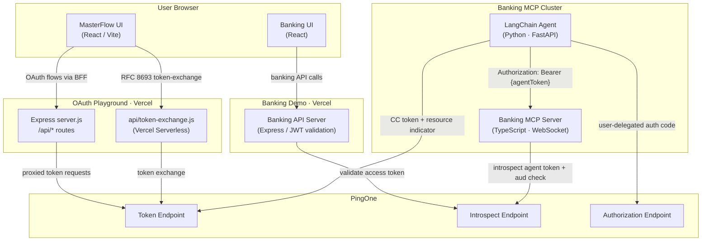
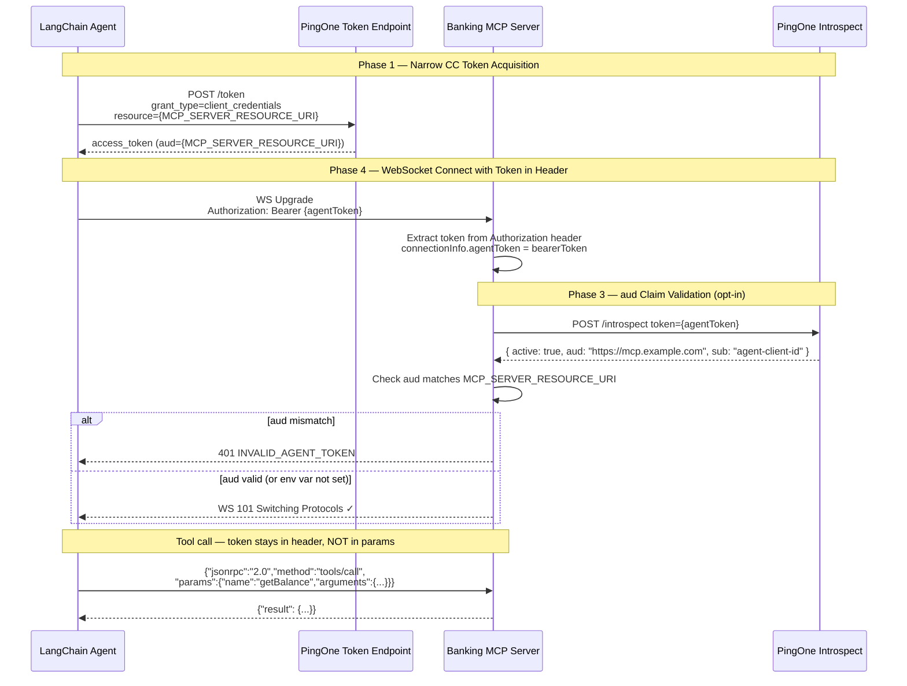
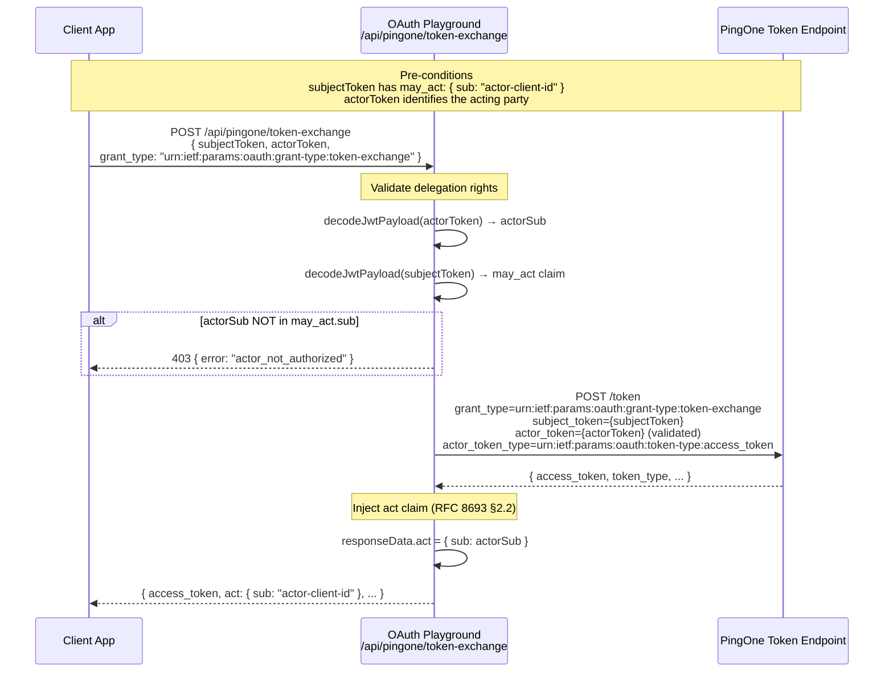
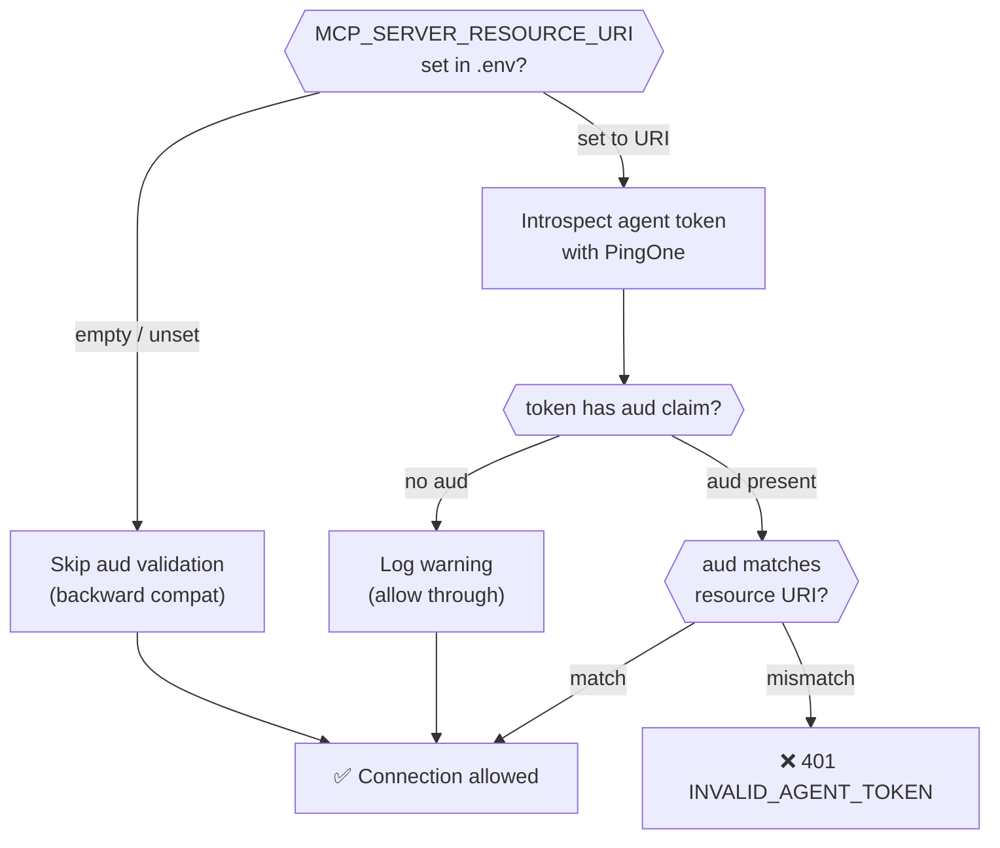

# MasterFlow + Banking Demo — Mermaid Diagrams

---

## 1. System Architecture



---

## 2. MCP Zero-Trust — Agent Token Flow



---

## 3. may_act / act — RFC 8693 Delegation Flow



---

## 4. Banking API — BFF Session Auth Flow

```mermaid
sequenceDiagram
    participant U as User Browser
    participant P1 as PingOne Authorize
    participant OPX as OAuth Playground BFF
    participant BAPI as Banking API Server

    U->>OPX: Initiate Auth (PKCE)
    OPX->>P1: /authorize?code_challenge=...&scope=banking:read
    P1-->>U: Login page
    U->>P1: Credentials
    P1-->>OPX: Authorization Code (redirect)
    OPX->>P1: POST /token  code + code_verifier
    P1-->>OPX: { access_token, refresh_token, id_token }

    Note over OPX: BFF stores tokens server-side<br/>issues opaque session cookie ONLY
    OPX-->>U: Set-Cookie: session=<opaque-id> HttpOnly; Secure; SameSite=Strict

    U->>BAPI: GET /accounts  Cookie: session=<opaque-id>
    BAPI->>BAPI: Resolve session → access_token (server-side)
    BAPI->>P1: POST /introspect token={access_token}
    P1-->>BAPI: { active: true, scope: "banking:read", sub: "user-id" }
    BAPI-->>U: [ account data ]
```

---

## 5. Zero-Trust Env-Var Gates


