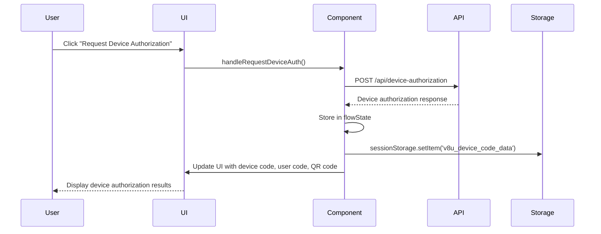
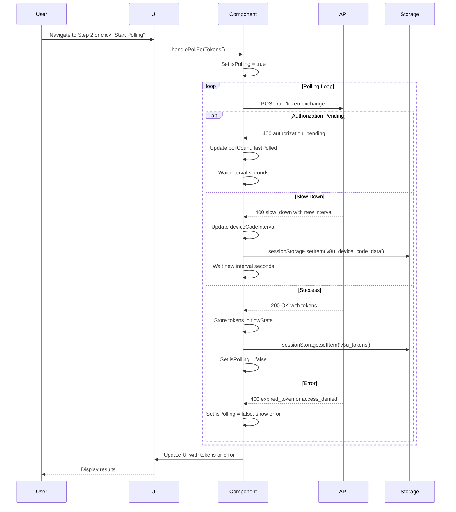
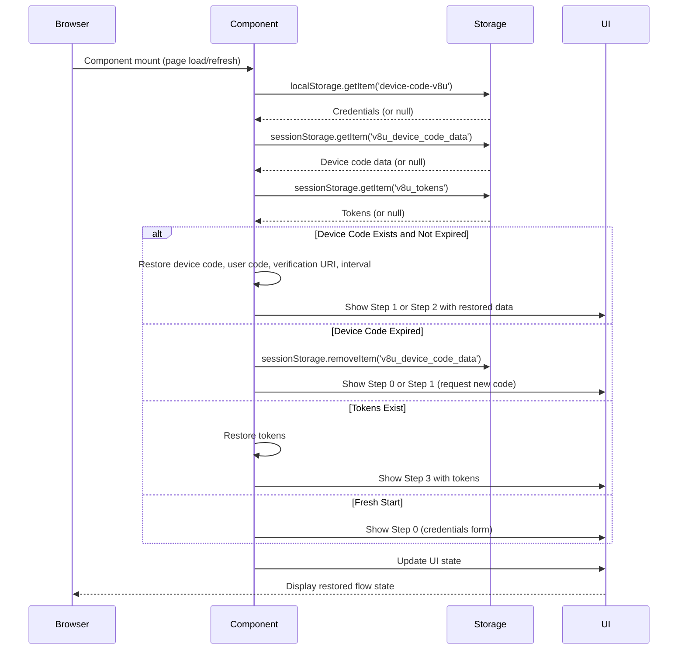

# Unified Flow - Device Authorization Flow Restore & Persistence

**Version:** 1.0  
**Last Updated:** 2025-01-27  
**Flow Type:** Device Authorization Flow (RFC 8628)  
**Component:** `UnifiedFlowSteps` in `UnifiedFlowSteps.tsx`

## Overview

This document describes the persistence and restoration mechanisms for the Device Authorization Flow in the Unified Flow system. It covers how device codes, polling state, tokens, and credentials are stored, restored, and managed across page refreshes and navigation.

## Storage Locations

### localStorage

**Purpose:** Long-term persistence of credentials and flow configuration

**Keys:**
- `device-code-v8u`: Flow credentials (environmentId, clientId, clientSecret, scopes, clientAuthMethod)

**Data Structure:**
```typescript
{
  environmentId: string;
  clientId: string;
  clientSecret?: string;
  scopes: string;
  clientAuthMethod?: 'client_secret_basic' | 'client_secret_post' | 'none';
  redirectUri?: string;
  // ... other flow-specific fields
}
```

**Lifecycle:**
- **Created**: When user saves credentials in Step 0
- **Updated**: When user modifies credentials
- **Deleted**: When user explicitly clears credentials or starts new flow
- **Persistence**: Survives page refresh, browser restart, tab close

### sessionStorage

**Purpose:** Temporary persistence of device authorization data and tokens (session-scoped)

**Keys:**
1. **`v8u_device_code_data`**: Device authorization response data
2. **`v8u_tokens`**: Received tokens (access token, ID token, refresh token)

**Data Structures:**

**Device Code Data:**
```typescript
{
  deviceCode: string;
  userCode: string;
  verificationUri: string;
  verificationUriComplete?: string;
  deviceCodeExpiresIn: number;
  deviceCodeInterval: number; // RFC 8628: Server-provided polling interval
  savedAt: number; // Timestamp when saved
}
```

**Tokens:**
```typescript
{
  access_token: string;
  token_type: string;
  expires_in: number;
  refresh_token?: string;
  id_token?: string;
  scope?: string;
  savedAt: number; // Timestamp when saved
}
```

**Lifecycle:**
- **Created**: When device authorization is requested (Step 1) or tokens are received (Step 2)
- **Updated**: When new device code is requested or new tokens are received
- **Deleted**: When user starts new flow, clears session, or browser session ends
- **Persistence**: Survives page refresh, tab close (but not browser restart)

---

## Device Code Persistence

### Storage

**Location:** `sessionStorage`  
**Key:** `v8u_device_code_data`  
**Trigger:** After successful device authorization request (Step 1)

**When Saved:**
- User clicks "Request Device Authorization" button
- Device authorization request succeeds (200 OK)
- Device code, user code, verification URI received

**What Is Saved:**
```typescript
{
  deviceCode: result.device_code,
  userCode: result.user_code,
  verificationUri: result.verification_uri,
  verificationUriComplete: result.verification_uri_complete || undefined,
  deviceCodeExpiresIn: result.expires_in,
  deviceCodeInterval: result.interval || 5, // RFC 8628 compliance
  savedAt: Date.now()
}
```

### Restoration

**Location:** Component initialization in `UnifiedFlowSteps.tsx`  
**Trigger:** When component mounts or flow type is `device-code`

**Restoration Logic:**
```typescript
// In component initialization
if (flowType === 'device-code') {
  const storedDeviceCode = sessionStorage.getItem('v8u_device_code_data');
  if (storedDeviceCode) {
    try {
      const deviceData = JSON.parse(storedDeviceCode);
      initialState.deviceCode = deviceData.deviceCode;
      initialState.userCode = deviceData.userCode;
      initialState.verificationUri = deviceData.verificationUri;
      initialState.verificationUriComplete = deviceData.verificationUriComplete;
      initialState.deviceCodeExpiresIn = deviceData.deviceCodeExpiresIn;
      initialState.deviceCodeInterval = deviceData.deviceCodeInterval || 5;
      
      // Calculate expiration timestamp if not stored
      if (deviceData.deviceCodeExpiresIn && !initialState.deviceCodeExpiresAt) {
        const savedAt = deviceData.savedAt || Date.now();
        initialState.deviceCodeExpiresAt = savedAt + (deviceData.deviceCodeExpiresIn * 1000);
      }
    } catch (err) {
      console.error('Failed to parse stored device code data', err);
    }
  }
}
```

**Restoration Conditions:**
- ✅ Device code exists in sessionStorage
- ✅ Device code is valid JSON
- ✅ Device code hasn't expired (checked on restoration)

### Expiration Handling

**Check on Restoration:**
```typescript
if (initialState.deviceCodeExpiresAt && Date.now() > initialState.deviceCodeExpiresAt) {
  // Device code expired, clear stored data
  sessionStorage.removeItem('v8u_device_code_data');
  initialState.deviceCode = undefined;
  initialState.userCode = undefined;
  // ... clear other fields
}
```

**Check During Polling:**
```typescript
// Before each poll
if (flowState.deviceCodeExpiresAt && Date.now() > flowState.deviceCodeExpiresAt) {
  throw new Error('Device code expired. Please request a new device code.');
}
```

**Expiration Display:**
- Countdown timer shown in Step 1 and Step 2
- Timer updates every second
- Warning displayed when less than 60 seconds remaining

---

## Polling State Persistence

### Storage

**Location:** `flowState.pollingStatus` (React state)  
**Key:** Not persisted separately (part of component state)  
**Trigger:** During polling operations (Step 2)

**What Is Tracked:**
```typescript
{
  isPolling: boolean;
  pollCount: number;
  lastPolled?: number; // Timestamp of last poll
  error?: string; // Error message if polling failed
}
```

**When Updated:**
- **Start Polling**: `isPolling = true`, `pollCount = 0`
- **After Each Poll**: `pollCount++`, `lastPolled = Date.now()`
- **On Success**: `isPolling = false`, tokens stored
- **On Error**: `isPolling = false`, `error = error message`
- **On Stop**: `isPolling = false` (manual stop)

### Restoration

**Location:** Component state initialization  
**Trigger:** Component mount or step change

**Restoration Logic:**
- Polling state is **not persisted** to storage (transient state)
- Polling state is **reset** on component mount or step change
- If device code exists but no tokens, user can manually start polling again

**Resume Behavior:**
- If device code exists and not expired → User can click "Start Polling" again
- If device code expired → User must request new device code
- If tokens already received → Step 3 shows tokens, polling not needed

---

## Token Persistence

### Storage

**Location:** `sessionStorage`  
**Key:** `v8u_tokens`  
**Trigger:** After successful token poll (Step 2)

**When Saved:**
- Polling receives 200 OK response with tokens
- Tokens are filtered based on spec version (OAuth 2.0/2.1 vs OIDC)
- Tokens are stored immediately after receipt

**What Is Saved:**
```typescript
{
  access_token: string;
  token_type: string;
  expires_in: number;
  refresh_token?: string;
  id_token?: string; // OIDC only
  scope?: string;
  savedAt: number;
}
```

**Filtering by Spec Version:**
- **OAuth 2.0/2.1**: Only `access_token` and `refresh_token` (no `id_token`)
- **OIDC**: `access_token`, `id_token`, and `refresh_token` (if `openid` scope)

### Restoration

**Location:** Component initialization  
**Trigger:** Component mount or step change

**Restoration Logic:**
```typescript
// In component initialization
const storedTokens = sessionStorage.getItem('v8u_tokens');
if (storedTokens) {
  try {
    const tokens = JSON.parse(storedTokens);
    initialState.tokens = {
      accessToken: tokens.access_token,
      tokenType: tokens.token_type,
      expiresIn: tokens.expires_in,
      refreshToken: tokens.refresh_token,
      idToken: tokens.id_token
    };
  } catch (err) {
    console.error('Failed to parse stored tokens', err);
  }
}
```

**Restoration Conditions:**
- ✅ Tokens exist in sessionStorage
- ✅ Tokens are valid JSON
- ✅ Tokens are not expired (checked on use, not on restoration)

**Token Expiration:**
- Tokens are not validated on restoration (expiration checked on use)
- Access tokens typically expire after 1 hour
- Refresh tokens typically expire after days or months
- ID tokens should be validated locally (signature, expiration, issuer)

---

## Credential Persistence

### Storage

**Location:** `localStorage`  
**Key:** `device-code-v8u`  
**Trigger:** After credentials are entered or modified (Step 0)

**When Saved:**
- User enters credentials in credentials form
- User clicks "Save" (if explicit save button exists)
- Credentials are auto-saved when user moves to next step

**What Is Saved:**
```typescript
{
  environmentId: string;
  clientId: string;
  clientSecret?: string;
  scopes: string;
  clientAuthMethod?: 'client_secret_basic' | 'client_secret_post' | 'none';
  redirectUri?: string; // Auto-generated, not used in device flow
  // ... other unified flow fields
}
```

### Restoration

**Location:** `CredentialsFormV8U` component  
**Trigger:** Component mount or flow key change

**Restoration Logic:**
```typescript
// In CredentialsFormV8U
useEffect(() => {
  const flowKey = getFlowKey(); // e.g., 'device-code-v8u'
  const storedCredentials = localStorage.getItem(flowKey);
  if (storedCredentials) {
    try {
      const credentials = JSON.parse(storedCredentials);
      setCredentials(credentials);
    } catch (err) {
      console.error('Failed to parse stored credentials', err);
    }
  }
}, [flowKey]);
```

**Restoration Conditions:**
- ✅ Credentials exist in localStorage for flow key
- ✅ Credentials are valid JSON
- ✅ Flow key matches current flow type

---

## State Restoration Flow

### On Component Mount

1. **Load Credentials** (from localStorage):
   - Check for stored credentials under flow key: `device-code-v8u`
   - If found, restore to credentials form
   - If not found, use default/empty credentials

2. **Load Device Code Data** (from sessionStorage):
   - Check for stored device code data under key: `v8u_device_code_data`
   - If found:
     - Check if device code expired
     - If expired, clear stored data
     - If not expired, restore device code, user code, verification URI, interval
   - If not found, start fresh

3. **Load Tokens** (from sessionStorage):
   - Check for stored tokens under key: `v8u_tokens`
   - If found, restore tokens to flow state
   - If not found, tokens are undefined

4. **Initialize Flow State**:
   - Set `currentStep` based on URL or default to 0
   - Set `flowState` with restored data
   - Update UI to reflect restored state

### On Step Navigation

1. **Validate Current State**:
   - Check if device code expired (if on Step 2)
   - Check if tokens exist (if on Step 3+)
   - Show warnings if data is invalid or expired

2. **Update URL**:
   - Update browser URL to reflect current step
   - Example: `/v8u/unified/device-code/oidc/2` (Step 2)

3. **Update UI**:
   - Show appropriate step content
   - Show restored data (device code, tokens, etc.)
   - Enable/disable navigation buttons based on state

### On Page Refresh

1. **SessionStorage Persistence**:
   - Device code data survives refresh (if not expired)
   - Tokens survive refresh
   - Polling state is **not** persisted (resets to not polling)

2. **Restoration Behavior**:
   - If user was polling → Polling stops, user can restart
   - If user had tokens → Tokens are restored, user can view them
   - If user had device code → Device code is restored, user can poll again

3. **URL Restoration**:
   - Current step is restored from URL
   - If URL has step parameter, navigate to that step
   - If no step in URL, default to Step 0

---

## Reset Semantics

### Clear Device Code Data

**When:**
- User requests new device code
- Device code expires
- User clicks "Clear" or "Reset" button
- User starts new flow

**What Is Cleared:**
```typescript
sessionStorage.removeItem('v8u_device_code_data');
flowState.deviceCode = undefined;
flowState.userCode = undefined;
flowState.verificationUri = undefined;
flowState.verificationUriComplete = undefined;
flowState.deviceCodeExpiresIn = undefined;
flowState.deviceCodeExpiresAt = undefined;
flowState.deviceCodeInterval = undefined;
flowState.pollingStatus = undefined;
```

### Clear Tokens

**When:**
- User clicks "Clear Tokens" or "Reset" button
- User starts new flow
- User logs out

**What Is Cleared:**
```typescript
sessionStorage.removeItem('v8u_tokens');
flowState.tokens = undefined;
```

### Clear All Flow Data

**When:**
- User clicks "Reset Flow" or "Start Over" button
- User navigates to different flow type
- User explicitly clears browser data

**What Is Cleared:**
```typescript
// Device code data
sessionStorage.removeItem('v8u_device_code_data');

// Tokens
sessionStorage.removeItem('v8u_tokens');

// Credentials (optional, user may want to keep)
// localStorage.removeItem('device-code-v8u');

// Reset flow state
flowState = {
  deviceCode: undefined,
  userCode: undefined,
  verificationUri: undefined,
  verificationUriComplete: undefined,
  deviceCodeExpiresIn: undefined,
  deviceCodeExpiresAt: undefined,
  deviceCodeInterval: undefined,
  pollingStatus: undefined,
  tokens: undefined,
  userInfo: undefined
};
```

---

## Session Management

### Browser Session

**Scope:** Same browser session (same tab or same browser with sessionStorage)

**Persistence:**
- ✅ Survives page refresh (F5 or reload)
- ✅ Survives tab close (if browser stays open)
- ❌ Does not survive browser restart
- ❌ Does not survive incognito/private mode close

**SessionStorage Behavior:**
- Shared across tabs in same origin
- Cleared when browser session ends
- Not shared across different origins

### Cross-Tab Behavior

**Shared State:**
- ✅ Credentials are shared (localStorage)
- ✅ Device code data is shared (sessionStorage)
- ✅ Tokens are shared (sessionStorage)

**Independent State:**
- ❌ Polling state is **not** shared (component state per tab)
- ❌ UI state is **not** shared (each tab has own UI state)

**Use Case:**
- User can have multiple tabs open
- User can authorize device in one tab
- Other tabs will see updated device code data and tokens (via sessionStorage)
- But polling must be manually started in each tab (component state)

---

## Data Flow Diagrams

### Device Code Request Flow



### Polling Flow



### Restoration Flow



---

## Best Practices

### For Developers

1. **Always Check Expiration**: Before using device code, check if it's expired
2. **Validate on Restoration**: Validate stored data on restoration (JSON parsing, expiration, etc.)
3. **Handle Storage Errors**: Wrap storage operations in try-catch (QuotaExceededError, etc.)
4. **Clear Expired Data**: Automatically clear expired device codes on restoration
5. **Reset on Flow Change**: Clear flow-specific data when switching flow types

### For Users

1. **Keep Browser Session Open**: Device codes and tokens are stored in sessionStorage (cleared on browser close)
2. **Complete Authorization Quickly**: Device codes expire after 15 minutes
3. **Request New Code if Expired**: If device code expires, request a new one
4. **Don't Share User Codes**: User codes should be kept private
5. **Refresh Page if Needed**: Page refresh restores state from storage

---

## Troubleshooting

### Device Code Not Restored

**Problem:** Device code data not restored after page refresh

**Possible Causes:**
- Device code expired (checked and cleared on restoration)
- sessionStorage cleared (browser restart, private mode, etc.)
- Storage key mismatch

**Solution:**
- Request new device code
- Check browser console for storage errors
- Verify sessionStorage is enabled

### Tokens Not Restored

**Problem:** Tokens not restored after page refresh

**Possible Causes:**
- Tokens not saved (polling didn't complete)
- sessionStorage cleared
- Storage key mismatch

**Solution:**
- Check if tokens were saved (inspect sessionStorage)
- Re-run flow if tokens were not saved
- Verify sessionStorage is enabled

### Polling State Lost

**Problem:** Polling stops after page refresh

**This is Expected:** Polling state is not persisted (component state)

**Solution:**
- Click "Start Polling" again after page refresh
- Polling will continue from where it left off (same device code)
- If device code expired, request a new code

### Expired Device Code on Restoration

**Problem:** Expired device code still in storage

**Handling:**
- Component checks expiration on restoration
- Expired device codes are automatically cleared
- User is prompted to request new code

---

## Storage Keys Reference

### localStorage Keys

| Key | Purpose | Data Type | Lifecycle |
|-----|---------|-----------|-----------|
| `device-code-v8u` | Flow credentials | Object | Persists until explicitly cleared |

### sessionStorage Keys

| Key | Purpose | Data Type | Lifecycle |
|-----|---------|-----------|-----------|
| `v8u_device_code_data` | Device authorization response | Object | Session-scoped, cleared on browser close |
| `v8u_tokens` | Received tokens | Object | Session-scoped, cleared on browser close |

---

## Summary

The Device Authorization Flow uses a combination of localStorage and sessionStorage for persistence:

- **localStorage**: Long-term credential storage (survives browser restart)
- **sessionStorage**: Temporary device code and token storage (session-scoped)

Key features:
- ✅ Device codes are restored on page refresh (if not expired)
- ✅ Tokens are restored on page refresh
- ✅ Expired device codes are automatically cleared
- ✅ Polling state is not persisted (transient component state)
- ✅ User can resume flow from any step after page refresh

This design provides a good balance between persistence and security, allowing users to resume flows while ensuring sensitive data is cleared when the browser session ends.

