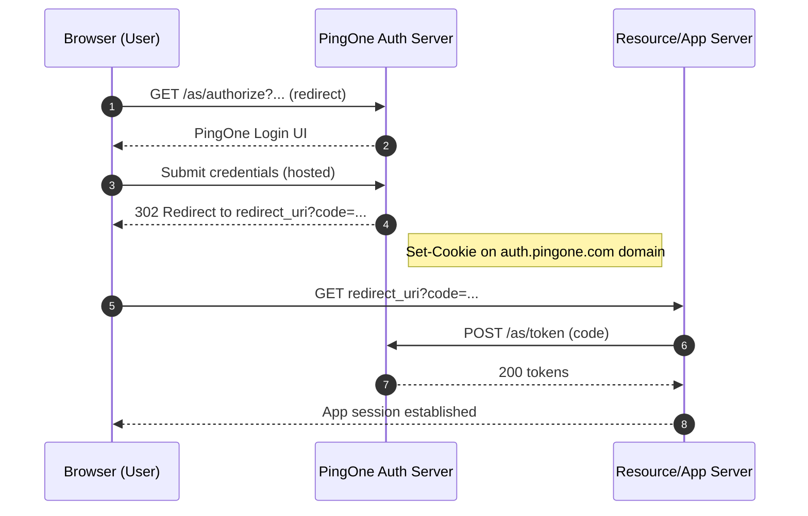

## AI Prompt: When and How PingOne Sets the Session Cookie (Redirectless and Standard Flows)

### 🧩 1. When the Session Cookie Appears

#### ✅ Standard (Redirect-based) Flow

In a normal redirect-based flow:

1. The client app hits the `/as/authorize?...` endpoint.
2. PingOne shows its hosted login UI (user enters credentials).
3. After successful authentication, PingOne sets a **session cookie** (e.g., `pingone.sid`) in its own domain (`auth.pingone.com`).
4. This cookie is **HTTP-only, Secure**, and scoped to the PingOne domain.
5. Future `/authorize` requests automatically reuse this session for SSO.

---

#### ⚙️ Redirectless Flow (`response_mode=pi.flow`)

When using redirectless login (`response_mode=pi.flow`):

- No browser redirect occurs, so PingOne **cannot directly set a cookie** in your app’s domain.
- PingOne creates its session cookie **after valid credentials are submitted**.
- The cookie is returned in the ``** header** of a `202 Accepted` response.

> 🧠 The cookie typically appears right after the password step — i.e., the moment the user’s credentials are verified.

Example:

```http
HTTP/1.1 202 Accepted
Set-Cookie: pingone.sid=abc123...; Path=/; Secure; HttpOnly; SameSite=None
Location: https://auth.pingone.com/.../pi.flow/nextStep
```

---

### 🔐 2. How to Detect It

After each redirectless step:

1. Inspect the `` headers.
2. Save them (server-side) into a **cookie jar** or session.
3. Forward them in subsequent PingOne calls using the `` header.

Example:

```js
const setCookieHeader = r.headers.raw()["set-cookie"] ?? [];
const parsedCookies = setCookie.parse(setCookieHeader);
req.session.pingCookies = mergeCookies(req.session.pingCookies, parsedCookies);
```

This preserves PingOne session continuity across the entire redirectless sequence.

---

### 🧠 3. Why You Might Not See a Cookie

- Running from **localhost** without HTTPS → cookies blocked by `SameSite=None; Secure`.
- Your proxy removes `Set-Cookie` headers.
- You send the wrong `Cookie` header back (missing flow token or mismatched cookies).
- Flow failed before the credential validation step.

---

### ✅ 4. Correct Sequence (Redirectless)

| Step | Endpoint                                  | Description              | Cookie Behavior                           |
| ---- | ----------------------------------------- | ------------------------ | ----------------------------------------- |
| 1    | `/as/authorize?...&response_mode=pi.flow` | Start redirectless flow  | No cookie yet                             |
| 2    | `/pi.flow` (identifier step)              | Send username or email   | Still no cookie                           |
| 3    | `/pi.flow` (password step)                | Submit password          | 🔹 PingOne sets session cookie            |
| 4    | `/pi.flow` (resume / next step)           | Resume or finalize       | Send cookie with request                  |
| 5    | `/token`                                  | Exchange code for tokens | Cookie optional; PingOne session persists |

---

### ⚙️ 5. Implementation in Your App

In your `api/pingone/resume` handler:

1. Capture `Set-Cookie` from PingOne.
2. Merge with existing cookies.
3. Forward `Cookie` header in each subsequent step.
4. Log cookies received and sent for debugging (mask values).

```ts
const setCookieHeader = r.headers.raw()["set-cookie"] ?? [];
const parsedCookies = setCookie.parse(setCookieHeader, { map: false });
req.session.pingCookies = mergeCookies(req.session.pingCookies, parsedCookies);

const cookieHeader = (req.session.pingCookies || []).map(c => `${c.name}=${c.value}`).join('; ');
```

---

### 🔄 6. Summary Table

| Flow Type                | When Session Cookie is Set | Who Owns It                   | How to Use                          |
| ------------------------ | -------------------------- | ----------------------------- | ----------------------------------- |
| Redirect-based           | After user logs in         | Browser / PingOne domain      | Automatically reused by browser     |
| Redirectless (`pi.flow`) | After credentials verified | Your backend (via Set-Cookie) | Forward manually in `Cookie` header |

---

### 🧭 7. Key Takeaways

- The **session cookie** is created **after** successful credential validation.
- You must **capture and resend** it manually during redirectless flows.
- Never expose or store PingOne cookies in frontend code.
- Maintain cookies per user session; they are environment- and flow-specific.

---

### ✅ Example Log Flow

```
[🔄 Flow Start] /authorize?response_mode=pi.flow → 202 (no cookie)
[🧑‍💻 Step 1] POST identifier → 202 (still no cookie)
[🔐 Step 2] POST password → 202 (Set-Cookie: pingone.sid=...)
[➡️ Step 3] POST resume → 202 (use cookie)
[🏁 Step 4] POST /token → 200 (tokens returned)
```

This sequence ensures the session persists through all redirectless authentication steps and supports seamless continuation or future SSO requests.


---

## 📈 Visual Sequence Diagrams

### A) Redirectless (`response_mode=pi.flow`) — Cookie Set After Credentials

```mermaid
sequenceDiagram
    autonumber
    participant B as Browser (User)
    participant A as Your App Backend
    participant P as PingOne Auth Server

    B->>A: Start login (click Sign In)
    A->>P: GET /as/authorize?response_mode=pi.flow&... (no cookie yet)
    P-->>A: 202 Accepted + Location: next step (no Set-Cookie)
    A-->>B: Continue (app-managed flow)

    B->>A: Submit identifier (username/email)
    A->>P: POST nextStep { identifier }
    P-->>A: 202 + Location: password step (no Set-Cookie)

    B->>A: Submit password
    A->>P: POST password { password }
    P-->>A: 202 + Location: next step
    Note right of P: Set-Cookie: pingone.sid=...<br/>Secure; HttpOnly; SameSite=None
    A->>A: Store cookie in server session (cookie jar)

    B->>A: Resume flow
    A->>P: POST resume (with Cookie: pingone.sid=...)
    P-->>A: 202 + Location: authorization code ready

    A->>P: POST /as/token (code + code_verifier)
    P-->>A: 200 { id_token?, access_token, refresh_token? }
    A-->>B: User signed in (tokens handled server-side)
```

### B) Standard Redirect-Based — Cookie Set by PingOne UI



### Implementation Notes for Diagrams

- In redirectless, your backend must **capture **`` from PingOne and **send it back** via `Cookie:` on subsequent steps.
- Use `redirect: "manual"` on fetch/HTTP client to inspect `Location` + `Set-Cookie` headers.
- Keep cookies per-user-session; mask in logs.

