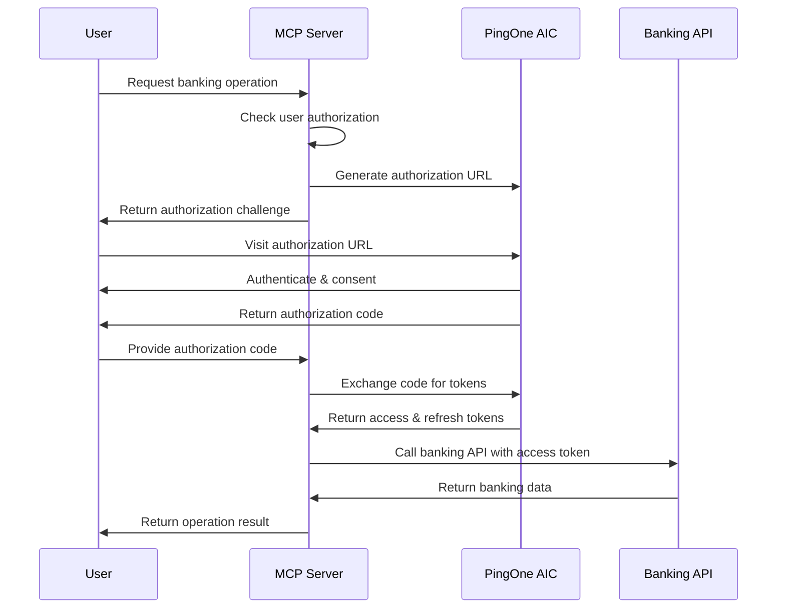
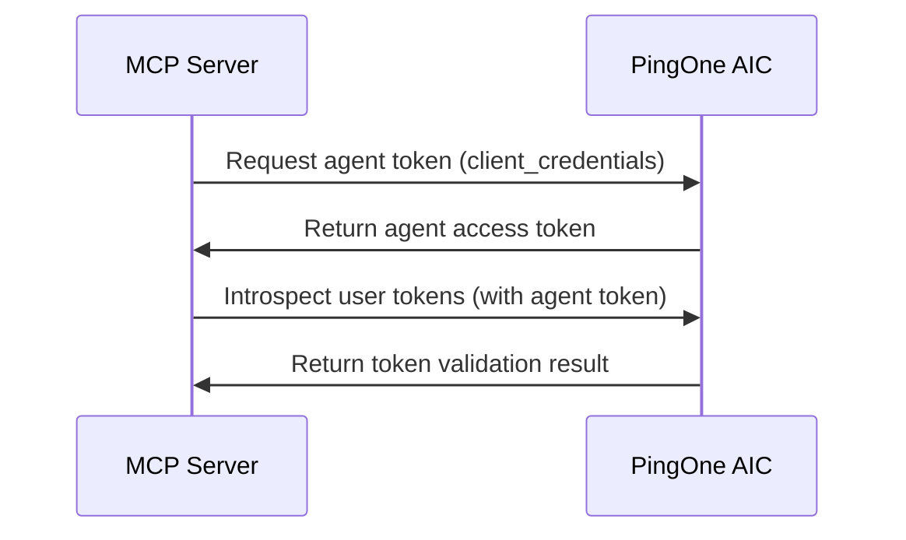

# PingOne Advanced Identity Cloud OAuth Client Setup

This document provides detailed instructions for configuring an OAuth 2.0 client in PingOne Advanced Identity Cloud (AIC) for the Banking MCP Server.

## Table of Contents

- [Overview](#overview)
- [OAuth Client Configuration](#oauth-client-configuration)
- [Required Scopes](#required-scopes)
- [Redirect URI Configuration](#redirect-uri-configuration)
- [Client Authentication](#client-authentication)
- [Grant Types](#grant-types)
- [Security Considerations](#security-considerations)
- [Testing Configuration](#testing-configuration)
- [Troubleshooting](#troubleshooting)

## Overview

The Banking MCP Server uses a **dual-token authentication model**:

1. **Agent Token**: Authenticates the MCP server itself (machine-to-machine)
2. **User Token**: Authenticates end users for banking operations (authorization code flow)

This setup requires **two separate OAuth clients** in PingOne AIC.

## OAuth Client Configuration

### 1. Agent Client (Machine-to-Machine)

This client authenticates the Banking MCP Server itself.

#### **Client Type**
- **Application Type**: `Machine to Machine` / `Service Account`
- **Client Profile**: `OAuth 2.0 Client Credentials`

#### **Grant Types**
- ✅ `client_credentials`

#### **Token Endpoint Authentication Method**
- **Recommended**: `client_secret_post`
- **Alternative**: `client_secret_basic`

#### **Scopes**
```
banking:server:introspect
banking:server:validate
```

#### **Configuration Example**
```json
{
  "client_id": "banking-mcp-agent-client",
  "client_type": "confidential",
  "application_type": "service",
  "grant_types": ["client_credentials"],
  "token_endpoint_auth_method": "client_secret_post",
  "scope": "banking:server:introspect banking:server:validate"
}
```

### 2. User Client (Authorization Code Flow)

This client handles end-user authentication for banking operations.

#### **Client Type**
- **Application Type**: `Web Application` / `Server-side Web App`
- **Client Profile**: `OAuth 2.0 Authorization Code`

#### **Grant Types**
- ✅ `authorization_code`
- ✅ `refresh_token`

#### **Token Endpoint Authentication Method**
- **Recommended**: `client_secret_post`
- **Alternative**: `client_secret_basic`

#### **Response Types**
- ✅ `code`

#### **PKCE (Proof Key for Code Exchange)**
- **PKCE Required**: `Yes` (Enhanced Security)
- **Code Challenge Method**: `S256`

#### **Configuration Example**
```json
{
  "client_id": "banking-mcp-user-client",
  "client_type": "confidential",
  "application_type": "web",
  "grant_types": ["authorization_code", "refresh_token"],
  "response_types": ["code"],
  "token_endpoint_auth_method": "client_secret_post",
  "require_pkce": true,
  "pkce_code_challenge_method": "S256"
}
```

## Required Scopes

### Banking Operation Scopes

Configure these scopes in your PingOne environment:

#### **Read Operations**
```
banking:accounts:read          # View bank accounts and balances
banking:transactions:read      # View transaction history
banking:read                   # General banking read access
```

#### **Write Operations**
```
banking:transactions:write     # Create deposits, withdrawals, transfers
banking:write                  # General banking write access
```

#### **Standard OpenID Connect Scopes**
```
openid                         # OpenID Connect authentication
profile                        # User profile information
email                          # User email address
```

### Scope Hierarchy

The Banking MCP Server supports hierarchical scopes:

```
banking:read
├── banking:accounts:read
└── banking:transactions:read

banking:write
└── banking:transactions:write
```

## Redirect URI Configuration

### **Primary Redirect URI**
```
http://localhost:8100/auth/callback
```

### **Additional Redirect URIs (for different environments)**

#### **Development**
```
http://localhost:8100/auth/callback
http://localhost:8101/auth/callback
http://127.0.0.1:8100/auth/callback
```

#### **Staging**
```
https://banking-mcp-staging.example.com/auth/callback
```

#### **Production**
```
https://banking-mcp.example.com/auth/callback
```

### **Special Considerations**

1. **No Redirect URI Required**: The Banking MCP Server supports **out-of-band authorization** where users complete authorization in a separate browser and provide the authorization code manually.

2. **Flexible Redirect Handling**: If no redirect URI is configured, the authorization flow will display the authorization code for manual entry.

3. **Localhost Development**: For development, use `localhost` rather than `127.0.0.1` for consistency.

## Client Authentication

### **Recommended: client_secret_post**

The Banking MCP Server sends client credentials in the request body:

```http
POST /oauth2/token
Content-Type: application/x-www-form-urlencoded

grant_type=authorization_code&
code=AUTH_CODE_HERE&
client_id=your-client-id&
client_secret=your-client-secret&
redirect_uri=http://localhost:8100/auth/callback
```

### **Alternative: client_secret_basic**

Client credentials sent in Authorization header:

```http
POST /oauth2/token
Authorization: Basic base64(client_id:client_secret)
Content-Type: application/x-www-form-urlencoded

grant_type=authorization_code&
code=AUTH_CODE_HERE&
redirect_uri=http://localhost:8100/auth/callback
```

## Grant Types

### **Authorization Code Flow (User Authentication)**



### **Client Credentials Flow (Agent Authentication)**



## Security Considerations

### **Client Secret Management**

1. **Environment Variables**: Store client secrets in environment variables, never in code
2. **Secret Rotation**: Implement regular client secret rotation
3. **Secure Storage**: Use secure secret management systems in production

### **Token Security**

1. **Short-Lived Access Tokens**: Configure access tokens with 1-hour expiration
2. **Refresh Token Rotation**: Enable refresh token rotation for enhanced security
3. **Token Introspection**: Validate tokens on each request using introspection endpoint

### **PKCE Implementation**

The Banking MCP Server automatically implements PKCE for enhanced security:

```typescript
// Automatic PKCE implementation
const codeVerifier = generateCodeVerifier();
const codeChallenge = generateCodeChallenge(codeVerifier);

const authUrl = `${authorizationEndpoint}?` +
  `response_type=code&` +
  `client_id=${clientId}&` +
  `scope=${scopes}&` +
  `state=${state}&` +
  `code_challenge=${codeChallenge}&` +
  `code_challenge_method=S256`;
```

### **State Parameter**

Secure state generation for CSRF protection:

```typescript
// State format: sessionHash_timestamp_randomBytes
const state = `${sessionHash}_${timestamp}_${randomBytes}`;
```

## Testing Configuration

### **Development Environment**

```bash
# Agent Client Configuration
PINGONE_CLIENT_ID=banking-mcp-agent-dev
PINGONE_CLIENT_SECRET=agent-secret-dev

# User Client Configuration  
PINGONE_USER_CLIENT_ID=banking-mcp-user-dev
PINGONE_USER_CLIENT_SECRET=user-secret-dev

# PingOne Endpoints
PINGONE_BASE_URL=https://auth.pingone.com/your-env-id
PINGONE_AUTHORIZATION_ENDPOINT=/as/authorize
PINGONE_TOKEN_ENDPOINT=/as/token
PINGONE_INTROSPECTION_ENDPOINT=/as/introspect
```

### **Test Authorization Flow**

1. **Start MCP Server**:
   ```bash
   ./scripts/start-server.sh --environment development
   ```

2. **Connect MCP Client** and attempt a banking operation

3. **Follow Authorization Challenge**:
   - Copy authorization URL from MCP response
   - Open in browser and complete authentication
   - Copy authorization code from response
   - Provide code back to MCP client

4. **Verify Token Exchange**:
   - Check server logs for successful token exchange
   - Verify banking operation completes successfully

## Environment-Specific Configuration

### **Development (.env.development)**
```bash
# Use localhost and HTTP for development
PINGONE_BASE_URL=https://auth.pingone.com/dev-env-id
MCP_SERVER_HOST=localhost
MCP_SERVER_PORT=8100
```

### **Staging (.env.staging)**
```bash
# Use staging environment with HTTPS
PINGONE_BASE_URL=https://auth.pingone.com/staging-env-id
MCP_SERVER_HOST=0.0.0.0
MCP_SERVER_PORT=8100
```

### **Production (.env.production)**
```bash
# Use production environment with strict security
PINGONE_BASE_URL=https://auth.pingone.com/prod-env-id
MCP_SERVER_HOST=0.0.0.0
MCP_SERVER_PORT=8100
```

## Troubleshooting

### **Common Issues**

#### **1. Invalid Client Credentials**
```
Error: Invalid client credentials for token introspection
```
**Solution**: Verify `PINGONE_CLIENT_ID` and `PINGONE_CLIENT_SECRET` are correct for the agent client.

#### **2. Invalid Grant**
```
Error: Invalid or expired authorization code
```
**Solutions**:
- Ensure authorization code is used immediately after generation
- Verify redirect URI matches exactly between authorization request and token exchange
- Check that client ID matches between authorization and token requests

#### **3. Insufficient Scope**
```
Error: Obtained tokens do not have required banking scopes
```
**Solutions**:
- Verify user client is configured with required banking scopes
- Check that user has permissions for requested banking operations
- Ensure scope parameter in authorization request includes all required scopes

#### **4. PKCE Verification Failed**
```
Error: PKCE verification failed
```
**Solutions**:
- Ensure PingOne client is configured to require PKCE
- Verify code challenge method is set to `S256`
- Check that code verifier is properly generated and stored

### **Debug Configuration**

Enable debug logging to troubleshoot issues:

```bash
# Enable debug logging
LOG_LEVEL=DEBUG

# Start server with debug output
./scripts/start-server.sh --environment development --config .env.development
```

### **Validation Checklist**

- [ ] Agent client configured with `client_credentials` grant
- [ ] User client configured with `authorization_code` and `refresh_token` grants
- [ ] Both clients use `client_secret_post` authentication
- [ ] Required banking scopes are configured in PingOne
- [ ] Redirect URIs are properly configured (or omitted for out-of-band flow)
- [ ] PKCE is enabled for user client
- [ ] Client secrets are securely stored in environment variables
- [ ] PingOne endpoints are correctly configured in environment files

## Support

For additional support with PingOne Advanced Identity Cloud configuration:

1. **PingOne Documentation**: [PingOne Developer Portal](https://docs.pingidentity.com/)
2. **OAuth 2.0 Specification**: [RFC 6749](https://tools.ietf.org/html/rfc6749)
3. **PKCE Specification**: [RFC 7636](https://tools.ietf.org/html/rfc7636)
4. **Banking MCP Server Issues**: Check server logs and configuration validation output