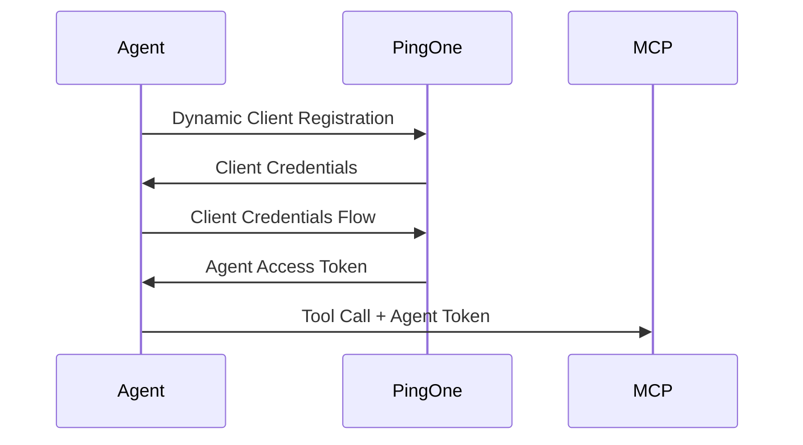
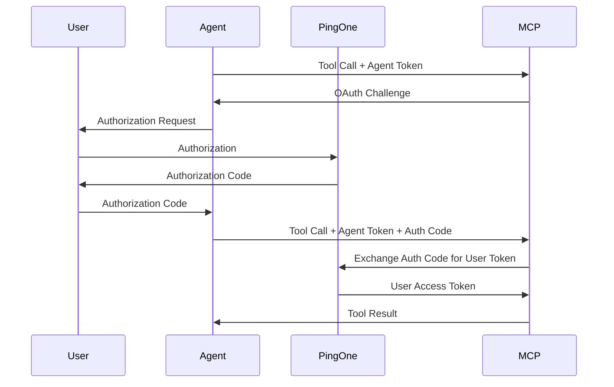

# MCP Server Integration Guide

This guide explains how to integrate MCP (Model Context Protocol) servers with the LangChain MCP OAuth Agent.

## Table of Contents

- [Overview](#overview)
- [MCP Server Requirements](#mcp-server-requirements)
- [Authentication Flow](#authentication-flow)
- [Configuration](#configuration)
- [API Reference](#api-reference)
- [Implementation Examples](#implementation-examples)
- [Testing](#testing)
- [Troubleshooting](#troubleshooting)

## Overview

The LangChain MCP OAuth Agent acts as a bridge between users and MCP servers, handling OAuth authentication flows and providing secure access to MCP server capabilities.

### Architecture

```
User Browser → LangChain Agent → MCP Server → External APIs
                     ↓
              OAuth Provider (PingOne)
```

### Key Features

- **Dual Authentication**: Agent-level and user-level OAuth flows
- **Token Management**: Automatic token refresh and secure storage
- **Error Handling**: Graceful degradation and retry logic
- **Session Management**: Correlation between agent and user contexts

## MCP Server Requirements

### Protocol Compliance

MCP servers must implement:
- Standard MCP protocol for tool registration and execution
- OAuth challenge/response mechanism for user authorization
- Token correlation for agent and user contexts

### Authentication Support

MCP servers should support:
- Agent token validation (client credentials flow)
- User authorization code exchange
- Token correlation and session management

### Capabilities Declaration

MCP servers must declare their capabilities:
```json
{
  "capabilities": ["read", "write", "execute"],
  "auth_requirements": {
    "agent_auth": true,
    "user_auth": true,
    "scopes": ["openid", "profile", "api:read", "api:write"]
  }
}
```

## Authentication Flow

### 1. Agent Authentication (Client Credentials)

The agent automatically authenticates with PingOne:



### 2. User Authorization (Authorization Code)

When user authorization is required:



## Configuration

### Environment Variables

Configure MCP servers using environment variables:

```bash
# Basic MCP server configuration
MCP_SERVER_EXAMPLE_ENDPOINT=ws://localhost:3001
MCP_SERVER_EXAMPLE_CAPABILITIES=read,write,execute
MCP_SERVER_EXAMPLE_AUTH_REQUIRED=true

# Multiple servers
MCP_SERVER_GITHUB_ENDPOINT=ws://localhost:3002
MCP_SERVER_GITHUB_CAPABILITIES=read,write
MCP_SERVER_GITHUB_AUTH_REQUIRED=true

MCP_SERVER_SLACK_ENDPOINT=ws://localhost:3003
MCP_SERVER_SLACK_CAPABILITIES=read,write,execute
MCP_SERVER_SLACK_AUTH_REQUIRED=true
```

### Programmatic Configuration

```python
from src.config.settings import get_mcp_server_configs

# Get all configured MCP servers
servers = get_mcp_server_configs()

for name, config in servers.items():
    print(f"Server: {name}")
    print(f"  Endpoint: {config['endpoint']}")
    print(f"  Capabilities: {config['capabilities']}")
    print(f"  Auth Required: {config['auth_required']}")
```

## API Reference

### MCP Server Interface

MCP servers must implement these interfaces:

#### Tool Registration

```json
{
  "method": "tools/list",
  "result": {
    "tools": [
      {
        "name": "example_tool",
        "description": "Example tool description",
        "inputSchema": {
          "type": "object",
          "properties": {
            "param1": {"type": "string"},
            "param2": {"type": "number"}
          }
        }
      }
    ]
  }
}
```

#### Tool Execution

```json
{
  "method": "tools/call",
  "params": {
    "name": "example_tool",
    "arguments": {
      "param1": "value1",
      "param2": 42
    },
    "agent_token": "eyJ0eXAiOiJKV1QiLCJhbGciOiJSUzI1NiJ9...",
    "session_id": "session_123"
  }
}
```

#### OAuth Challenge Response

When user authorization is required:

```json
{
  "error": {
    "code": "OAUTH_AUTHORIZATION_REQUIRED",
    "message": "User authorization required",
    "data": {
      "authorization_url": "https://auth.example.com/oauth/authorize?client_id=...",
      "scope": "api:read api:write",
      "state": "random_state_value"
    }
  }
}
```

#### Tool Execution with User Authorization

```json
{
  "method": "tools/call",
  "params": {
    "name": "example_tool",
    "arguments": {
      "param1": "value1",
      "param2": 42
    },
    "agent_token": "eyJ0eXAiOiJKV1QiLCJhbGciOiJSUzI1NiJ9...",
    "user_auth_code": "auth_code_from_user",
    "session_id": "session_123"
  }
}
```

### Agent API

The agent provides these interfaces for MCP integration:

#### MCPClientManager

```python
from src.mcp.connection import MCPClientManager

manager = MCPClientManager()

# Connect to MCP server
await manager.connect_to_server(server_config)

# Call tool with agent authentication
result = await manager.call_tool(
    tool_name="example_tool",
    params={"param1": "value"},
    agent_token=agent_token
)

# Handle OAuth challenge
if result.get("error", {}).get("code") == "OAUTH_AUTHORIZATION_REQUIRED":
    auth_response = await manager.handle_auth_challenge(result["error"]["data"])
```

#### Authentication Handler

```python
from src.mcp.auth_handler import AuthenticationHandler

handler = AuthenticationHandler()

# Inject agent token into MCP request
request_with_auth = handler.inject_agent_token(request, agent_token)

# Handle OAuth challenge
challenge_response = handler.handle_oauth_challenge(challenge_data)

# Pass user authorization code
result = handler.pass_user_auth_code(auth_code, session_id)
```

## Implementation Examples

### Basic MCP Server

```python
import asyncio
import json
from typing import Dict, Any

class ExampleMCPServer:
    def __init__(self):
        self.tools = {
            "get_data": {
                "description": "Get data from external API",
                "inputSchema": {
                    "type": "object",
                    "properties": {
                        "resource_id": {"type": "string"}
                    }
                }
            }
        }
    
    async def handle_request(self, request: Dict[str, Any]) -> Dict[str, Any]:
        method = request.get("method")
        
        if method == "tools/list":
            return {"result": {"tools": list(self.tools.values())}}
        
        elif method == "tools/call":
            return await self.execute_tool(request["params"])
    
    async def execute_tool(self, params: Dict[str, Any]) -> Dict[str, Any]:
        tool_name = params["name"]
        arguments = params["arguments"]
        agent_token = params.get("agent_token")
        user_auth_code = params.get("user_auth_code")
        
        # Validate agent token
        if not self.validate_agent_token(agent_token):
            return {"error": {"code": "INVALID_AGENT_TOKEN"}}
        
        # Check if user authorization is required
        if self.requires_user_auth(tool_name) and not user_auth_code:
            return {
                "error": {
                    "code": "OAUTH_AUTHORIZATION_REQUIRED",
                    "message": "User authorization required",
                    "data": {
                        "authorization_url": self.get_auth_url(),
                        "scope": "api:read api:write",
                        "state": self.generate_state()
                    }
                }
            }
        
        # Execute tool
        if tool_name == "get_data":
            return await self.get_data(arguments, agent_token, user_auth_code)
        
        return {"error": {"code": "UNKNOWN_TOOL"}}
    
    def validate_agent_token(self, token: str) -> bool:
        # Validate agent token with OAuth provider
        # Implementation depends on your OAuth provider
        return True  # Simplified
    
    def requires_user_auth(self, tool_name: str) -> bool:
        # Determine if tool requires user authorization
        return tool_name in ["get_user_data", "modify_user_data"]
    
    async def get_data(self, args: Dict, agent_token: str, user_auth_code: str = None):
        # Implement your tool logic here
        resource_id = args["resource_id"]
        
        # Use appropriate token based on resource requirements
        if user_auth_code:
            # Exchange auth code for user token
            user_token = await self.exchange_auth_code(user_auth_code)
            # Use user token for API calls
            data = await self.fetch_user_data(resource_id, user_token)
        else:
            # Use agent token for API calls
            data = await self.fetch_public_data(resource_id, agent_token)
        
        return {"result": data}
```

### Agent Integration

```python
from src.agent.langchain_mcp_agent import LangChainMCPAgent
from src.mcp.connection import MCPClientManager
from src.authentication.oauth_manager import OAuthAuthenticationManager

# Initialize components
auth_manager = OAuthAuthenticationManager()
mcp_manager = MCPClientManager()
agent = LangChainMCPAgent(mcp_manager, auth_manager)

# Process user message
async def handle_user_message(message: str, session_id: str):
    try:
        response = await agent.process_message(message, session_id)
        return response
    except Exception as e:
        # Handle errors gracefully
        return f"I encountered an error: {str(e)}"
```

## Testing

### Unit Tests

Test MCP server integration:

```python
import pytest
from unittest.mock import AsyncMock, patch

@pytest.mark.asyncio
async def test_mcp_tool_execution():
    # Mock MCP server response
    mock_response = {"result": {"data": "test_data"}}
    
    with patch('src.mcp.connection.MCPConnection') as mock_conn:
        mock_conn.return_value.call_tool = AsyncMock(return_value=mock_response)
        
        manager = MCPClientManager()
        result = await manager.call_tool("test_tool", {}, "test_token")
        
        assert result["result"]["data"] == "test_data"

@pytest.mark.asyncio
async def test_oauth_challenge_handling():
    # Mock OAuth challenge response
    challenge_response = {
        "error": {
            "code": "OAUTH_AUTHORIZATION_REQUIRED",
            "data": {
                "authorization_url": "https://auth.example.com/oauth/authorize",
                "scope": "api:read",
                "state": "test_state"
            }
        }
    }
    
    handler = AuthenticationHandler()
    auth_request = handler.handle_oauth_challenge(challenge_response["error"]["data"])
    
    assert "authorization_url" in auth_request
    assert auth_request["scope"] == "api:read"
```

### Integration Tests

Test complete OAuth flows:

```python
@pytest.mark.asyncio
async def test_complete_oauth_flow():
    # Test agent authentication
    auth_manager = OAuthAuthenticationManager()
    agent_token = await auth_manager.get_agent_token()
    assert agent_token is not None
    
    # Test MCP server call with agent token
    mcp_manager = MCPClientManager()
    result = await mcp_manager.call_tool("test_tool", {}, agent_token)
    
    # Handle OAuth challenge if required
    if result.get("error", {}).get("code") == "OAUTH_AUTHORIZATION_REQUIRED":
        challenge_data = result["error"]["data"]
        # In real test, simulate user authorization
        auth_code = "test_auth_code"
        final_result = await mcp_manager.call_tool(
            "test_tool", {}, agent_token, auth_code
        )
        assert "result" in final_result
```

## Troubleshooting

### Common Issues

#### Connection Failures

```python
# Check MCP server connectivity
import websockets

async def test_connection():
    try:
        async with websockets.connect("ws://localhost:3001") as websocket:
            print("Connection successful")
    except Exception as e:
        print(f"Connection failed: {e}")
```

#### Authentication Errors

```python
# Validate agent token
from src.authentication.oauth_manager import OAuthAuthenticationManager

async def validate_token():
    auth_manager = OAuthAuthenticationManager()
    try:
        token = await auth_manager.get_agent_token()
        print(f"Token valid: {token.token[:20]}...")
    except Exception as e:
        print(f"Token error: {e}")
```

#### Tool Execution Failures

```python
# Debug tool execution
from src.mcp.connection import MCPClientManager

async def debug_tool_call():
    manager = MCPClientManager()
    try:
        result = await manager.call_tool("test_tool", {}, "test_token")
        print(f"Result: {result}")
    except Exception as e:
        print(f"Tool call failed: {e}")
```

### Debug Mode

Enable debug logging for MCP operations:

```bash
export LOG_LEVEL=DEBUG
export MCP_DEBUG=true
python -m src.main
```

### Monitoring

Monitor MCP server health:

```python
# Health check endpoint
async def health_check():
    manager = MCPClientManager()
    servers = await manager.get_server_status()
    
    for name, status in servers.items():
        print(f"{name}: {'✅' if status['healthy'] else '❌'}")
```

For additional troubleshooting:
1. Check MCP server logs
2. Verify OAuth provider configuration
3. Test network connectivity
4. Validate token formats and expiration
5. Review agent and server capability matching